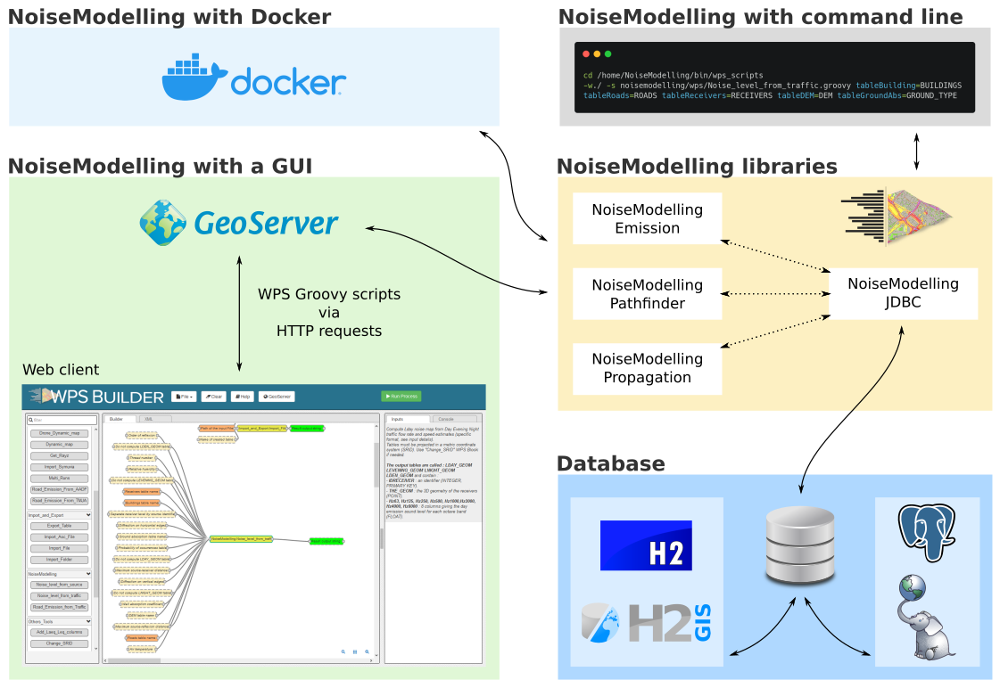

Architecture
^^^^^^^^^^^^^^^^^

NoiseModelling is the name of the application that allows to calculate noise maps (notably through a Graphical User Interface). 
But did you know that it is also the name of different calculation libraries?

The documentation below presents the architecture of NoiseModelling and the different bricks that compose it:

#. NoiseModelling libraries
#. Database connection
#. NoiseModelling with a Graphical User Interface (GUI)

Requirement - Java
~~~~~~~~~~~~~~~~~~~~

Since NoiseModelling is developped with the `Java langage`_, you will need to install the Java Virtual Machine (JVM) on your computer to use the application.

.. Warning::
    **Windows users**: If you are launching NoiseModelling thanks to the ``NoiseModelling_xxx_install.exe`` file, the JVM is already inside, so you don't have anything to do.

    **Linux or Mac users**: If not already done, you have to install the Java version v11.x. Currently only version 11 of Java is compatible (Download Java here : https://www.java.com/fr/download/)

.. _Java langage : https://en.wikipedia.org/wiki/Java_(programming_language)

1. NoiseModelling libraries
~~~~~~~~~~~~~~~~~~~~~~~~~~~~~~~~~

NoiseModelling is made of 4 main `librairies`_: 

* ``noisemodelling-emission`` : to determine the noise emission
* ``noisemodelling-pathfinder`` : to determine the noise path 
* ``noisemodelling-propagation`` : to calculate the noise propagation
* ``noisemodelling-jdbc`` : to connect NoiseModelling to a database

These libraries may be used independently of each other. Note that the ``noisemodelling-jdbc`` library *(JDBC = Java DataBase Connectivity)* is central since it allows the three others to communicate with each other as soon as the data are stored in a database *(which is the default situation)*.

.. _librairies: https://github.com/Ifsttar/NoiseModelling

2. Database connection
~~~~~~~~~~~~~~~~~~~~~~~~~~~~~~~~~

Thanks to the ``noisemodelling-jdbc`` library, NoiseModelling can access and communicate with databases. This system is quite adapted to store, manage and process (spatial) data. Here, the user has the choice between to database (free, open-source and powerful) couples:

* `H2`_ / `H2GIS`_, which is configured and embeded by default. In this case, the user has nothing to do.
* `PostGreSQL`_ / `PostGIS`_. In this case, the user has to configure the connexion.

In both cases, database can be local or remote.

.. _H2 : https://www.h2database.com
.. _H2GIS: http://www.h2gis.org/
.. _PostgreSQL: https://www.postgresql.org/
.. _PostGIS: https://postgis.net/

3. NoiseModelling with a GUI
~~~~~~~~~~~~~~~~~~~~~~~~~~~~~

NoiseModelling has a Graphical User Interface (GUI). It is accessible through a web browser (here http://localhost:9580/geoserver/web/) and is generated by a module named ":doc:`WPS_Builder`"."

In order for "WPS Builder" to communicate with the NoiseModelling libraries, we use a *'bridge'* named `GeoServer`_. This free and open-source software, allows to execute WPS* scripts, written in `Groovy`_ language, via HTTP requests.

\* `Web Processing Service`_, which is a standard from the Open Geospatial Consortium (`OGC`_).

.. Note::
    When launching NoiseModelling, Geoserver is started first. In your terminal, you will have a lot of log messages. Most of them are coming from Geoserver and are not directly linked to NoiseModelling. Unfortunately, we can not remove them.

.. _GeoServer : http://geoserver.org/
.. _Groovy : http://www.groovy-lang.org/
.. _Web Processing Service : https://www.ogc.org/standards/wps
.. _OGC : https://www.ogc.org/