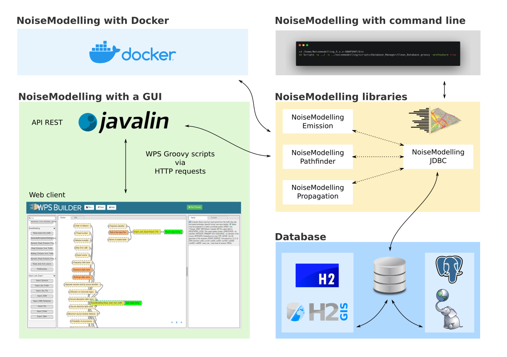

Architecture
^^^^^^^^^^^^^^^^^

NoiseModelling is the name of the application that allows to calculate noise maps (notably through a Graphical User Interface). 
But did you know that it is also the name of different calculation libraries?

The documentation below presents the architecture of NoiseModelling with its different bricks and the ways to launch it:

#. NoiseModelling libraries
#. Database connection
#. NoiseModelling with a Graphical User Interface (GUI)
#. NoiseModelling with command line
#. NoiseModelling with Docker

1. NoiseModelling libraries
~~~~~~~~~~~~~~~~~~~~~~~~~~~~~~~~~

NoiseModelling is made of 5 main `librairies`_:

* ``noisemodelling-emission`` : to determine the noise emission
* ``noisemodelling-pathfinder`` : to determine the noise path
* ``noisemodelling-propagation`` : to calculate the noise propagation
* ``noisemodelling-jdbc`` : to connect NoiseModelling to a database
* ``noisemodelling-scripts`` : Groovy scripts and web server

These libraries may be used independently of each other. Note that the ``noisemodelling-jdbc`` library *(JDBC = Java DataBase Connectivity)* is central since it allows the three others to communicate with each other as soon as the data are stored in a database *(which is the default situation)*.

.. _librairies: https://github.com/Universite-Gustave-Eiffel/NoiseModelling/

2. Database connection
~~~~~~~~~~~~~~~~~~~~~~~~~~~~~~~~~

Thanks to the ``noisemodelling-jdbc`` library, NoiseModelling can access and communicate with databases. This system is quite adapted to store, manage and process (spatial) data. Here, the user has the choice between to database (free, open-source and powerful) couples:

* `H2`_ / `H2GIS`_, which is configured and embedded by default. In this case, the user has nothing to do.
* `PostGreSQL`_ / `PostGIS`_. In this case, the user has to configure the connexion (read ":doc:`NoiseModellingOnPostGIS`" page for more information).

In both cases, database can be local or remote.

.. _H2 : https://www.h2database.com
.. _H2GIS: https://www.h2gis.org/
.. _PostgreSQL: https://www.postgresql.org/
.. _PostGIS: https://postgis.net/

3. NoiseModelling with a GUI
~~~~~~~~~~~~~~~~~~~~~~~~~~~~~

NoiseModelling has a Graphical User Interface (GUI). It is accessible through a web browser and the web page is named ":doc:`WPS_Builder`".

In order for "WPS Builder" to communicate with the NoiseModelling libraries, we use a standard name `Web Processing Service`_ (Defined by the Open Geospatial Consortium `OGC`_) API to execute WPS scripts. Theses scripts are written in the `Groovy`_ language.

You can see NoiseModelling with a GUI in action in the page ":doc:`Get_Started_GUI`".

.. _Groovy : http://www.groovy-lang.org/
.. _Web Processing Service : https://www.ogc.org/standards/wps
.. _OGC : https://www.ogc.org/

4. NoiseModelling with command lines
~~~~~~~~~~~~~~~~~~~~~~~~~~~~~~~~~~~~~~

You can use NoiseModelling with command lines. To do so, 

#. Open a terminal
#. Go in the NoiseModelling directory
#. Call the WPS .groovy script you want, with the needed arguments

.. Note::
    The ``.groovy`` script may be simple (the ones already provided with NoiseModelling, executing one task) or complex (tailor made by users and calling one or many ``.groovy`` script(s)).

.. Note::
    No need to launch / start the application as we do with web server. Here the NoiseModelling libraries are called directly for each instructions.

Examples can be found in the page ":doc:`Get_Started_Script`".

5. Docker Setup
~~~~~~~~~~~~~~~~~~~~

When a developer uses `Docker`_, he creates an application or service, which he then bundles together with the associated dependencies in a container image. An image is a static representation of the application or service, its configuration and dependencies.

Available versions
********************

The Docker images are published on our Github repository. It is the best way to safely host NoiseModelling on a public server. Be aware that a registered user may be able to run a privilege escalation attack through the usage of scripts/SQL, so you should provide access to the server only to trusted users.

.. _Docker : https://www.docker.com/
.. _Docker repository : https://github.com/Universite-Gustave-Eiffel/NoiseModelling/pkgs/container/noisemodelling
