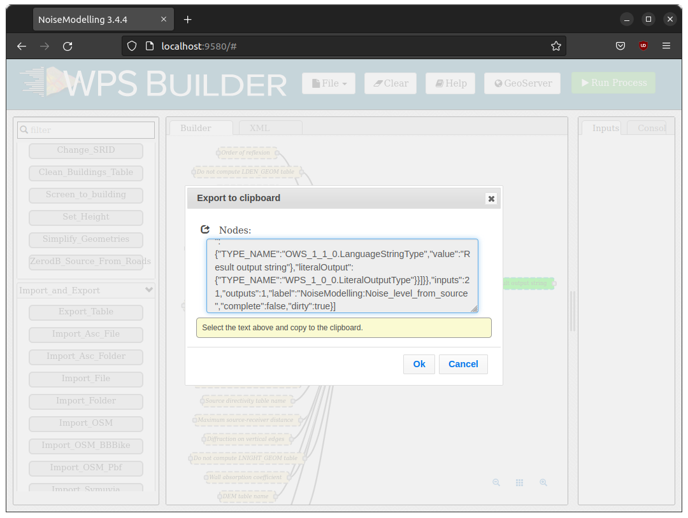

Builder
^^^^^^^^^^^^^^^^^^^^^^^^^^^^^^^^^^^^

What is the Builder ?
~~~~~~~~~~~~~~~~~~~~~~~~~~~
The NoiseModelling Builder (referred to as the **Builder**) allows you to create graphical process workflows that can be easily executed and reproduced. It allows Web Processing Services to operate through a user interface.

We have developed a version of the Builder adapted to the needs of NoiseModelling. This version being very close to `the original version initially developed by former BoundlessGEO company <https://github.com/planetfederal/wps-gui>`_.

Frequently Asked Question
~~~~~~~~~~~~~~~~~~~~~~~~~~

What do the colors correspond to?
---------------------------------
- Orange blocks are mandatory
- Beige blocks are optional
- Green blocks are the output of the process*
- Blocks get solid border when they are ready/filled

Can I save my Builder project?
------------------------------------

Yes. To save your Builder project you have two possibilities:

#. Export the blocks state into a JSON file
#. Export the blocks state and the whole database into a zip file (limited to 500 MB database)

1. Export/Import the blocks state
*********************************

Click on the ``File`` icon and then choose ``Save project``. The browser will save the file in your download folder.

Once you want to recover the saved state, click on ``File / Open project`` and select the saved file.

2. Export/Import the database
*****************************

Click on the ``File`` icon and then choose ``Save project with database``. The browser will save the file in your download folder.

How to run multiple processing at once ?
----------------------------------------

You can use the output of a processing block (like ``Import File``) as the input of another process. To do this keep the left button of your mouse down while dragging the white square on the right side of a green output block to the left white square of the input of another process. Then run the last process in the chain in order to execute the whole processing.

I want to run the same processing but using a script not using my web browser, how to do it ?
------------------------------------------------------------------------------------------

NoiseModelling WebServer is using the standard protocol named OGC Web Processing Service (`WPS`_) Interface Standard. When you run a Block, the Builder generates an equivalent Python script in the Python tab of the user interface. You can just copy/paste the script in a Python console and it should work (no dependency) as long as the NoiseModelling Builder is running in the background.

The generated Python script is using the synchronous WPS execution, so the server will not respond until the process is done or after the 60 seconds default timeout.

If the timeout is reached it will always return a message "Long running process..." like in the Builder (but the job will still run on the server).

You can use the asynchronous WPS API so the server will return a message immediately with links to follow the progression of the execution of your job.

You can use the `OwsLib Python library <https://github.com/geopython/OWSLib>`_ to do so, here is an example of how to do it:

.. literalinclude:: scripts/OwsLib_ListProcess.py
   :language: python
   :caption: List all available processes
   :linenos:

.. literalinclude:: scripts/OwsLib_ExecuteProcess.py
   :language: python
   :caption: Execute a process
   :linenos:

.. _WPS: https://www.ogc.org/standards/wps

