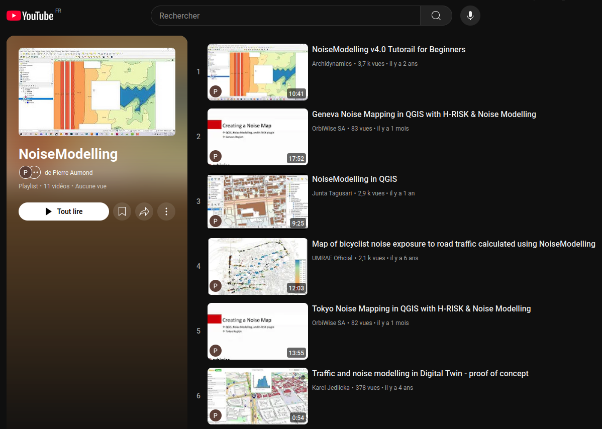

Community
^^^^^^^^^^^^^^^^^

How to contact?
~~~~~~~~~~~~~~~~~~~~~~~~~~~~~~~~~

* for **more information** on NoiseModelling, visit the `offical NoiseModelling website`_
* to **contribute to NoiseModelling** source code, follow the ":doc:`Get_Started_Dev`" page
* to **contact the support / development team**, 
    - open an `issue`_ or a write a `message`_ *(we prefer these two options)*
    - send us an email at contact@noise-planet.org  

.. _issue : https://github.com/Universite-Gustave-Eiffel/NoiseModelling/issues
.. _message : https://github.com/Universite-Gustave-Eiffel/NoiseModelling/discussions
.. _offical NoiseModelling website : http://noise-planet.org/noisemodelling.html

Former and/or actual users
~~~~~~~~~~~~~~~~~~~~~~~~~~~~~~~~~

NoiseModelling benefits from a large community of users. Some of them are listed below:

Academic labs
------------------

* `UMRAE`_ (Université Gustave Eiffel - Cerema) (France)
* `KTH`_ Royal Institue of Technology (Stockholm - Sweden)
* `Utrecht University`_ (Netherlands)
* `Université de Sherbrooke`_ (Canada)
* Groupe WAVES (`Ghent University`_ - Belgium)
* `Dipartimento di Ingegneria Civile/DICIV`_ (Università Degli Studi di Salerno - Italy)
* `HFT Stuttgart Technical University of Applied Science`_ (Germany)
* `LETG - CNRS`_ (Nantes, France)
* `LAboratoire de Géographie et d’Aménagement de Montpellier`_ (LAGAM) - Université Paul Valéry (Montpellier, France)

Private company
------------------

* `Archimethod SA`_ (Switzerland)
* `OrbiWise`_ (Switzerland)
* `Neovya`_ (France)
* `Quiet Places Ltd`_ (United-Kingdom)

Teaching
------------------

* `ENSIM`_ (Le Mans, France)
* `Université de Sherbrooke`_ (Canada)
* `INSA Rennes`_ (France)
* `Master Acoustique`_ Université du Mans (France)
* `École Centrale de Nantes`_ (France)

Other
------------------

* `Centre National d’Incendie et de Secours`_ - CNIS (Luxembourg)

.. _UMRAE: https://www.umrae.fr
.. _KTH: https://www.kth.se/en
.. _Utrecht University: https://www.uu.nl/en
.. _Université de Sherbrooke : https://www.usherbrooke.ca/
.. _Ghent University : https://www.ugent.be/en
.. _Dipartimento di Ingegneria Civile/DICIV: https://www.diciv.unisa.it/
.. _HFT Stuttgart Technical University of Applied Science: https://www.hft-stuttgart.com/
.. _LETG - CNRS: https://letg.cnrs.fr/
.. _LAboratoire de Géographie et d’Aménagement de Montpellier: https://lagam.xyz/

.. _Archimethod SA: https://archi-method.ch/
.. _OrbiWise: https://orbiwise.com/
.. _Neovya: https://www.neovya.com/
.. _Quiet Places Ltd: https://www.quietplacesuk.com/

.. _ENSIM: https://ensim.univ-lemans.fr/
.. _INSA Rennes: https://www.insa-rennes.fr/
.. _Master Acoustique: https://www.univ-lemans.fr/fr/formation/catalogue-des-formations/master-lmd-MLMD/sciences-technologies-sante-0004/master-acoustique-IXLYLOF4.html
.. _École Centrale de Nantes: https://www.ec-nantes.fr/

.. _Centre National d’Incendie et de Secours: https://112.public.lu/fr/organisation/cnis0.html

NoiseModelling in videos
~~~~~~~~~~~~~~~~~~~~~~~~~~~~~~~~~

Click on the thumbnail below to access the NoiseModelling YouTube playlist

