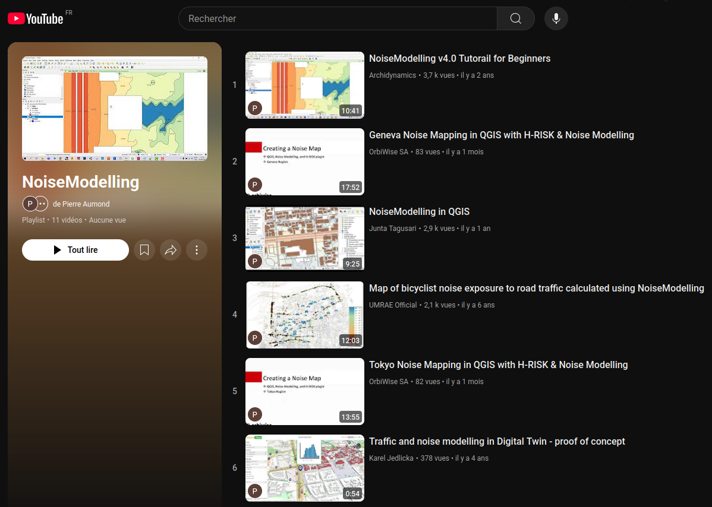

Community
^^^^^^^^^^^^^^^^^

How to contact?
~~~~~~~~~~~~~~~~~~~~~~~~~~~~~~~~~

* for **more information** on NoiseModelling, visit the `offical NoiseModelling website`_
* to **contribute to NoiseModelling** source code, follow the ":doc:`Get_Started_Dev`" page
* to **contact the support / development team**, 
    - open an `issue`_ or a write a `message`_ *(we prefer these two options)*
    - send us an email at contact@noise-planet.org  

.. _issue : https://github.com/Universite-Gustave-Eiffel/NoiseModelling/issues
.. _message : https://github.com/Universite-Gustave-Eiffel/NoiseModelling/discussions
.. _offical NoiseModelling website : http://noise-planet.org/noisemodelling.html

Former and/or actual users
~~~~~~~~~~~~~~~~~~~~~~~~~~~~~~~~~

NoiseModelling benefits from a large community of users. Some of them are listed below:

Academic labs 🧪
------------------

* `UMRAE`_ (Université Gustave Eiffel - Cerema) (🇫🇷)
* `KTH`_ Royal Institue of Technology (Stockholm - 🇸🇪)
* `Utrecht University`_ (🇳🇱)
* `Université de Sherbrooke`_ (🇨🇦)
* Groupe WAVES (`Ghent University`_ - 🇧🇪)
* `Dipartimento di Ingegneria Civile/DICIV`_ (Università Degli Studi di Salerno - 🇮🇹)
* `HFT Stuttgart Technical University of Applied Science`_ (🇩🇪)
* `LETG - CNRS`_ (Nantes, 🇫🇷)
* `LAboratoire de Géographie et d’Aménagement de Montpellier`_ (LAGAM) - Université Paul Valéry (Montpellier, 🇫🇷)
* `South China University of Technology`_ (🇨🇳)
* `Università di Pisa - ARPAT`_ (🇮🇹)

.. _UMRAE: https://www.umrae.fr
.. _KTH: https://www.kth.se/en
.. _Utrecht University: https://www.uu.nl/en
.. _Université de Sherbrooke : https://www.usherbrooke.ca/
.. _Ghent University : https://www.ugent.be/en
.. _Dipartimento di Ingegneria Civile/DICIV: https://www.diciv.unisa.it/
.. _HFT Stuttgart Technical University of Applied Science: https://www.hft-stuttgart.com/
.. _LETG - CNRS: https://letg.cnrs.fr/
.. _LAboratoire de Géographie et d’Aménagement de Montpellier: https://lagam.xyz/
.. _South China University of Technology: https://www.scut.edu.cn/en/
.. _Università di Pisa - ARPAT: https://www.arpat.toscana.it/notizie/arpatnews/2021/231-21/arpat-e-universita-di-pisa-insieme-per-iniziative-congiunte-nel-campo-della-protezione-dell-ambiente/?searchterm=None

Private company 🏭
-------------------

* `UrbanMetrix`_ (previously `Archimethod SA`_) (🇨🇭)
* `OrbiWise`_ (🇨🇭)
* `Neovya`_ (🇫🇷)
* `Quiet Places Ltd`_ (🇬🇧)
* `MobiLysis`_ (🇨🇭)

.. _UrbanMetrix: https://urbanmetrix.com/
.. _Archimethod SA: https://archi-method.ch/
.. _OrbiWise: https://orbiwise.com/
.. _Neovya: https://www.neovya.com/
.. _Quiet Places Ltd: https://www.quietplacesuk.com/
.. _MobiLysis: https://mobilysis.ch/

Teaching 📚
------------------

* `ENSIM`_ (Le Mans, 🇫🇷)
* `Université de Sherbrooke`_ (🇨🇦)
* `INSA Rennes`_ (🇫🇷)
* `Master Acoustique`_ Université du Mans (🇫🇷)
* `École Centrale de Nantes`_ (🇫🇷)

.. _ENSIM: https://ensim.univ-lemans.fr/
.. _INSA Rennes: https://www.insa-rennes.fr/
.. _Master Acoustique: https://www.univ-lemans.fr/fr/formation/catalogue-des-formations/master-lmd-MLMD/sciences-technologies-sante-0004/master-acoustique-IXLYLOF4.html
.. _École Centrale de Nantes: https://www.ec-nantes.fr/

Other
------------------

* `Direction générale de la prévention des risques (DGPR)`_ - (🇫🇷)
* `Corps grand-ducal d’incendie et de secours`_ - CGDIS (G.D. Luxembourg 🇱🇺)
* `Ministerio para la Transición Ecológica y el Reto Demográfico`_ (🇪🇸)

.. _Direction générale de la prévention des risques (DGPR): https://www.ecologie.gouv.fr/direction-generale-prevention-risques-dgpr
.. _Corps grand-ducal d’incendie et de secours:  https://112.public.lu/fr.html
.. _Ministerio para la Transición Ecológica y el Reto Demográfico: https://www.miteco.gob.es

NoiseModelling Days
~~~~~~~~~~~~~~~~~~~~~~~~~~~~~~~~~

Every year, the NoiseModelling Days bring together users and contributors to discuss the tool.

To find out more, `please visit this page`_ (or `this one for previous editions`_).

.. _please visit this page: https://noise-planet.org/noisemodelling_days.html
.. _this one for previous editions: https://noise-planet.org/noisemodelling_days_former.html

NoiseModelling in videos
~~~~~~~~~~~~~~~~~~~~~~~~~~~~~~~~~

Click on the thumbnail below to access the `NoiseModelling YouTube playlist`_.

.. _NoiseModelling YouTube playlist: https://www.youtube.com/playlist?list=PLIZraYcEigE8aOrpk7ythCM3ygSuhkVjO
