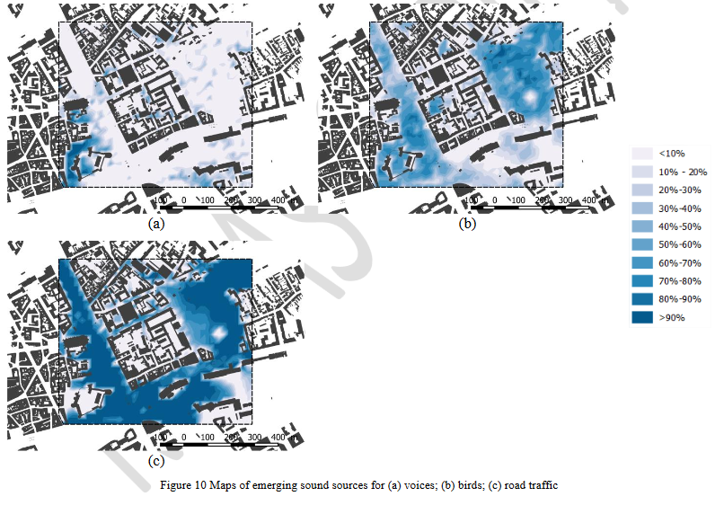

Some contributions using NoiseModelling 
^^^^^^^^^^^^^^^^^^^^^^^^^^^^^^^^^^^^^^^^^^^

Standard Noise maps
~~~~~~~~~~~~~~~~~~~~~~~~~

-  NOURMOHAMMADI, Zahra, LILASATHAPORNKIT, Tanapon, ASHFAQ, Mudabber, et al. Mapping Urban Environmental Performance with Emerging Data Sources: A Case of Urban Greenery and Traffic Noise in Sydney, Australia. Sustainability, 2021, vol. 13, no 2, p. 605. https://www.mdpi.com/2071-1050/13/2/605
- WANG Z., NOVACK T., YAN Y., ZIPF A. Quiet Route Planning for Pedestrians in Traffic Noise Polluted Environments. IEEE Transactions on Intelligent Transportation Systems 2020. https://ieeexplore.ieee.org/document/9139350/keywords#keywords
- BAEZA, Jesús López, SIEVERT, Julia L., LANDWEHR, André, et al. CityScope Platform for Real-Time Analysis and Decision-Support in Urban Design Competitions. International Journal of E-Planning Research (IJEPR), 2021, vol. 10, no 4, p. 1-17. https://www.igi-global.com/article/cityscope-platform-for-real-time-analysis-and-decision-support-in-urban-design-competitions/278826

Dynamic Noise maps
~~~~~~~~~~~~~~~~~~~~~~~~~
- CAN A., AUMOND P., BECARIE C., LECLERCQ L. Approche dynamique pour l’étude de l’emprise spatiale du bruit de trafic routier aux heures de pointe, Recherche en Transport Sécurité, 2018.
- CAN A., AUMOND P. BECARIE, C., LECLERCQ, L. Dynamic approach for the study of the spatial impact of road traffic noise at peak hours, Proceedings of the 23rd International Congress on Acoustics, Aachen, Allemagne, 09-13 September, 2019.
- QUNITERO G., AUMOND P., CAN A., BALASTEGUI A., ROMEU J. Statistical requirements for noise mapping based on mobile measurements using bikes. Applied Acoustics, 156, 271-278, 2019. 

.. figure:: images/examples/Exposure.PNG
    :align: center
    :width: 300px
    :target: https://www.youtube.com/watch?v=jl8tASDr-uQ&t=133s

.. centered::
  https://www.youtube.com/watch?v=jl8tASDr-uQ&t=133s

Probabilistic & Multi-sources Noise maps
~~~~~~~~~~~~~~~~~~~~~~~~~~~~~~~~~~~~~~~~~~~~~~~~~
- ALIONTE, Cristian-Gabriel et COMEAGA, Daniel-Constantin. Noise assessment of the small-scale wind farm. In : E3S Web of Conferences. EDP Sciences, 2019.
- AUMOND P., CAN A. Probabilistic modeling framework to predict traffic sound distribution, Proceedings of Euronoise, Hersonissos, Crete, 27-31 May 2018
- AUMOND, P., JACQUESSON, L., CAN, A. (2018). Probabilistic modeling framework for multisource sound mapping. Applied Acoustics, 139, 34-43.

Sensitivity Analysis & data assimilation
~~~~~~~~~~~~~~~~~~~~~~~~~~~~~~~~~~~~~~~~~~~~~~~~~~~

- LESIEUR, Antoine, AUMOND, Pierre, MALLET, Vivien, et al. Meta-modeling for urban noise mapping. The Journal of the Acoustical Society of America, 2020, vol. 148, no 6, p. 3671-3681

- AUMOND P., CAN A., MALLET V., GAUVREAU B., GUILLAUME G. Global sensitivity analysis for urban noise modelling Proceedings of the 23rd International Congress on Acoustics, Aachen, Allemagne, 09-13 September, 2019.
- AUMOND P., CAN A., MALLET V., GAUVREAU B., GUILLAUME G. Global sensitivity analysis of a noise mapping model based on open-source software, Proceedings of Internoise 2019, Madrid, Espagne, 16-19 Juin 2019.

.. figure:: images/examples/Metamodeling.PNG
    :align: center
    :width: 300px
    :target: https://www.youtube.com/watch?v=orc5ZbN2dlY

.. centered::
  https://www.youtube.com/watch?v=orc5ZbN2dlY

Auralisation
~~~~~~~~~~~~~~~~~~~~~~~~~
- F. ROHRLICH, C. VERRON (Noise Makers), Captation et Simulation d’Ambiances Urbaines Spatialisées , 2018-2019

.. figure:: images/examples/Rohrlich.PNG
    :align: center
    :width: 300px
