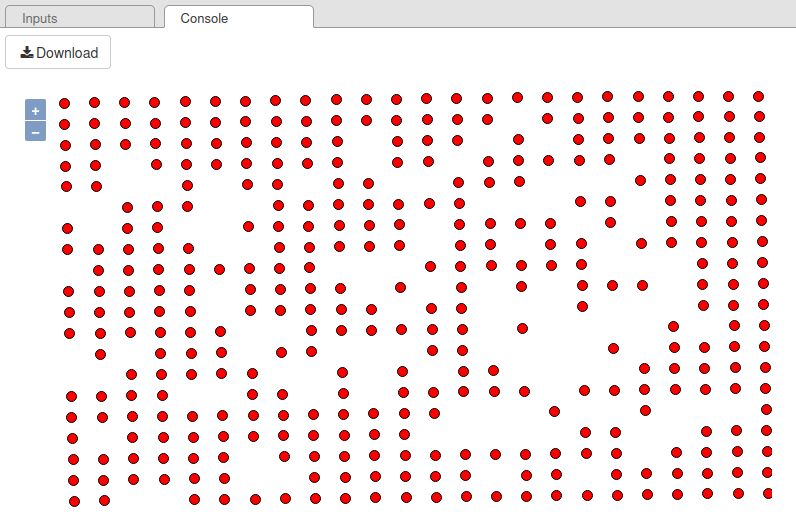

Data Assimilation
^^^^^^^^^^^^^^^^^^^^

Introduction
~~~~~~~~~~~~~~~

Data assimilation is a technique that combines observations with a numerical model to improve the accuracy of forecasts or analyses. Applied to acoustics and noise maps, data assimilation makes it possible to integrate real noise measurements (*e.g* coming from sensors) into noise propagation models to produce more accurate and reliable noise maps.

In this tutorial, we will see how to model and simulate noise in `Geneva`_ 🇨🇭 using static (road network, buildings) and dynamic (traffic, temperature) data.
The main objective is to **combine measurements from sensors** located in Geneva **with acoustic simulations** to **identify traffic configurations that best match measurements**.

.. _Geneva: https://www.openstreetmap.org/relation/1685488

Requirements
~~~~~~~~~~~~~~~~~

To play with this tutorial, you will need:

* a working installation of NoiseModelling (NM) with at least version 5.0.1. If needed, get the last release on the official `GitHub repository`_,
* the tutorial's datasets, stored in the folder ``.../NoiseModelling_5.0.1/data_dir/data/wpsdata/dataAssimilation/``,
* the dedicated WPS ``.groovy`` scripts, stored in the folder ``.../NoiseModelling_5.0.1/data_dir/scripts/wps/DataAssimilation/``.

.. _GitHub repository: https://github.com/Universite-Gustave-Eiffel/NoiseModelling/releases

The data
~~~~~~~~~~~~~~~~~

In the the tutorial's folder, you have the following data:

    1. sensor measurement ``.csv`` files, stored in the ``devices_data/`` folder (One file per sensor),
    2. ``device_mapping_sf.geojson`` containing two columns : the point geometry (``THE_GEOM``) and a sensor's unique identifier (``DEVEUI```). This file is also provided in ``.csv`` format,
    3. the `OpenStreetMap`_ (OSM) dataset of the studied area : ``geneva.osm.pbf``.

.. _OpenStreetMap: https://www.openstreetmap.org/


Sensor measurements
-------------------------------------------------

Each ``.csv`` files in the folder ``devices_data/`` contains environmental noise measurements recorded by individual sensors.
The columns are:

* ``deveui`` : Unique identifier of the sensor,
* ``epoch`` : Time of measurement (Epoch format - Unix time, ex:1724567400),
* ``Leq`` : Equivalent continuous sound level in dB(A), calculated over a period (15 min),
* ``Temp`` : Temperature (°C) recorded by the sensor at the time of measurement,
* ``timestamp`` : Time of measurement (timestamp format ``"YYYY-MM-DD HH:MM:SS"``).

Below is an illustration with the file ``4a6.csv``. Here we can see that 5 measurements were taken, every 15 minutes, between 6:30 and 7:30 am. During this period, noise levels rose slightly, while temperatures remained stable overall (except for the first measurement).

.. csv-table:: Informations stored in the sensor's file ``4a6.csv``
   :file: ./data/4a6.csv
   :widths: 15, 15, 15, 15, 30
   :header-rows: 1

.. warning::
    In this tutorial all the values, coming from the 7 sensors, are sampled approximately every 15 minutes, but the exact spacing may vary slightly.

    We could also have had data with a time step of 5 minutes, 10 minutes, 1 hour, etc.

    **In all cases, it is important that all the measurements from the sensors are set to the same time step AND that they are phased (i.e. set to the same time intervals).**


Sensor localization
-------------------------------------------------

The ``device_mapping_sf.geojson`` columns are:

* ``deveui`` : Unique Identifier of the sensor,
* ``the_geom`` : 3D point geometry in WKT (Well-Known Text) format — includes coordinates (X, Y) and altitude (Z) in the projected coordinate system.

Below is a map, showing the seven sensors (red points), with their identifier ``deveui``.

.. image:: ./images/Data_Assimilation/geneva_sensors.png
    :alt: Sensors in Geneva


How to compute the assimilation?
~~~~~~~~~~~~~~~~~~~~~~~~~~~~~~~~~~~~~~~~~~~~~~
To compute the data assimilation, you will have to execute several WPS ``.groovy`` scripts. You can play with them in two ways:


* with the NoiseModelling's GUI (Graphic User Interface). In this case, the WPS blocks are listed in the ``Data_Assimilation`` tab *(see screenshot below)*,
* in command line (see how to :doc:`Get_Started_Script`). In this case, just note that they are stored in the folder ``.../NoiseModelling_5.0.1/data_dir/scripts/wps/DataAssimilation/``,
* in a .groovy script, calling one or various WPS .groovy scripts.


Data Simulation
~~~~~~~~~~~~~~~~~~~~~~~~~~~~~~~~~~~~~~~~~~~~~~
This process prepares the training dataset from sensor measurements, importing it into NoiseModelling (in a spatial database) and performing various calculations to determine noise levels.

Maps are generated with all possible combinations, in order to identify the best road configuration in terms of noise levels generated.

Step 1 : Generate all possible combinations
-------------------------------------------------

Generates all possible combinations of values from two given lists and inserts them into a table named ``ALL_CONFIGURATIONS``.

To calculate the combinations, you have to execute the WPS script ``All_Possible_Configuration``.


Two input parameters are needed:

* **Traffic values** (``trafficValues``):  variation around standard values for the 4 types of roads: primary, secondary, tertiary and others. When generating a variation of the default map (the set of maps), the values taken by the primary, the secondary, ... sections, will be calculated from these parameters (between 1 and *n*). For example, if ``"trafficValues": "0.01, 1"``, then the primary sections will take 1% or 100% of their default value. The same applies to the remaining road types.
* **Temperature values** (``temperatureValues``) : the temperatures (in °C - Double). The 1 to *n* possible temperatures to play (in the example below, 3 temperatures are defined: 10, 15 and 20°C)


Execute ``All_Possible_Configuration`` WPS block
**************************************************

With the **NoiseModelling GUI**

.. image:: ./images/Data_Assimilation/all_possible_configuration_all.png
    :alt: All possible configuration

With **command lines**

.. literalinclude:: scripts/data_assimilation_all_configurations.bash
   :language: bash
   :linenos:


With **Groovy script**

.. code-block:: groovy

    new All_Possible_Configuration().exec(connection,[
                   "trafficValues": "0.01,1.0,2.0",
                   "temperatureValues": "10,15,20"
    ])

.. _all_configuration_result:

Result
********

The generated combinations include values for type of roads primary, secondary, tertiary, others, and temperature. The resulting table ``ALL_CONFIGURATIONS`` has the following columns:

* ``IT``: Unique identifier of the combination (Primary Key - Integer)
* ``PRIMARY_VAL``: percentage of primary roads traffic, given by trafficValues  (Double)
* ``SECONDARY_VAL``: (Double)
* ``TERTIARY_VAL``: (Double)
* ``OTHERS_VAL``: (Double)
* ``TEMP_VAL``: (Integer)


The first 10 lines of this table are shown below:

.. csv-table:: 
   :file: ./data/all_configuration_example.csv
   :widths: 10, 15, 15, 15, 15, 15
   :header-rows: 1


.. warning::
    The total number of combinations can be huge. This value is defined as: (number of ``trafficValues`` elements) ^ 4  * (number of ``temperatureValues`` elements). 

    In our example, we have ``"trafficValues": [0.01, 1.0, 2.0]`` and ``"temperatureValues": [10,15,20]``, so the number of combinations = 3 ^ 4 * 3 = 243 *(before filtration - see ‘note‘ tab just below)*

    Even though this table is very important, only part of it will be used for all the maps to be simulated (see :ref:`Step 5 <Generate_all_traffic_emissions_and_maps>`)


.. note::
    When the combinations are calculated, **a filter is applied to remove inconsistent pairs** (e.g. an ‘other’ type road with much more traffic than a ‘primary‘ road).

    As a result, only pairs meeting the following rule are retained: ``traffic on a lower type of road / traffic on a higher type of road <= 20``

    This rule eliminates cases where a road of a lower type would have 20 times more traffic than another of a higher type.


Step 2 : Import sensor positions
---------------------------------------

Using the ``Import_File`` WPS script*, import the location of the sensors into the NoiseModelling's database from the .geojson file ``device_mapping_sf.geojson``. This file will be stored in a table called ``SENSORS_LOCATION``.

\* in the ``data_dir/scripts/wps/Ìmport_and_Export/`` folder

🌍 Since we are in the Geneva area, we are using the ``CH1903+`` metric coordinate system (identified as `EPSG:2056`_).

* ``pathFile`` : ``.../device_mapping_sf.geojson``
* ``inputSRID`` : ``2056``
* ``tableName`` : ``SENSORS_LOCATION``


If you are using the Groovy script

.. code-block:: groovy

    new Import_File().exec(connection,[
                    "pathFile" : workingFolder+"device_mapping_sf.geojson",
                    "inputSRID" : 2056,
                    "tableName": "SENSORS_LOCATION"
    ])

.. _EPSG:2056: https://epsg.io/2056

Result
********

Once done, you have the table ``SENSORS_LOCATION``, presented below.

.. csv-table:: 
   :file: ./data/SENSORS_LOCATION.csv
   :widths: 80, 20
   :header-rows: 1


Step 3 : Prepare sensor data
---------------------------------------

Now we can extract and prepare the sensors, for a given period. To do so, we are using the ``Prepare_Sensors`` WPS .groovy script stored in the folder ``.../data_dir/scripts/wps/DataAssimilation/``. 

This script has the following parameters:  

* ``startDate`` : the start timestamp to extract the dataset (in format ``YYYY-MM-DD HH:MM:SS``)
* ``endDate`` : the start timestamp to extract the dataset (in format ``YYYY-MM-DD HH:MM:SS``)
* ``trainingRatio`` : define the percentage of data to be used for training (e.g a value of 0.7 means that 70% of the data will be used for training. The remaining 30% will be used for validation) (Double)
* ``workingFolder`` : folder containing the file ``device_mapping_sf.csv``, the OSM file and the ``devices_data`` folder.
* ``targetSRID``: Target projection identifier (also called SRID) of your project (Integer)

Execution
**********

For this tutorial, you can fill with these informations:

* ``startDate`` : ``2024-08-25 06:30:00``
* ``endDate`` : ``2024-08-25 07:30:00``
* ``trainingRatio`` : ``0.8``
* ``workingFolder`` : ``data_dir/data/wpsdata/dataAssimilation/``
* ``targetSRID`` : ``2056``


If you are using the Groovy script

.. code-block:: groovy

    new Prepare_Sensors().exec(connection,[
                    "startDate":"2024-08-25 06:30:00",
                    "endDate": "2024-08-25 07:30:00",
                    "trainingRatio": 0.8,
                    "workingFolder": "data_dir/data/wpsdata/dataAssimilation/",
                    "targetSRID": 2056
    ])

Result
********

Once executed, two tables are created:

* ``SENSORS_MEASUREMENTS`` : representing all the data for this period, with sensor's position (POINT geometry)
* ``SENSORS_MEASUREMENTS_TRAINING`` : filtering ``SENSORS_MEASUREMENTS`` to keep only the training dataset. This table (described below) will be used as the RECEIVER table for the following steps.

    * ``IDSENSOR`` : Unique identifier of the sensor,
    * ``THE_GEOM`` : The sensor's position (POINT geometry),
    * ``IDRECEIVER`` : The receiver's unique Id
    * ``EPOCH`` : Time of measurement (Epoch format - Unix time, ex:1724567400),
    * ``LAEQ`` : Equivalent continuous sound level in dB(A), calculated over a period (15 min),
    * ``TEMP`` : Temperature (°C) recorded by the sensor at the time of measurement,
    * ``timestamp`` : Time of measurement (timestamp format ``"YYYY-MM-DD HH:MM:SS"``).


Step 4: Import buildings and roads
---------------------------------------

Now, using the ``Ìmport_OSM`` block, you can import buildings and road network (with predicted traffic flows) from the ``geneva.osm.pbf`` OSM file.

Execution
**********

* ``pathFile`` : ``data_dir/data/wpsdata/dataAssimilation/geneva.osm.pbf``
* ``targetSRID``: ``2056``
* ``ignoreGround`` : ``true``
* ``ignoreBuilding`` : ``false``
* ``ignoreRoads`` : ``false``
* ``removeTunnels`` : ``true``
* ``eliminateNoTrafficRoads`` : ``false``


If you are using the Groovy script

.. code-block:: groovy

    new Import_OSM().exec(connection, [
                    "pathFile"      : "data_dir/data/wpsdata/dataAssimilation/geneva.osm.pbf",
                    "targetSRID"    : 2056,
                    "ignoreGround"  : true,
                    "ignoreBuilding": false,
                    "ignoreRoads"   : false,
                    "removeTunnels" : true,
                    "eliminateNoTrafficRoads" : false
    ])

Result
********

The tables ``BUILDINGS`` and ``ROADS`` are created.

.. note::
    If you are using NoiseModelling with the GUI and wish to visualize the data in a map, you can use the ``Table_Visualization_Map`` block. Below is the result with the two table ``BUILDINGS`` *(left)* and ``ROADS`` *(right)*.

    .. image:: ./images/Data_Assimilation/BUILDINGS_ROADS.png
        :alt: BUILDINGS and ROADS

.. _Generate_all_traffic_emissions_and_maps:

Step 5 : Generate all traffic emissions and maps
-----------------------------------------------------

This step consists in generating all the traffic emissions by modifying traffic data according to the road type, using data from ``ALL_CONFIGURATIONS`` (see :ref:`Step 1 <all_configuration_result>`).

1. Generate emissisons
***********************

To do so, users have first to execute the ``Data_Simulation`` WPS block, which has only one **optionnal** parameter :

* ``noiseMapLimit`` : final number of maps to be generated (INTEGER). If a value is filled, a random selection is applied to keep the number of expected maps, based on the LHS (`Latin Hypercube Sampling`_) method. 

.. _Latin Hypercube Sampling: https://en.wikipedia.org/wiki/Latin_hypercube_sampling

Execution
**********

For this tutorial, you can fill with this information:

* ``noiseMapLimit`` : ``80``

If you are using the Groovy script

.. code-block:: groovy

    new DataSimulation().exec(connection,[
                    "noiseMapLimit": 80
    ])

Result
********

Two tables are created:

* ``LW_ROADS`` : table containing all traffic emissions
* ``ROADS_GEOM`` : table containing the geometry of roads


2. Calculate noise levels
**************************

Now, users can calculate the noise levels, emitted from the road sources. To do so, execute the ``Noise_level_from_source`` WPS script.

Execution
**********

For this tutorial, you can fill with this information:

* Source geometry table name / ``tableSources`` : ``ROADS_GEOM``
* Source emission table name / ``tableSourcesEmission`` : ``LW_ROADS``
* Buildings table name / ``tableBuilding`` : ``BUILDINGS``
* Receivers table name / ``tableReceivers`` : ``SENSORS_LOCATION``,
* Separate receiver level by source id / ``confExportSourceId`` : ``false``
* Maximum source-receiver distance / ``confMaxSrcDist`` : ``250``
* Diffraction on vertical edges / ``confDiffVertical`` : ``false``
* Diffraction on horizontal edges / ``confDiffHorizontal`` : ``false``

If you are using the Groovy script

.. code-block:: groovy

    new Noise_level_from_source().exec(connection, [
                    "tableSources": "ROADS_GEOM",
                    "tableSourcesEmission" : "LW_ROADS",
                    "tableBuilding": "BUILDINGS",
                    "tableReceivers": "SENSORS_LOCATION",
                    "confExportSourceId": false,
                    "confMaxSrcDist": 250,
                    "confDiffVertical": false,
                    "confDiffHorizontal": false
    ])

Result
********

The table ``RECEIVERS_LEVEL`` is created and stores all the generated maps *(see the three first lines below)*.

.. csv-table:: 
   :file: ./data/RECEIVERS_LEVEL.csv
   :widths: 15, 15, 25, 10, 5, 10, 10, 10
   :header-rows: 1


Step 6 : Extract best configuration
---------------------------------------

Many maps have been generated. So now, the best map, **minimizing the difference between the measurements and the simulation**, must be chosen.

To do so, users have to execute the ``Extract_Best_Configuration`` WPS script. There are 3 parameters to enter here:

* ``observationTable`` : name of the table where observed data are stored,
* ``noiseMapTable`` : name of the table where simulated data are stored,
* ``tempToleranceThreshold`` : tolerance threshold (exprimed in °C) for the temperature that allows to extract the map that have a temperature value close to the real temperature.

This process will first determine the LAEQ difference between simulated (``noiseMapTable``) and observed (``observationTable``) values.

Then, for each time steps, the median value of the difference between the two values is calculated, for all maps. **The map having the smallest median value will be the best one**.


Execution
**********

For this tutorial, you can fill with this information:

* ``observationTable`` : ``SENSORS_MEASUREMENTS_TRAINING``
* ``noiseMapTable`` : ``RECEIVERS_LEVEL``
* ``tempToleranceThreshold`` : ``5``

If you are using the Groovy script

.. code-block:: groovy

    new Extract_Best_Configuration().exec(connection,[
                    "observationTable": "SENSORS_MEASUREMENTS_TRAINING",
                    "noiseMapTable": "RECEIVERS_LEVEL",
                    "tempToleranceThreshold"  : 5
    ])

Result
********

.. note::
    The best configuration is found for each time step (here 15 minutes)

As a result, the ``BEST_CONFIGURATION_FULL`` table is created (see table below). This table is made of the following columns:

* ``EPOCH`` : Time of measurement (Epoch format - Unix time, ex:1724567400),
* ``MIN_MEDIAN_DIFF`` : the minimum median of the difference between simulated and measured LAEQs (this is how the best maps are chosen)
* ``IT`` : Unique identifier of the combination (Primary Key - Integer)
* ``PRIMARY_VAL`` : percentage of primary roads traffic, given by ``trafficValues`` (Double)
* ``SECONDARY_VAL`` : ... secondary roads ...
* ``TERTIARY_VAL`` : ... tertiary roads ... 
* ``OTHERS_VAL`` : ... other roads ... 
* ``TEMP_VAL`` : temperature (Interger)


.. csv-table:: Table ``BEST_CONFIGURATION_FULL`` showing one best configuration for each of the time steps
   :file: ./data/BEST_CONFIGURATION_FULL.csv
   :widths: 15, 15, 10, 15, 15, 10, 10, 10
   :header-rows: 1


Execute Simulation: Generate the Dynamic Map
~~~~~~~~~~~~~~~~~~~~~~~~~~~~~~~~~~~~~~~~~~~~~~~
This part is made to execute a dynamic traffic calibration process, using the best configuration.

Step 7 : Generate new receivers
---------------------------------

Create a regular grid of receivers between the buildings.

To do so, use the ``Regular_Grid`` WPS script (in the ``/Receivers/`` wps scripts folder).

Execution
**********

For this tutorial, you can fill with this information:

* ``buildingTableName`` : ``BUILDINGS``
* ``fenceTableName`` : ``BUILDINGS``
* ``sourcesTableName`` : ``ROADS``
* ``delta`` : ``200`` (1 receiver every 200m)

If you are using the Groovy script

.. code-block:: groovy

    new Regular_Grid().exec(connection,[
                  "buildingTableName": "BUILDINGS",
                  "fenceTableName": "BUILDINGS",
                  "sourcesTableName":"ROADS",
                  "delta": 200
    ])

Result
********

The table ``RECEIVERS`` is created.

.. csv-table:: Three first lines of the table ``RECEIVERS``
   :file: ./data/RECEIVERS.csv
   :widths: 25, 25, 25, 25
   :header-rows: 1




Step 8 : Adding sensors as receivers
---------------------------------------

**Optionally**, add the sensors location into the ``RECEIVERS`` table (just created before).

Execution
**********

In the ``Merged_Sensors_Receivers`` WPS block, fill these information:

* ``tableReceivers`` : ``RECEIVERS``
* ``tableSensors`` : ``SENSORS_LOCATION``

If you are using the Groovy script

.. code-block:: groovy

    new Merged_Sensors_Receivers().exec(connection,[
                    "tableReceivers": "RECEIVERS",
                    "tableSensors" : "SENSORS_LOCATION"
    ])

Result
********

The ``RECEIVERS`` table has now new points, the sensor's one


Step 9 : Generate dynamic road emissions
------------------------------------------

For each time step (here 15 min), generate an emissions map for all the receivers, corresponding to the best configuration (for this time step).

To do so, use the ``NMs_4_BestConfigs`` WPS block. This block has two inputs:

* ``bestConfig`` : best configuration table name
* ``roadEmission`` : road emissions table name

Execution
**********

* ``bestConfig`` : ``BEST_CONFIGURATION_FULL``
* ``roadEmission`` : ``LW_ROADS``

If you are using the Groovy script

.. code-block:: groovy

    new NMs_4_BestConfigs().exec(connection)
                    "bestConfig": "BEST_CONFIGURATION_FULL",
                    "roadEmission" : "LW_ROADS"

Result
********

The table ``LW_ROADS_best`` is created.


Step 10 : Generate the noise levels
---------------------------------------

Using the ``Noise_level_from_source`` WPS block, we can finally compute the noise level from the network sources emission (``LW_ROADS_best``) based on all the receivers.

Execution
**********

* ``tableSources`` : ``ROADS_GEOM``
* ``tableSourcesEmission`` : ``LW_ROADS_best``
* ``tableBuilding`` : ``BUILDINGS``
* ``tableReceivers`` : ``RECEIVERS``
* ``confExportSourceId`` : ``false``
* ``confMaxSrcDist`` : ``250``
* ``confDiffVertical`` : ``false``
* ``confDiffHorizontal`` : ``false``

If you are using the Groovy script

.. code-block:: groovy

    new Noise_level_from_source().exec(connection, [
                          "tableSources": "ROADS_GEOM",
                          "tableSourcesEmission" : "LW_ROADS_best",
                          "tableBuilding": "BUILDINGS",
                          "tableReceivers": "RECEIVERS",
                          "confExportSourceId": false,
                          "confMaxSrcDist": 250,
                          "confDiffVertical": false,
                          "confDiffHorizontal": false
    ])

Result
********

We obtain the table ``RECEIVERS_LEVEL``.

Step 11 : Create & visualize the resulting table
--------------------------------------------------

Create a table, called ``ASSIMILATED_MAPS``, containing both sound levels and configuration parameters

To do so, execute the ``Create_Assimilated_Maps`` WPS block, with the 3 following parameters:

* ``bestConfigTable`` : the best configuration table name
* ``receiverLevel`` : the receivers level table name
* ``outputTable`` : the output table name

Execution
**********

For this tutorial, you can fill with this information:

* ``bestConfigTable`` : ``BEST_CONFIGURATION_FULL``
* ``receiverLevel`` : ``RECEIVERS_LEVEL``
* ``outputTable`` : ``ASSIMILATED_MAPS``

.. code-block:: groovy

    new Create_Assimilated_Maps().exec(connection,[
                    "bestConfigTable" : "BEST_CONFIGURATION_FULL",
                    "receiverLevel" : "RECEIVERS_LEVEL",
                    "outputTable": "ASSIMILATED_MAPS"
    ])

Result
********

The resulting ``ASSIMILATED_MAPS`` table has the following columns:

* ``TIMESTAMP`` : time of the measure
* ``LAEQ`` : noise level (dB(A))
* ``THE_GEOM`` : receiver's geometry (POINT)
* ``IDRECEIVER`` : receiver's unique identifier

.. csv-table:: Three first lines of the table ``RECEIVERS``
   :file: ./data/ASSIMILATED_MAPS.csv
   :widths: 25, 25, 25, 25
   :header-rows: 1


Visualize the map
******************

You can now export ``ASSIMILATED_MAPS``, for example as a Shapefile, using the ``Export_Table`` WPS block and then import it into your favorite GIS app (such as `QGIS`_) to visualize the results.

* ``exportPath`` : ``results/ASSIMILATED_MAPS.shp``
* ``tableToExport``: ``ASSIMILATED_MAPS``

or

.. code-block:: groovy

    new Export_Table().exec(connection,
                    ["exportPath": "results/ASSIMILATED_MAPS.shp",
                     "tableToExport": "ASSIMILATED_MAPS"
    ])


.. _QGIS: https://qgis.org/

The resulting maps may looks like this


Here, we applied the color scheme proposed by Beate Tomio (see :doc:`Noise_Map_Color_Scheme`) on the column ``LAEQ``. We also added the input sensors, the buildings (light grey) and the roads (white lines).
