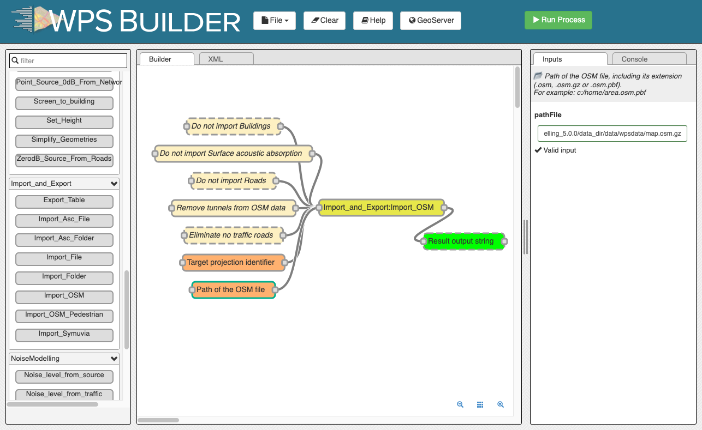
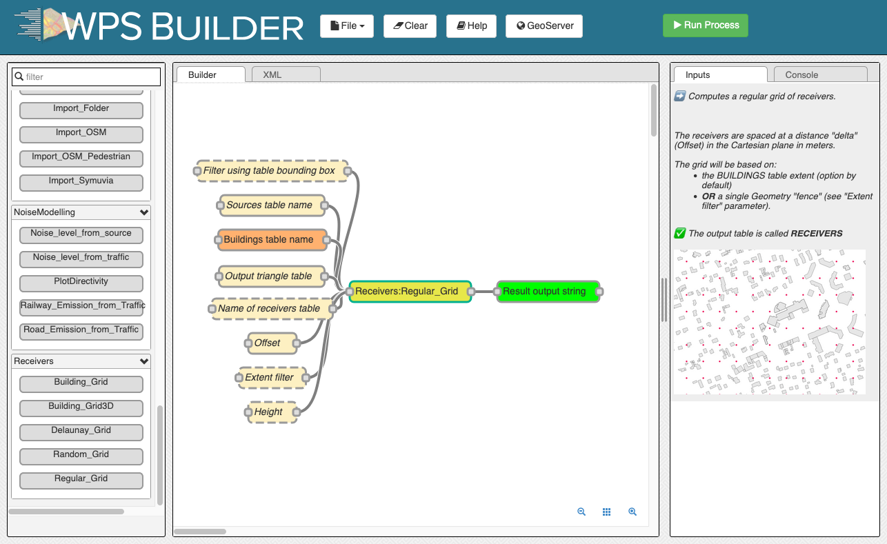
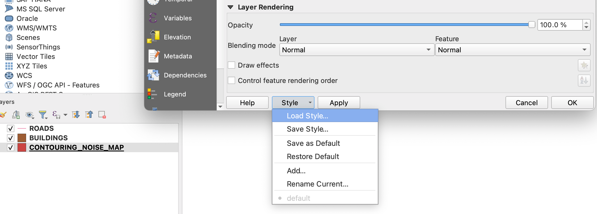
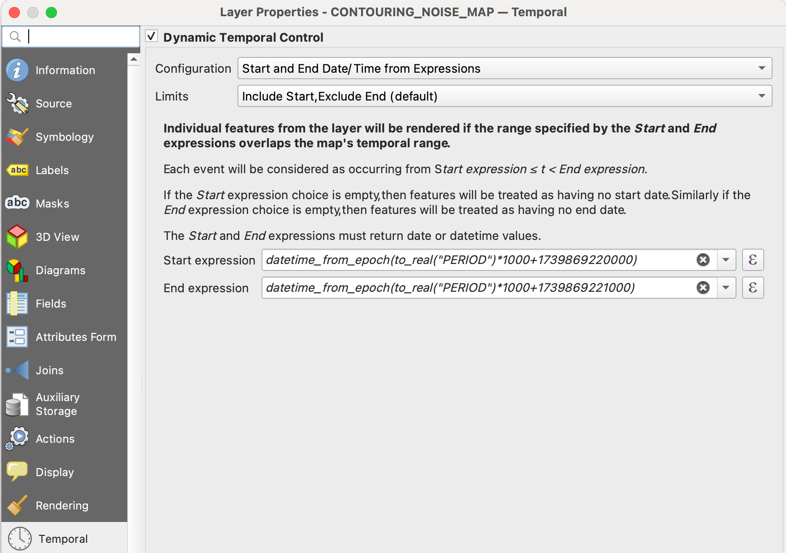
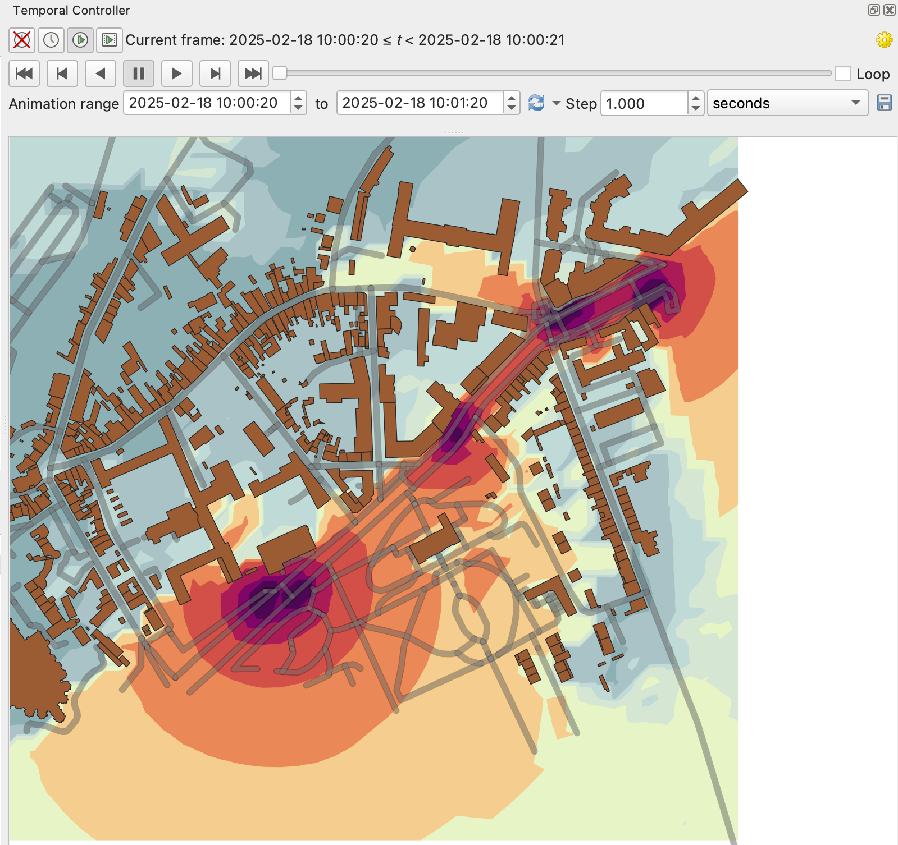

Dynamic Tutorial - GUI
^^^^^^^^^^^^^^^^^^^^^^^^^^^^^^^^^^^^

Many publications have emerged showcasing the use of **NoiseModelling** to create dynamic maps (see `scientific production`_).

.. _scientific production : https://noisemodelling.readthedocs.io/en/latest/Scientific_production.html

If you'd like to achieve similar results but you feel a bit lost, this tutorial is here to help you navigate through the process.

There are three main approaches to creating dynamic maps using NoiseModelling:

1. **A road network with a single traffic flow**  
   You have a road network and a single traffic flow associated with a specific time period (e.g., 24h). You want to compute dynamic indicators such as **L10**, **L90**, or the **number of events exceeding a threshold** or to get time series for the same time period.

2. **A road network with traffic flows at regular intervals**  
   You have a road network and traffic flow data available at regular intervals (e.g., hourly or every 15 minutes), and you want to generate a dynamic noise map every 15 min.

3. **A road network with associated spatio-temporal data of moving sources**
   You have spatio-temporal information about vehicles moving around a network (e.g., from traffic simulations such as Simuvya or SUMO; or from trajectories of drones). You want to compute **time-series data at each receiver** corresponding to the passage of these sources.

A Word of Caution
-----------------

**Caution** : In all these cases, we assume that the **sound attenuation between the source and receiver remains constant throughout the calculation**. This is a strong approximation, and there are ways to account for variations, but this tutorial will not cover such specific cases.

Dynamic mapping has its subtleties, and it's important to be aware of them to avoid errors. We recommend referring to the following documents for a better understanding of these concepts:

- Can, A., & Aumond, P. (2018). Estimation of road traffic noise emissions: The influence of speed and acceleration. Transportation Research Part D: Transport and Environment, 58, 155-171.
- Gozalo, G. R., Aumond, P., & Can, A. (2020). Variability in sound power levels: Implications for static and dynamic traffic models. Transportation Research Part D: Transport and Environment, 84, 102339.
- Le Bescond, V., Can, A., Aumond, P., & Gastineau, P. (2021). Open-source modeling chain for the dynamic assessment of road traffic noise exposure. Transportation Research Part D: Transport and Environment, 94, 102793.

Assumptions are freely made, specific formats are expected, and so on. To understand the required data formats and check the expected structure of the input tables, please refer also to the example input tables and spatial layers!

Case 1: A Road Network with a Single Traffic Flow
----------------------------------------------------

Import the road network (with arbitrary traffic flows) and buildings from an OSM file
~~~~~~~~~~~~~~~~~~~~~~~~~~~~~~~~~~~~~~~~~~~~~~~~~~~~~~~

Use Import_OSM WPS block

#. ``Path of the osm file``: Enter the path of the provided Open Street map file (can be relative to NoiseModelling): ``data_dir/data/wpsdata/map.osm.gz``
#. ``Target projection identifier``: Enter the official France projection for this tutorial files ``2154``
#. ``Remove tunnels``: Check it
#. ``Do not import surface``: Check it as we will not use this output

Create a receiver grid using 25 meters step in a grid pattern
~~~~~~~~~~~~~~~~~~~~~~~~~~~~~~~~~~~~~~~~~~~~~~~~~~~~~~~

Use Regular_Grid WPS block

#. ``Table bounding box name``: Enter ``ROADS`` The receivers will use  the envelope of the ROADS table.
#. ``Offset``: Enter ``15`` for 15 meters distance
#. ``Output triangle table``: Check it in order to be able to generate the iso contours
#. ``height``: Enter ``1.5``

Convert traffic to dynamic traffic flow
~~~~~~~~~~~~~~~~~~~~~~~~~~~~~~~~~~~~~~~~~~~~~~~~~~~~~~~

From the network with traffic flow to individual trajectories with associated Lw

#. The Probabilistic method, this method place randomly the vehicles on the network according to the traffic flow
#. The Poisson method place the vehicles on the network according to the traffic flow following a poisson law,
 it keeps a coherence in the time series of the noise level

Use the ``Dynamic:Flow_2_Noisy_Vehicles`` WPS block:

#. ``Method``: Enter ``TNP`` Use the Poisson method
#. ``Roads table name``: Enter ``ROADS``
#. ``timestep``: Enter ``1``
#. ``duration``: Enter ``60``
#. ``gridStep``: Enter ``10``

Compute noise level at receivers points for each receiver-period
~~~~~~~~~~~~~~~~~~~~~~~~~~~~~~~~~~~~~~~~~~~~~~~~~~~~~~~

Use the ``NoiseModelling:Noise_level_from_source`` WPS block

#. ``Buildings table name``: Enter ``BUILDINGS``
#. ``Source geometry table name``: Enter ``SOURCES_GEOM`` Contain only the geometries of the sources (points)
#. ``Source emission table name``: Enter ``SOURCES_EMISSION`` Contain for each source index and period the noise emission
#. ``Receivers table name``: Enter ``RECEIVERS``
#. ``Max Error (dB)``: Enter ``3`` Will skip further sources, reduce the computation time for this tutorial
#. ``Maximum source receiver distance``: Enter ``800``
#. ``Diffraction on horizontal edges``: Check it
#. ``Order of reflexion``: Enter ``0``

Compute noise indicators
~~~~~~~~~~~~~~~~~~~~~~~~~~~~~~~~~~~~~~~~~~~~~~~~~~~~~~~

This step is optional, it compute the LA10, LA50 and LA90 at each receiver from the table RECEIVERS_LEVEL

Use the ``Acoustic_Tools:DynamicIndicators`` wps block

#. ``tableName``: Enter ``RECEIVERS_LEVEL``
#. ``columnName``: Enter ``LAEQ``

Compute iso-surfaces for each time period
~~~~~~~~~~~~~~~~~~~~~~~~~~~~~~~~~~~~~~~~~~~~~~~~~~~~~~~

Generate a dynamic iso-contour map for each time period based on the LAEQ of the receivers.

Use the ``Acoustic_Tools:Create_Isosurface`` wps block

#. ``Sound levels table``: Enter ``RECEIVERS_LEVEL``
#. ``Smooth coefficient``: Enter ``0``

Export Map to QGis
~~~~~~~~~~~~~~~~~~~~~~~~~~~~~~~~~~~~~~~~~~~~~~~~~~~~~~~

Using ``Export_Table`` block export the following tables as files in any folder.

#. ``CONTOURING_NOISE_MAP``
#. ``BUILDINGS``
#. ``ROADS``

Configure QGis to display time dependant map
~~~~~~~~~~~~~~~~~~~~~~~~~~~~~~~~~~~~~~~~~~~~~~~~~~~~~~~

Load the 3 files in QGIS. ``Contouring_noise_map`` must be ordered as the last layer (rendered in the bottom)

Load the style for contouring noise map:

Load the style located in the NoiseModelling folder ``Docs/styles/style_beate_tomio.sld``

In QGis in time window paste the following formulae:

``datetime_from_epoch(to_real("PERIOD")*1000+1739869220000)``
``datetime_from_epoch(to_real("PERIOD")*1000+1739869221000)``

Epoch is in millisecond, so we multiply by 1000 and add any base epoch time. The step end 1000 milliseconds after the start period.

With the navigation bar of QGis you can select the period to display.

Case 2: A Road Network with Traffic Flows at Regular Intervals
---------------------------------------------------------------

This case is similar to the **MATSim** use case (`here <Matsim_Tutorial.rst>`_), but this tutorial generalizes the approach to fit other datasets.

This sample dataset used in this example was kindly provided by Valentin Lebescond from Université Gustave Eiffel.

Import Buildings for your study area
~~~~~~~~~~~~~~~~~~~~~~~~~~~~~~~~~~~~~~~~~~~~~~~~~~~~~~~

Use ``Import File`` WPS block

#. ``Path of the input File``: Enter the path of building (can be relative to NoiseModelling): ``data_dir/data/wpsdata/Dynamic/Z_EXPORT_TEST_BUILDINGS.geojson``
#. ``Projection identifier``: Enter SRID ``2154``
#. ``Output table name``: Enter ``buildings``

Import the road network
~~~~~~~~~~~~~~~~~~~~~~~~~~~~~~~~~~~~~~~~~~~~~~~~~~~~~~~

Use ``Import File`` WPS block

#. ``Path of the input File``: Enter the path of building (can be relative to NoiseModelling): ``data_dir/data/wpsdata/Dynamic/Z_EXPORT_TEST_TRAFFIC.geojson``
#. ``Projection identifier``: Enter SRID ``2154``
#. ``Output table name``: Enter ``roads``

Create a receiver grid using 25 meters step in a grid pattern
~~~~~~~~~~~~~~~~~~~~~~~~~~~~~~~~~~~~~~~~~~~~~~~~~~~~~~~

Use ``Regular_Grid`` WPS block

#. ``Table bounding box name``: Enter ``ROADS`` The receivers will use  the envelope of the ROADS table.
#. ``Offset``: Enter ``25`` for 25 meters distance
#. ``height``: Enter ``1.5``

Split geometry and traffic periods
~~~~~~~~~~~~~~~~~~~~~~~~~~~~~~~~~~~~~~~~~~~~~~~~~~~~~~~

In the table ROADS, the traffic information is given for each period in the TIME column.

The following WPS block aggregate roads by the geometry and place the associated pair IDSOURCE/PERIOD
with the corresponding road traffic into the SOURCES_EMISSION table.

Use the block ``Dynamic::Split_Sources_Period`` :

#. ``Source table name``: Enter ``ROADS``
#. ``Source index field name``: Enter ``LINK_ID``
#. ``Source period field name``: Enter ``TIME``. The field time will be renamed to PERIOD.

Two output table is created ``SOURCES_GEOM`` and ``SOURCES_EMISSION``

Compute noise level at receivers points for each receiver-period
~~~~~~~~~~~~~~~~~~~~~~~~~~~~~~~~~~~~~~~~~~~~~~~~~~~~~~~

Use the ``NoiseModelling:Noise_level_from_source`` WPS block

#. ``Buildings table name``: Enter ``BUILDINGS``
#. ``Source geometry table name``: Enter ``SOURCES_GEOM`` Contain only the geometries of the sources (points)
#. ``Source emission table name``: Enter ``SOURCES_EMISSION`` Contain for each source index and period the noise emission
#. ``Receivers table name``: Enter ``RECEIVERS``
#. ``Diffraction on horizontal edges``: Check it
#. ``Order of reflexion``: Enter ``0``

Compute noise indicators
~~~~~~~~~~~~~~~~~~~~~~~~~~~~~~~~~~~~~~~~~~~~~~~~~~~~~~~

This step is optional, it compute the LA10, LA50 and LA90 at each receiver from the table LT_GEOM

Use the ``Acoustic_Tools:DynamicIndicators`` wps block

#. ``tableName``: Enter ``RECEIVERS_LEVEL``
#. ``columnName``: Enter ``LAEQ``

The result table LT_GEOM can be displayed into QGis, if you filter by PERIOD.

Case 3: Spatio-Temporal Data of Moving Sources
----------------------------------------------------

This sample dataset was kindly provided by Sacha Baclet from KTH (0000-0003-2114-8680).

Import Buildings for your study area
~~~~~~~~~~~~~~~~~~~~~~~~~~~~~~~~~~~~~~~~~~~~~~~~~~~~~~~

Use ``Import File`` WPS block

#. ``Path of the input File``: Enter the path of building (can be relative to NoiseModelling): ``data_dir/data/wpsdata/Dynamic/buildings_nm_ready_pop_heights.shp``
#. ``Projection identifier``: Enter SRID ``32635``
#. ``Output table name``: Enter ``buildings``

Import the receivers (or generate your set of receivers using Regular_Grid script for example)
~~~~~~~~~~~~~~~~~~~~~~~~~~~~~~~~~~~~~~~~~~~~~~~~~~~~~~~

Use ``Import File`` WPS block

#. ``Path of the input File``: Enter the path of building (can be relative to NoiseModelling): ``data_dir/data/wpsdata/Dynamic/receivers_python_method0_50m_pop.shp``
#. ``Projection identifier``: Enter SRID ``32635``
#. ``Output table name``: Enter ``receivers``
#. ``height``: Enter ``1.5``

Import the road network
~~~~~~~~~~~~~~~~~~~~~~~~~~~~~~~~~~~~~~~~~~~~~~~~~~~~~~~

Use ``Import File`` WPS block

#. ``Path of the input File``: Enter ``data_dir/data/wpsdata/Dynamic/network_tartu_32635_.geojson``
#. ``Projection identifier``: Enter SRID ``32635``
#. ``Output table name``: Enter ``network_tartu``

Add primary key column to the road network (Optional)
~~~~~~~~~~~~~~~~~~~~~~~~~~~~~~~~~~~~~~~~~~~~~~~~~~~~~~~

Use ``Add_Primary_Key`` WPS block

#. ``Name of the column``: Enter ``PK``
#. ``Name of the table``: Enter SRID ``network_tartu``

Import the vehicles trajectories
~~~~~~~~~~~~~~~~~~~~~~~~~~~~~~~~~~~~~~~~~~~~~~~~~~~~~~~

Use ``Import File`` WPS block

#. ``Path of the input File``: Enter ``data_dir/data/wpsdata/Dynamic/SUMO.geojson``
#. ``Projection identifier``: Enter SRID ``32635``
#. ``Output table name``: Enter ``vehicle``

Create point sources from the network every 10 meters
~~~~~~~~~~~~~~~~~~~~~~~~~~~~~~~~~~~~~~~~~~~~~~~~~~~~~~~

This point source will be used to compute the noise attenuation level from them to each receiver.
The created table will be named SOURCES_GEOM.

Use ``Point_Source_From_Network`` WPS block

#. ``Input table name``: Enter ``network_tartu``
#. ``gridStep``: Enter SRID ``10``

Create a table with the noise level from the vehicles and snap the vehicles to the point sources
~~~~~~~~~~~~~~~~~~~~~~~~~~~~~~~~~~~~~~~~~~~~~~~~~~~~~~~

Use ``Ind_Vehicles_2_Noisy_Vehicles`` WPS block

#. ``Source geometry table``: Enter ``SOURCES_GEOM``
#. ``Individual Vehicles table``: Enter ``vehicle``
#. ``Snap distance``: Enter ``30`` This is the maximal distance (m) to reattach individual vehicles position to the source points
#. ``Vehicles table format``: Enter ``SUMO``

Compute noise attenuation for each receiver-source pairs
~~~~~~~~~~~~~~~~~~~~~~~~~~~~~~~~~~~~~~~~~~~~~~~~~~~~~~~

Unlike the previous tutorial we will use an alternative approach here by storing the attenuation between all sources and receivers first.
The applying later this attenuation to the emission level for each period.

Use the ``NoiseModelling:Noise_level_from_source`` WPS block

#. ``Buildings table name``: Enter ``BUILDINGS``
#. ``Source geometry table name``: Enter ``SOURCES_GEOM`` Contain only the geometries of the sources (points)
#. ``Receivers table name``: Enter ``RECEIVERS``
#. ``Maximum source receiver distance``: Enter ``300``
#. ``Diffraction on horizontal edges``: Check it
#. ``Order of reflexion``: Enter ``0``
#. ``Separate receiver level by source identifier``: Check it to have the SOURCEID column on the output

Apply attenuation on emission levels
~~~~~~~~~~~~~~~~~~~~~~~~~~~~~~~~~~~~~~~~~~~~~~~~~~~~~~~

Compute the noise level from the moving vehicles to the receivers.
The output table is called here LT_GEOM and contains the time series of the noise level at each receiver.

Use the ``Dynamic:Noise_From_Attenuation_Matrix`` WPS block

#. ``LW(PERIOD)``: Enter ``SOURCES_EMISSION``
#. ``Attenuation Matrix Table name``: Enter ``RECEIVERS_LEVEL``
#. ``outputTable Matrix Table name``: Enter ``LT_GEOM``

Compute noise indicators
~~~~~~~~~~~~~~~~~~~~~~~~~~~~~~~~~~~~~~~~~~~~~~~~~~~~~~~

This step is optional, it compute the LA10, LA50 and LA90 at each receiver from the table LT_GEOM

Use the ``Acoustic_Tools:DynamicIndicators`` wps block

#. ``tableName``: Enter ``RECEIVERS_LEVEL``
#. ``columnName``: Enter ``LAEQ``

The result table LT_GEOM can be displayed into QGis, if you filter by PERIOD.

.. note::
    All this tutorial done with Groovy is written on this unit test source code: `Github source <https://github.com/Universite-Gustave-Eiffel/NoiseModelling/blob/main/wps_scripts/src/test/groovy/org/noise_planet/noisemodelling/wps/TestDynamic.groovy>`_
