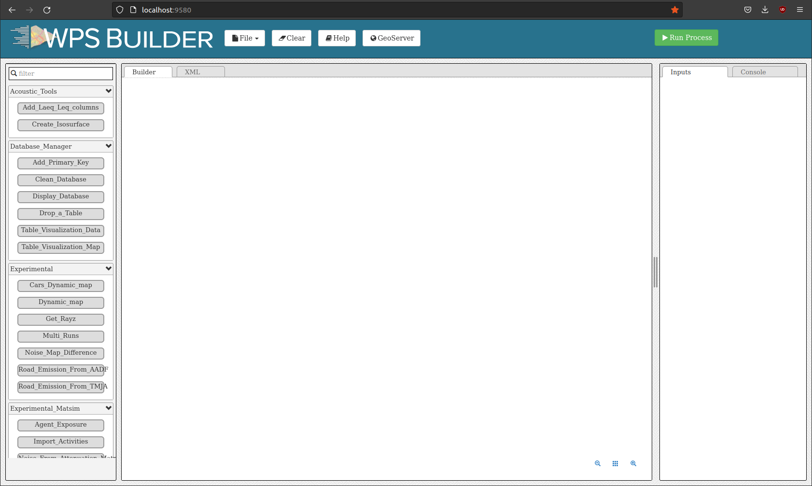
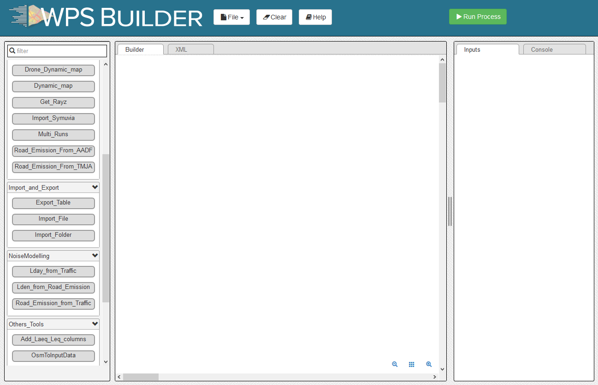
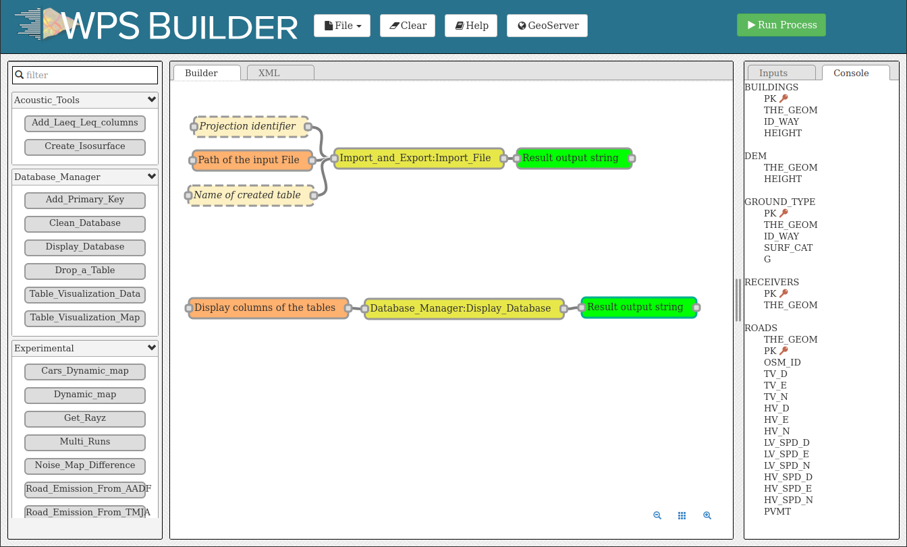
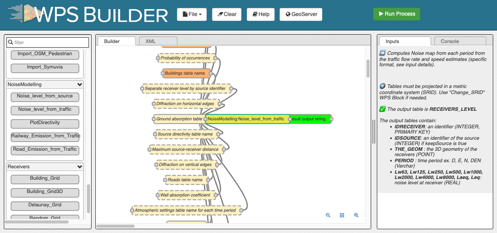

Get Started - GUI
^^^^^^^^^^^^^^^^^^^^^^^^^^^^^^^^^^^^

Below we present a simple application case, allowing you to discover NoiseModelling through its Graphical User Interface .

Step 1: Download NoiseModelling
~~~~~~~~~~~~~~~~~~~~~~~~~~~~~~~~~~~~~~~~~

Download the latest realease of NoiseModelling on `Github`_. 

* Windows: you can directly download and execute the ``NoiseModelling_5.x.x_install.exe`` installer file *(or you can also follow Linux / Mac instructions below)*
* Linux or Mac: download the ``NoiseModelling_5.x.x.zip`` file and unzip it into a chosen directory

.. warning::
    The chosen directory can be anywhere, but be sure that you have write access. If you are using the computer of your company, the Program Files folder is probably not a good idea.

.. warning::
    For **Linux** and **Mac** users, please make sure your Java environment is well setted. For more information, please read the page :doc:`Requirements`. **Windows** users who are using the ``.exe`` file are not concerned since the Java Runtime Environment is **already embeded**.

.. note::
    Only from version 3.3, NoiseModelling releases include the user interface described in this tutorial. 

.. _Github : https://github.com/Ifsttar/NoiseModelling/releases

Step 2: Start NoiseModelling GUI
~~~~~~~~~~~~~~~~~~~~~~~~~~~~~~~~~~~~~~~~~

As seen in the page ":doc:`Architecture`", NoiseModelling can be used through a Graphic User Interface (GUI), thanks to Geoserver and WPS Builder bricks.

In this tutorial, we will use the default and already configured H2GIS database.

Those tools (Geoserver, WPS Builder and H2GIS) are already included in the archive. So you don't have to install them before.

To launch NoiseModelling with GUI, please execute :

* Windows: ``NoiseModelling.exe`` or ``NoiseModelling_xxx\bin\startup_windows.bat``
* Linux or Mac: ``NoiseModelling_xxx/bin/startup_linux_mac.sh`` *(check authorize file execution in property of this file before)*

and wait until ``INFO:oejs.Server:main:Started`` is written in your command prompt.

.. warning::
    Depending on your computer configuration, the NoiseModelling launch can take some time. Be patient.

NoiseModelling with GUI is now started. 

.. tip::
    NoiseModelling will be open as long as the command window is open. If you close it, NoiseModelling will automatically be closed and you will not be able to continue with the tutorial.

.. _GeoServer : http://geoserver.org/
.. _H2GIS : http://www.h2gis.org/

Step 3: Open NoiseModelling GUI
~~~~~~~~~~~~~~~~~~~~~~~~~~~~~~~~~~~~~~~~~

The NoiseModelling GUI is built thanks to the :doc:`WPS_Builder` brick. To open it, just go to http://localhost:9580 using your preferred web browser.

.. warning::
    On former versions of NoiseModelling, the url was: http://localhost:8080/geoserver/web/

You are now ready to discover the power of NoiseModelling!

Step 4: Load input files
~~~~~~~~~~~~~~~~~~~~~~~~~~~~~~~~~~~~~~~~~

To compute your first noise map, you will need to load input geographic files into the NoiseModelling database. 

In this tutorial, we have 5 layers, zoomed in the city center of `Lorient`_ (France): Buildings, Roads, Ground type, Topography (DEM) and Receivers.

.. _Lorient : https://www.openstreetmap.org/relation/30305

In the ``noisemodelling/data_dir/data/wpsdata/`` folder, you will find the 5 files (4 shapefiles and 1 geojson) corresponding to these layers.

You can import these layers in your database using the ``Import File`` or ``Import Folder`` blocks.

- Drag ``Import File`` block into the Builder window 
- Select ``Path of the input File`` box and write ``data_dir/data/wpsdata/buildings.shp`` in the field ``PathFile`` *(on the right-side column)*
- Then click on ``Run Process`` after selecting one of the sub-boxes of your process

Repeat this operation for the 4 other files:

- ``data_dir/data/wpsdata/ground_type.shp``
- ``data_dir/data/wpsdata/receivers.shp``
- ``data_dir/data/wpsdata/ROADS2.shp``
- ``data_dir/data/wpsdata/dem.geojson``

Files are uploaded to database when the Console window displays ``The table x has been uploaded to database``.

.. note::
    - If you have the message ``Error opening database``, please refer to the note in Step 1.
    - The process is supposed to be quick (<5 sec.). In case of out of time, try to restart NoiseModelling (see Step 2).
    - Orange blocks are mandatory
    - Beige blocks are optional
    - If all input blocks are optional, you must modify at least one of these blocks to be able to run the process
    - Blocks get solid border when they are ready to run
    - Read the :doc:`WPS_Builder` page for more information

Once done, you can check if the tables have been well imported in the database. To do so, drag/drop and execute the ``Display_Database`` WPS script (in the "Database_Manager" part). You should see on the right panel the tables list (and their columns if you checked the the option in the ``Display columns of the tables`` block).

Step 5: Run Calculation
~~~~~~~~~~~~~~~~~~~~~~~~~~~~~~~~~~~~~~~~~

To run Calculation you have to drag the block ``Noise_level_from_traffic`` into WPS Builder window.

Then, select the orange blocks and indicate the name of the corresponding table in your database:

- Building table name : ``BUILDINGS``
- Sources table name : ``ROADS2`` This table contain geometry of roads with traffic for day, evening and night
- Receivers table name : ``RECEIVERS`` Location where to evaluate noise level
- DEM table name : ``DEM`` Digital elevation model
- Ground absorption table : ``GROUND_TYPE`` Nature of the ground
- Diffraction on horizontal edges : Check it (Sound propagation go over buildings)
- Maximum source-receiver distance: Set ``2000`` meters (do not look for sound sources further than 2km)
- Order of reflexion: Set ``0`` to disable it (faster but less accurate)

The beige blocks correspond to optional parameters (e.g ``DEM table name``, ``Ground absorption table name``, ``Diffraction on vertical edges``, ...).

When ready, you can press ``Run Process``.

As a result, the table ``RECEIVERS_LEVEL`` will be created in your database. This table correspond to the noise levels, based on receiver points, the column PERIOD correspond to the 4 different period of the day (D E N and DEN).

Step 6: Export (& see) the results
~~~~~~~~~~~~~~~~~~~~~~~~~~~~~~~~~~~~~~~~~

You can now export the output tables *(one by one)* in your favorite export format using ``Export_Table`` block, giving the path of the file you want to create.

.. warning::
    Dont' forget to add the file extension (*e.g* ``c:/home/receivers_level.geojson`` or ``c:/home/receivers_level.shp``) (Read more info about file extensions here: :doc:`Tutorials_FAQ`)

.. figure:: images/tutorial/Tutorial1_Image3.PNG
   :align: center

For example, you can choose to export the tables in ``.shp`` format. This format can be read with most of GIS tools such as the free and open-source `QGIS`_ and `SAGA`_ softwares.

.. _QGIS : https://www.qgis.org/fr/site/
.. _SAGA : http://www.saga-gis.org/en/index.html

.. note::
    For those who are new to GIS and want to get started with QGIS, we advise you to follow `this tutorial`_ as a start.

.. _this tutorial : https://docs.qgis.org/3.22/en/docs/training_manual/basic_map/index.html

To obtain the following image, filter use the styling vector options in your GIS and assign a color gradient to ``LAEQ`` column of your exported ``RECEIVERS_LEVEL`` table.

.. figure:: images/tutorial/Tutorial1_Image4.PNG
   :align: center

To display the result for a period you have to filter the rendering by the field PERIOD in QGIS.

.. figure:: images/tutorial/Tutorial1_FilterMenu.png
   :align: center

   Popup menu

.. figure:: images/tutorial/Tutorial1_FilterWindow.png
   :align: center

   Filter window

.. tip::
    Now that you have made your first noise map (congratulations!), you can try again, adding / changing optional parameters to see the differeneces.

Step 7: Know the possibilities
~~~~~~~~~~~~~~~~~~~~~~~~~~~~~~~~~~~~~~~~~

Now that you have finished this introduction tutorial, take the time to read the description of each of the WPS blocks present in your NoiseModelling version.

By clicking on each of the inputs or outputs, you will find a lot of information.

.. figure:: images/tutorial/Tutorial1_ImageLast.gif
   :align: center

