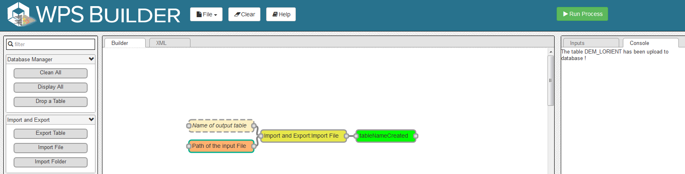
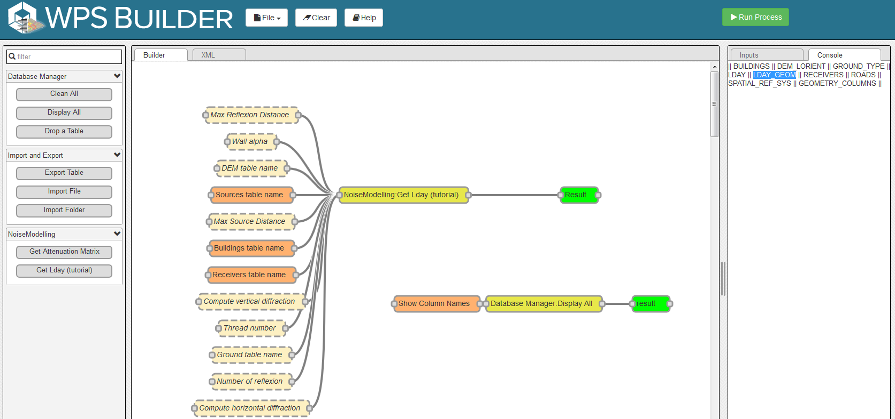
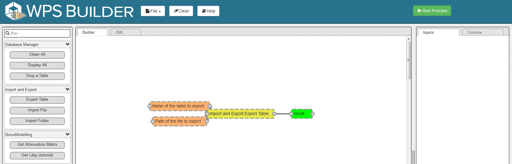
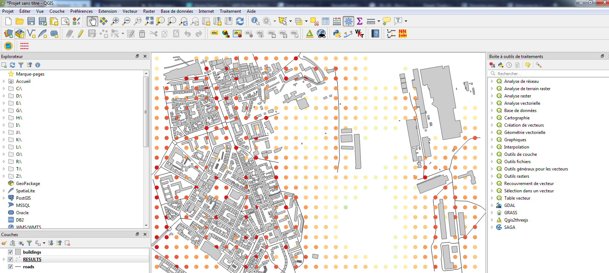

Get Started - Tutorial
^^^^^^^^^^^^^^^^^^^^^^^^^^^^^^^^^^^^

Requirements: Install Java
~~~~~~~~~~~~~~~~~~~~~~~~~~~~~~~~~~~~~~~~~

Please install JAVA version v8.x. Currently only version 8 of Java is compatible

- Download Java here : https://www.java.com/fr/download/

- You can check if JAVA_HOME environnement variable is well settled to your last installed java folder using :literal:`echo %JAVA_HOME%` in your command prompt. You should have a result similar to :literal:`C:\\Program Files (x86)\\Java\\jre1.8.x\\`

-  If JAVA_HOME environnement variable is not well settled , you can refer to `this document`_ for example.

.. warning::
    The command promprt should print :literal:`C:\\Program Files (x86)\\Java\\jre1.8.x\\` whithout the bin directory. If JAVA_HOME is settled as :literal:`C:\\Program Files (x86)\\Java\\jre1.8.x\\bin`, it will not work.
    
.. _this document : https://confluence.atlassian.com/doc/setting-the-java_home-variable-in-windows-8895.html   

Step 1: Download the latest release
~~~~~~~~~~~~~~~~~~~~~~~~~~~~~~~~~~~~~~~~~

- Download the latest realease on `Github`_. 
- Unzip the downloaded file into a chosen directory.

.. note::
    - Only from version 3.0, NoiseModelling releases include the user interface described in this tutorial. 
    - The chosen directory can be anywhere but be sure that you have write access. If you are using the computer of your company, the Program Files folder is probably not a good idea. 

.. _Github : https://github.com/Ifsttar/NoiseModelling/releases

Step 2: Run GeoServer
~~~~~~~~~~~~~~~~~~~~~~~~~~~~~~~~~~~~~~~~~

NoiseModelling connects to a PostGIS or H2GIS database. The database needs to be hosted by a server. 
In this tutorial the server type is `GeoServer`_ and the database type is `H2GIS`_. 

To run the server, please execute "startup" from your own Geoserver folder :

- Geoserver\\bin\\startup.bat for Windows Users 
- Geoserver\\bin\\startup.sh for Linux Users (check authorize file execution in property of this file before)

and wait until :literal:`INFO:oejs.Server:main:Started` is written in your command prompt.

Your local server is now started. 

.. warning::
    Your server will be open as long as the command window is open. If you close it, the server will automatically be closed and you will not be able to continue with the tutorial.

.. tip::
    You can consult it via your web browser : http://localhost:8080/geoserver/web/
    login (default): admin
    password (default): admin

.. _GeoServer : http://geoserver.org/
.. _H2GIS : http://www.h2gis.org/

Step 3: Run WPSBuilder
~~~~~~~~~~~~~~~~~~~~~~~~~~~~~~~~~~~~~~~~~

The WPSBuilder is the user interface used to communicate between the GeoServer and NoiseModelling.

To launch WPSBuilder, please run:

- WPSBuilder\\index.html

Step 4: Upload files to database
~~~~~~~~~~~~~~~~~~~~~~~~~~~~~~~~~~~~~~~~~

To compute your first noise map, you will need 5 layers: Buildings, Roads, Ground type, Topography (DEM) and Receivers.

In the Geoserver\\data_dir\\data\\wpsdata folder, you will find 5 files (4 shapefile and 1 geojson) corresponding to these layers.

You can import these layers in your database using the *Import File* or *Import Folder* blocks.

- Drag *Import File* block into Builder window 
- Select *Path of the input File* block and type ``data_dir/data/wpsdata/buildings.shp`` in the field **pathFile**: 
- Then click on *Run Process* after selecting the yellow block

Files are uploaded to database when the Console window displays :literal:`The table x has been uploaded to database.`

Repeat this operation for other files:

- ``data_dir/data/wpsdata/buildings.shp``
- ``data_dir/data/wpsdata/ground_type.shp``
- ``data_dir/data/wpsdata/receivers.shp``
- ``data_dir/data/wpsdata/roads.shp``
- ``data_dir/data/wpsdata/dem.geojson``

.. note::
    - if you have the message :literal:`Error opening database`, please refer to the note in Step 1.
    - The process is supposed to be quick (<5 sec.). In case of out of time, try to restart the Geoserver (see Step 2).
    - Orange blocks are mandatory
    - Beige blocks are optional
    - if all input blocks are optional, you must modify at least one of these blocks to be able to run the process
    - Blocks get solid border when they are ready to run

Step 5: Run Calculation
~~~~~~~~~~~~~~~~~~~~~~~~~~~~~~~~~~~~~~~~~

To run Calculation you have to drag the block *Get Lday* into WPS Builder window.

Then, select the orange blocks and indicate the name of the corresponding table your database, for example :

- Building table name : "BUILDINGS"
- Sources table name : "ROADS"
- Receivers table name : "RECEIVERS"

Then, you can run the process.

The table LDAY_GEOM will be created in your database.

.. note::
    If you want to know more about the format of the input tables, you can refer to the `WPS Blocks`_ section.

.. tip::
    If you want you can try to change the different parameters.

.. _WPS Blocks : WPS_Blocks.html

Step 6: Export (& see) the results
~~~~~~~~~~~~~~~~~~~~~~~~~~~~~~~~~~~~~~~~~

You can now export the output table in your favorite export format using *Export Table* block.

For example, you can choose to export the table in shp format. This format can be read with many GIS tools such as the open source software Qgis.

