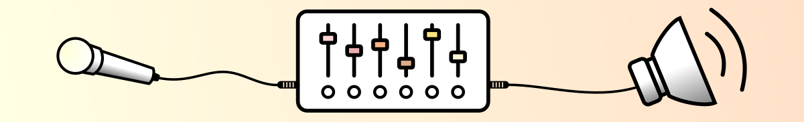
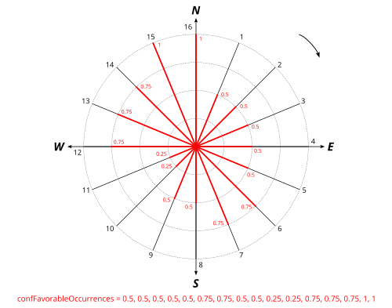
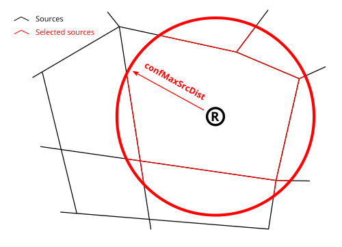
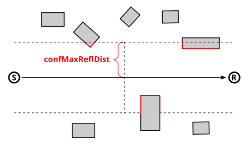
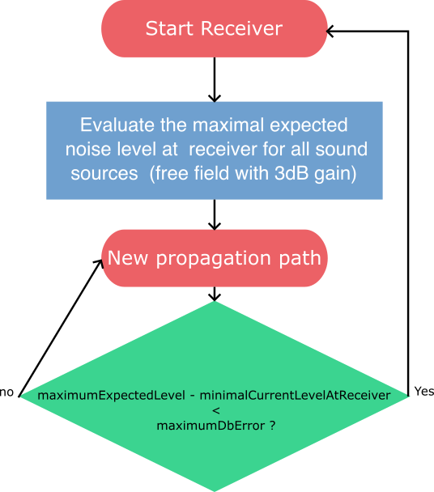

Acoustic parameters
^^^^^^^^^^^^^^^^^^^^^^^^^^^^^^^^^^^^

In the different WPS scripts of NoiseModelling, you will find many input parameters, mandatory or optional. 

Below we list the most important ones, indicating, where necessary, the default values and those we recommend (from an acoustic point of view).




The following parameters may be found in the scripts dealing with noise emission or propagation (*e.g* ``Noise_level_from_traffic``, ``Noise_level_from_source```, ...)


Probability of occurrences
--------------------------------

* Parameter name: ``confFavorableOccurrencesXXXXX`` (with ``XXXXX`` = evening, day, night, ...)
* Description: Comma-delimited string containing the probability ([0,1]) of occurrences of favourable propagation conditions. Follow the clockwise direction. The north slice is the last array index (n°16 in the schema below) not the first one
* Type: Double
* Default value: ``0.5, 0.5, 0.5, 0.5, 0.5, 0.5, 0.5, 0.5, 0.5, 0.5, 0.5, 0.5, 0.5, 0.5, 0.5, 0.5``
* Recommended value: 



Relative humidity
--------------------------------

* Parameter name: ``confHumidity``
* Description: Humidity for noise propagation (%) [0,100]
* Type: Double
* Default value: ``70``
* Recommended value: depends on the average conditions at the location where you perform the simulation

Air temperature
--------------------------------

* Parameter name: ``confTemperature``
* Description: Air temperature (°C)
* Type: Double
* Default value: ``15``
* Recommended value: depends on the average conditions at the location where you perform the simulation

Order of reflexion
--------------------------------

* Parameter name: ``confReflOrder``
* Description: Maximum number of reflections to be taken into account. Warning: adding 1 order increases the processing time significantly
* Type: Integer
* Default value: ``1``
* Recommended value: ``1`` or ``2``

Diffraction on horizontal edges
--------------------------------

* Parameter name: ``confDiffHorizontal``
* Description: Compute or not the diffraction on horizontal edges
* Type: Boolean
* Default value: ``False``
* Recommended value: ``True``

Diffraction on vertical edges
--------------------------------

* Parameter name: ``confDiffVertical``
* Description: Compute or not the diffraction on vertical edges. Following Directive 2015/996, enable this option for rail and industrial sources only
* Type: Boolean
* Default value: ``False``
* Recommended value: 

Maximum source-receiver distance
----------------------------------

* Parameter name: ``confMaxSrcDist``
* Description: Maximum distance between source and receiver (meters)
* Type: Double
* Default value: ``150``
* Recommended value: Between ``500`` and ``800``



Maximum source-reflexion distance
------------------------------------

* Parameter name: ``confMaxReflDist``
* Description: Maximum search distance of walls / facades from the "Source-Receiver" segment, for the calculation of specular reflections (meters)
* Type: Double
* Default value: ``50``
* Recommended value: Between ``350`` and ``800``




Wall absorption coefficient
--------------------------------

* Parameter name: ``paramWallAlpha``
* Description: Wall absorption coefficient [0,1] (between ``0`` : "fully absorbent" and ``1`` : "fully reflective")
* Type: Double
* Default value: ``0.1``
* Recommended value: ``0.1``

Separate receiver level by source identifier
---------------------------------------------

* Parameter name: ``confExportSourceId``
* Description: Keep source identifier in output in order to get noise contribution of each noise source
* Type: Boolean
* Default value: ``False``
* Recommended value: 

Thread number
--------------------------------

* Parameter name: ``confThreadNumber``
* Description: Number of thread to use on the computer
* Type: Integer
* Default value: ``0`` (``0`` = Automatic. Will check the number of cores and apply -1. (*e.g*: 8 cores = 7 cores will be used))
* Recommended value: ``0``


Max Error (dB)
--------------------------------

* Parameter name: ``confMaxError``
* Description: Threshold for excluding negligible sound sources in calculations. Default value: **0.1**. This parameter is ignored if no emission level is specified or if you set it to 0 dB. This parameter have a great impact on computation time.
* Type: Double
* Default value: ``0.1`` dB
* Recommended value: ``0.1`` dB

Maximum error algorithm explanation
************************************

In order to reduce computation time, we can ignore far away sound source that will not change the noise level at the receiver location.

Before looking for propagation path, all sound sources are fetched in the radius of ``confMaxSrcDist`` then sorted by distance from the receiver position.

After each propagation path is found, we evaluate if the difference between the accumulated noise level of all previous sound sources with the expected maximum noise level at the receiver with all sound sources is greater than the maximum error parameter.

If the next sound sources contribution is negligible we move to the next receiver point.

Minimal and maximal values are over all emission periods specified on the sound sources. The maximal expected noise level value is updated after each sound source is processed.




