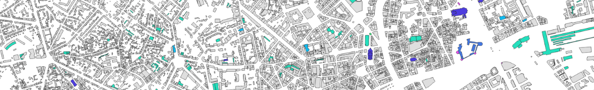
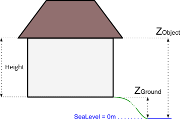
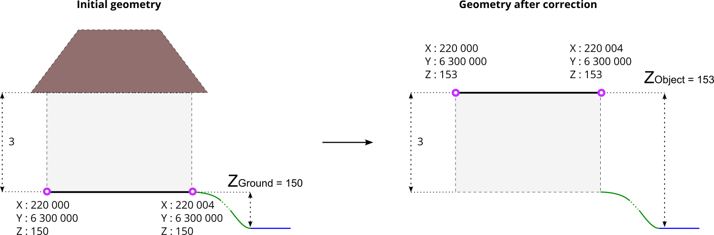
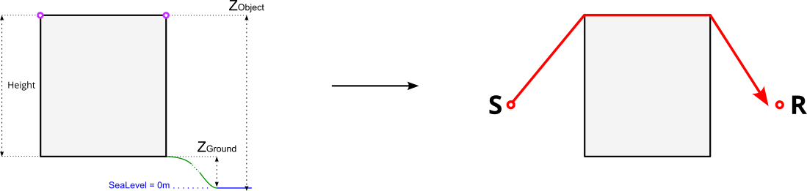
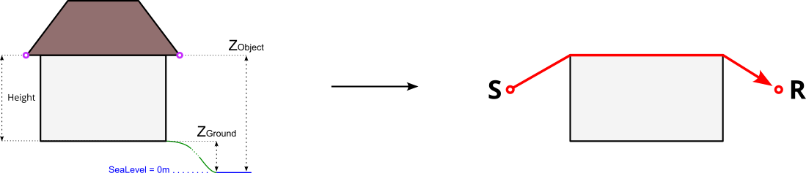
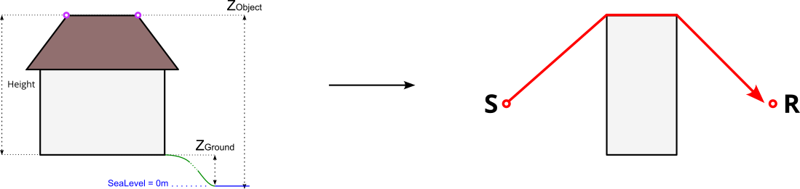
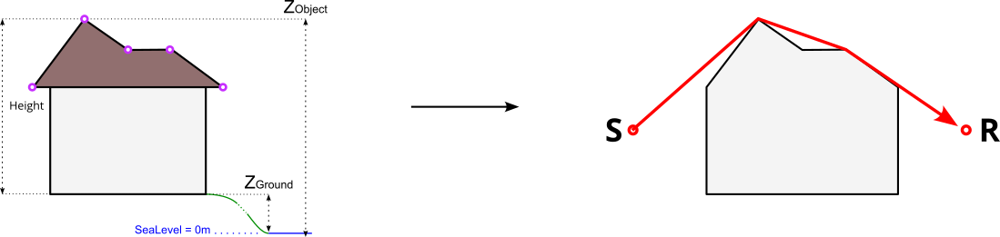
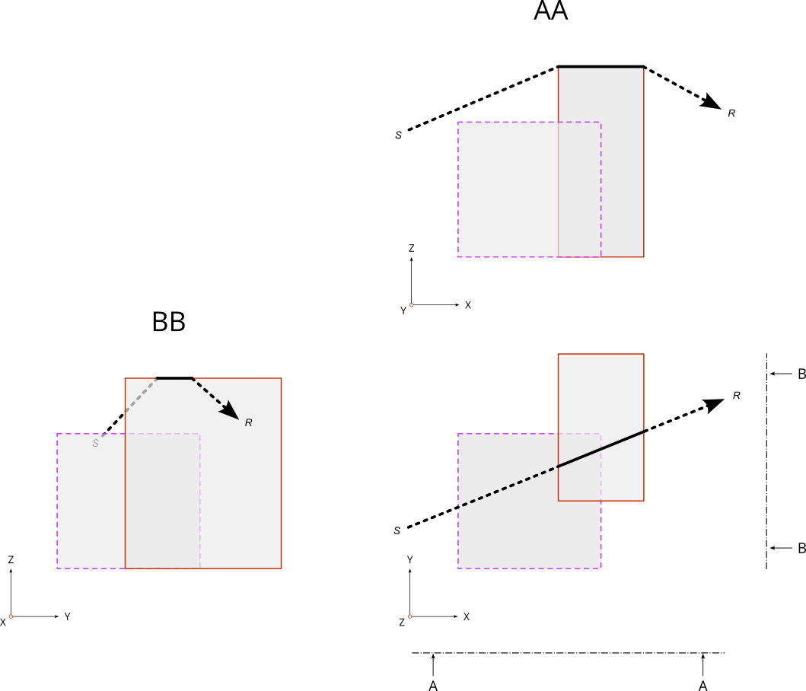

Buildings
^^^^^^^^^^^^^^^^^^^^^^^^^^^^^^^^^^^^

NoiseModelling is a tool for producing noise maps. To do so, at different stages of the process, the application needs input data, respecting a strict formalism.

Below we describe the table ``BUILDINGS``, dealing with buildings. 

The other tables are accessible via the left menu in the ``Input tables & parameters`` section.

Table definition
---------------------

.. warning::
	In the list below, the columns noted with ``*`` are mandatory

* ``THE_GEOM`` *
	* Description: building's geometry. It can be in 2D (stuck to the ground) or in 3D (see :ref:`Geometry modelling` section below)
	* Type: Geometry (``POLYGON`` or ``MULTIPOLYGON``)
* ``HEIGHT`` *
	* Description: building's height *(in meters)* 
	* Type: Double
* ``POP``
	* Description: number of inhabitant in the building 
	* Type: Double

.. note::
	If you want to generate a scene without buildings, create two fictitious buildings, placed in two corners of the scene, and assign them a height of 0 meter.

Geometry modelling
---------------------

In NoiseModelling, the geometry of the building is used to calculate the 3D ray path of the acoustic wave. Therefore, we need to know the footprint of the building as well as the points in height (at the roof, the gutter, ...)

To determine the 3D shape of the building we can use some of the following elements:

* ``Zground`` : The ground altitude, exprimed in meters and based on the 0 sea level
* ``Zobject`` : The altitude in the air, exprimed in meters and based on the 0 sea level
* ``HEIGHT``: The height, equal to the diffirence between ``Zobject`` and ``Zground``

In this context, geometry coordinates have to be in 3D, with:

* ``X`` and ``Y`` coordinates corresponding to the building's footprint (or the gutter/roof projection to the ground)
* ``Z`` = ``Zobject`` : coordinate corresponding to the gutter or the roof altitude(s), ...

Z coordinate deduction
-----------------------

Depending on the information you have, NoiseModelling will adpat the process to deduce the ``Zobject`` information and therefore the 3D frame of the building.

Two cases are possible:

1. The geometry has no Z coordinate
~~~~~~~~~~~~~~~~~~~~~~~~~~~~~~~~~~~~~~~~~~~~~~

There is a DEM layer
***********************

The DEM is triangulated. Then, all the vertices of the building are projected onto the triangle below it in order to determine their altitudes. Finally, the minimum altitude is taken and assigned to the whole building: ``Zground`` = Minimum DEM Z value. Then:

* If ``HEIGHT`` > 0 then ``Zobject`` = ``Zground`` + ``HEIGHT``
* If ``HEIGHT`` = 0 then ``Zobject`` = ``Zground`` and Warning message *"Be carreful, some buildings are 0 meter high"*
* If ``HEIGHT`` null or < 0 then Error message *"Not possible to determine Z coordinates"*

There is no DEM layer
***********************

* If ``HEIGHT`` > 0 then ``Zobject`` = ``HEIGHT``
* If ``HEIGHT`` = 0 then ``Zobject`` = 0 and Warning message *"Be carreful, some buildings are 0 meter high"*
* If ``HEIGHT`` null or < 0 then Error message *"Not possible to determine Z coordinates"*

2. The geometry has a Z coordinate
~~~~~~~~~~~~~~~~~~~~~~~~~~~~~~~~~~~~~~~~~~~~~~

* The Z coordinate correspond to ``Zobject``
	* It's ok, your data is already ready to be used by NoiseModelling
* The Z coordinate correspond to ``Zground``
	* You are invited to correct ``Z`` value(s) by changing the information by yourself or by using the dedicated WPS block called ``Correct_building_altitude``

Below is an example with a initial geometry (coordinates are exprimed in French Lambert 93 (`EPSG:2154`_) system) with a ``Zground`` value coupled with ``HEIGHT`` information. After correction, the geometry has a correct Z value, which corresponds to ``Zobject``.

.. _EPSG:2154 : https://epsg.io/2154

Ray path
-----------------------

Depending on the building modelisation and the ``Zobject`` you have, the acoustic wave path will differ.

In the 4 examples below, 

* the left-hand side is dealing with the building's modelisation. Pink circles represents the vertices of the geometry
* the right-hand side represents the corresponding path of the ray (in red), from the sound source (S) to the receiver (R) and how the building (in grey) is "understood" by NoiseModelling.

Case 1 : there is no roof
~~~~~~~~~~~~~~~~~~~~~~~~~~~~~~~~~~~~~~~~~~~~~~

Case 2 : ``Zobject`` is on the gutter level
~~~~~~~~~~~~~~~~~~~~~~~~~~~~~~~~~~~~~~~~~~~~~~

Case 3 : ``Zobject`` is on top ot the roof
~~~~~~~~~~~~~~~~~~~~~~~~~~~~~~~~~~~~~~~~~~~~~~

Case 4 : Complex roof shape
~~~~~~~~~~~~~~~~~~~~~~~~~~~~~~~~~~~~~~~~~~~~~~

Topology
-----------------------

In the table ``BUILDINGS`` there is no topological constraint. Even if it is not recommended, this means that NoiseModelling accepts that the buildings overlap. In this case, the highest points and edges will be retained for the determination of the wave path.

The figure below illustrate this possibility with two buildings that overlaps. The wave is going from the source ``S`` to the receveiver ``R``.

