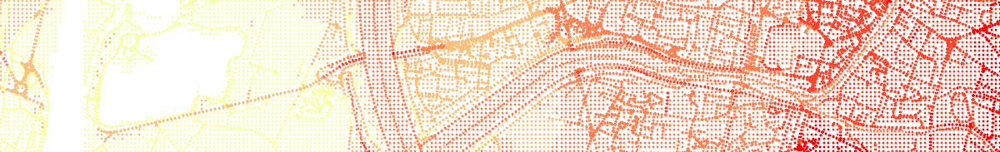
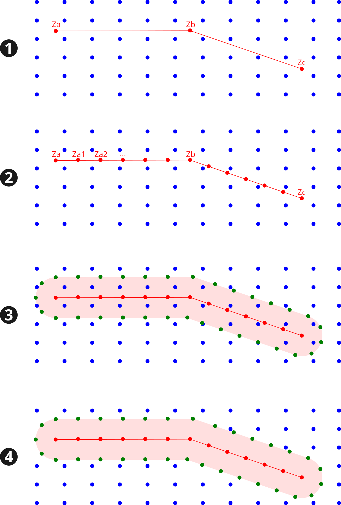

DEM
^^^^^^^^^^^^^^^^^^^^^^^^^^^^^^^^^^^^

NoiseModelling is a tool for producing noise maps. To do so, at different stages of the process, the application needs input data, respecting a strict formalism.

Below we describe the table ``DEM``, dealing with the Digital Elevation Model matrix. 

The other tables are accessible via the left menu in the ``Input tables`` section.

.. note::
	If your DEM is in raster, please use the ``Import_Asc_File`` WPS script which will format your DEM in the right format
	

Table definition
---------------------

.. warning::
	In the list below, the column noted with ``*`` is mandatory

* ``THE_GEOM`` *
	* Description: 3D point of the matrix (``POINT`` or ``MULTIPOINT``). Z coordinate represent the altitude from the 0 sea level.
	* Type: Geometry

DEM enrichment
---------------------

If you have input data with a good elevation quality (better than the DEM one) / higher density and if you are comfortable with GIS tools, you are invited to enrich your DEM so that it takes into account the structuring elements of the territory.

Below is an example of DEM enrichment using road network:

#. Roads (red lines) are inserted into the DEM (blue points),
#. Roads are densified in order to have more points (red) (for example a new point every 5m along the road). For each new point, the altitude (``Za1``, ``Za2``, ...) is deduced from a linear interpolation between input vertices (``Za``, ``Zb``, ``Zc``, ...),
#. We generate the road platform (pink area), using the road's width or an arbitrary distance (*e.g* 3m). The densified points (green), which keep the interpolated altitudes, are placed along this new plateform,
#. All the DEM points that intersects the road platform are removed from the layer.

