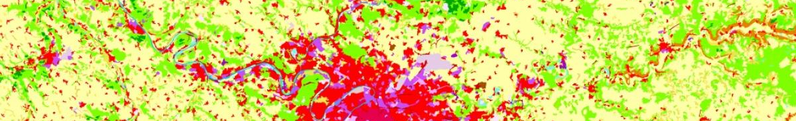

Ground surfaces
^^^^^^^^^^^^^^^^^^^^^^^^^^^^^^^^^^^^

NoiseModelling is a tool for producing noise maps. To do so, at different stages of the process, the application needs input data, respecting a strict formalism.

Below we describe the table ``GROUND``, dealing with the land use type, with an associated ground absorption coefficient (G). 

The other tables are accessible via the left menu in the ``Input tables`` section.

Table definition
---------------------

.. warning::
	In the lists below, the two columns are mandatory

* ``THE_GEOM``
	* Description: 2D geometry of the surfaces (``POLYGON`` or ``MULTIPOLYGON``)
	* Type: Geometry
* ``G``
	* Description: acoustic ground's absorption (from ``0`` : very hard to ``1`` : very soft - *see table below*)
	* Type: Double

.. list-table:: G values for different types of ground (extracted from "Common Noise Assessment Methods in Europe (`CNOSSOS-EU`_)", p86)
   :widths: 85 15
   :header-rows: 1

   * - Description
     - G
   * - Very soft (snow or moss‐like)
     - 1
   * - Soft forest floor (short, dense heather‐like or thick moss)
     - 1
   * - Uncompacted, loose ground (turf, grass, loose soil)
     - 1
   * - Normal uncompacted ground (forest floors, pasture field)
     - 1
   * - Compacted field and gravel (compacted lawns, park area)
     - 0.7
   * - Compacted dense ground (gravel road, car park)
     - 0.3
   * - Hard surfaces (most normal asphalt, concrete)
     - 0
   * - Very hard and dense surfaces (dense asphalt, concrete, water)
     - 0

.. _CNOSSOS-EU : https://hal.archives-ouvertes.fr/hal-00985998/document

Topology
---------------------

At a given point, there can only be one value of G. Consequently, in the ``GROUND`` table, the geometries must not overlap.

