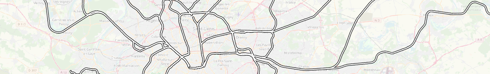

Railways
^^^^^^^^^^^^^^^^^^^^^^^^^^^^^^^^^^^^

NoiseModelling is a tool for producing noise maps. To do so, at different stages of the process, the application needs input data, respecting a strict formalism.

Below are described the tables ``RAIL_SECTIONS`` and ``RAIL_TRAFFIC``. 

The other tables are accessible via the left menu in the ``Input tables & parameters`` section.

.. warning::
	In the lists below, the columns noted with ``*`` are mandatory

Railways sections
---------------------

* Table name : ``RAIL_SECTIONS``
* Description: contains all the sections of railways

Table definition
~~~~~~~~~~~~~~~~~~~

* ``THE_GEOM`` *
	* Description: Railway's geometry 
	* Type: Geometry (``LINESTRING`` or ``MULTILINESTRING``)
* ``IDSECTION`` *
	* Description: A section identifier (PRIMARY KEY)
	* Type: Integer
* ``NTRACK`` *
	* Description: Number of tracks
	* Type: Integer
* ``TRACKSPD`` *
	* Description: Maximum speed on the section *(in km/h)*
	* Type: Double
* ``TRANSFER``
	* Description: Track transfer function identifier
		* ``1`` = Mono-bloc sleeper on soft rail pad
		* ``2`` = Mono-bloc sleeper on medium rail pad
		* ``3`` = Mono-bloc sleeper on stiff rail pad
		* ``4`` = Bi-bloc sleeper on soft rail pad
		* ``5`` = Bi-bloc sleeper on medium rail pad
		* ``6`` = Bi-bloc sleeper on stiff rail pad
		* ``7`` = Wooden sleeper (Traverse en bois)
	* Type: Integer
* ``ROUGHNESS``
	* Description: Rail roughness identifier
		* ``1`` = Classic lines
		* ``2`` = TGV (for France) lines
	* Type: Integer
* ``IMPACT``
	* Description: Impact noise coefficient identifier
		* ``0`` = No impact
		* ``1`` = Single joint, switch or crossing per 100 m
	* Type: Integer
* ``CURVATURE``
	* Description: Section's curvature identifier
		* ``0`` = R > 500 m
		* ``1`` = 300 m < R < 500 m
		* ``2`` = R < 300 m
	* Type: Integer
* ``BRIDGE``
	* Description: Bridge transfer function identifier
		* ``0`` = Any type of track or bridge except metal bridges with unballasted tracks
		* ``1`` = Metal bridges with unballasted tracks + 5dB
	* Type: Integer
* ``TRACKSPC``
	* Description: Commercial speed on the section *(in km/h)*
	* Type: Double
* ``ISTUNNEL``
	* Description: Indicates whether the section is a tunnel or not (``0`` = no / ``1`` = yes)
	* Type: Boolean 

Geometry modelling
~~~~~~~~~~~~~~~~~~~

The modeling of the geometry is identical to the road's one (see ":doc:`Input_roads`" page). The only difference is that the affected height is not 5cm by default. It depends on the model used (*e.g* in CNOSSOS: rolling noise = 0.05m / aerodynamic noise = 4m ).

----------------------------------

Railways traffic
---------------------

* Table name : ``RAIL_TRAFFIC``
* Description: contains all the railways traffic

Table definition
~~~~~~~~~~~~~~~~~~~

* ``IDTRAFFIC`` *
	* Description: A traffic identifier (PRIMARY KEY)
	* Type: Integer
* ``IDSECTION`` *
	* Description: A section identifier, refering to ``RAIL_SECTIONS`` table
	* Type: Integer
* ``TRAINTYPE`` *
	* Description: Type of vehicle, listed in the `Rail_Train_SNCF_2021.json`_ file *(mainly for french SNCF)*
	* Type: Varchar
* ``TRAINSPD`` *
	* Description: Maximum train speed *(in km/h)*
	* Type: Double
* ``TDAY``
	* Description: Hourly average train count, during the day (6-18h)
	* Type: Integer
* ``TEVENING``
	* Description: Hourly average train count, during the evening (18-22h)
	* Type: Integer
* ``TNIGHT``
	* Description: Hourly average train count, during the night (22-6h)
	* Type: Integer

.. _Rail_Train_SNCF_2021.json : https://github.com/Universite-Gustave-Eiffel/NoiseModelling/blob/4.X/noisemodelling-emission/src/main/resources/org/noise_planet/noisemodelling/emission/Rail_Train_SNCF_2021.json

