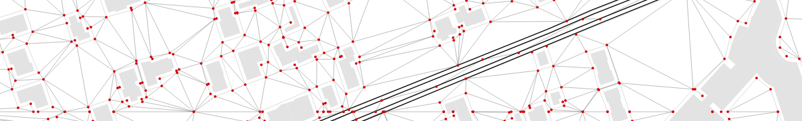
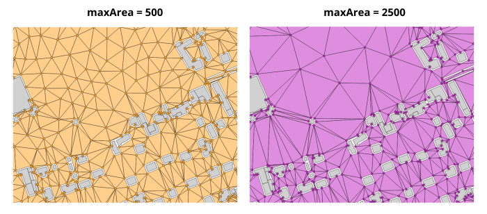
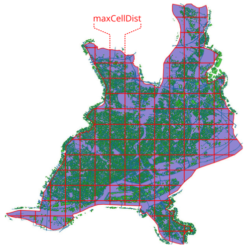

Receivers
^^^^^^^^^^^^^^^^^^^^^^^^^^^^^^^^^^^^

NoiseModelling is a tool for producing noise maps. To do so, at different stages of the process, the application needs input data, respecting a strict formalism.

Below we describe the table ``RECEIVERS``, dealing with the receivers. 

The other tables are accessible via the left menu in the ``Input tables & parameters`` section.

Table definition
********************

.. warning::
	The two following columns are mandatory

* ``PK``
	* Description: receiver's unique identifier. 
	* Type: Integer - Primary Key
* ``THE_GEOM``
	* Description: 3D receiver's geometry. Z coordinate correspond to the receiver's altitude 
	* Type: Geometry (``POINT`` or ``MULTIPOINT``)

If you are working with receivers based on buildings (*e.g* 50 cm around the building's facades - see ``Building_grid`` script), your ``RECEIVERS`` table will need this additional column:

* ``BUILD_PK``
	* Description: building's Primary Key (``PK``), allowing to link the receivers with their building
	* Type: Integer

Parameters
********************

Below are listed the most important input parameters that may be found in the scripts dealing with receivers generation (*e.g* ``Building_grid``, ``Delaunay_grid``, ...) (see ``Receivers`` section in the left-side menu of NoiseModelling).

These parameters can be mandatory or optional. When necessary, we indicates the default values and those we recommend (from an acoustic point of view).

Maximum area
-------------------------

* Parameter name: ``maxArea``
* Description: Set Maximum Area. No triangles larger than the provided area will be created. Smaller area will create more receivers (square meters)
* Type: Double
* Default value: ``2500``
* Recommanded value: ``2500``

Maximum cell size
--------------------------------

* Parameter name: ``maxCellDist``
* Description: Maximum distance used to split the domain into sub-domains. In a logic of optimization of processing times, it allows to limit the number of objects (buildings, roads, ...) stored in memory during the Delaunay triangulation (meters)
* Type: Double
* Default value: ``600``
* Recommanded value: 

Road width
--------------------------------

* Parameter name: ``roadWidth``
* Description: Set Road Width. No receivers closer than road width distance will be created (meters)
* Type: Double
* Default value: ``2``
* Recommanded value: 

Height
--------------------------------

* Parameter name: ``height``
* Description: Receiver height relative to the ground (meters)
* Type: Double
* Default value: ``4``
* Recommanded value: 
