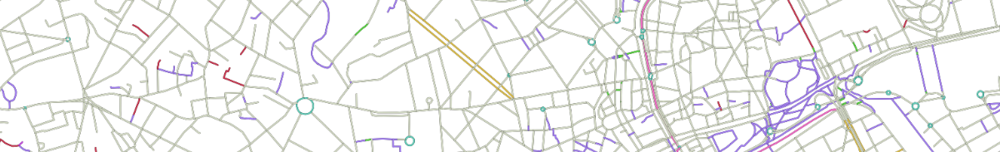
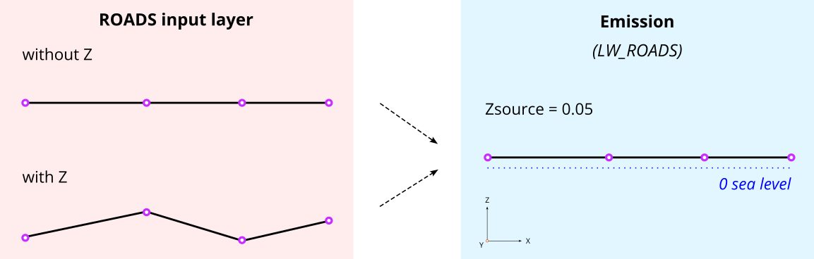
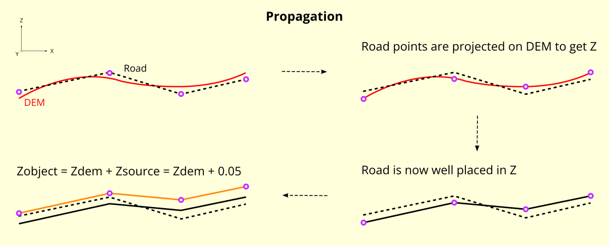

Roads
^^^^^^^^^^^^^^^^^^^^^^^^^^^^^^^^^^^^

NoiseModelling is a tool for producing noise maps. To do so, at different stages of the process, the application needs input data, respecting a strict formalism.

Below we describe the table ``ROADS``, dealing with the roads network. 

The other tables are accessible via the left menu in the ``Input tables & parameters`` section.

Table SOURCES_GEOM definition
---------------------

.. warning::
    * In the list below, the columns noted with ``*`` are mandatory
    * This description is only valid for ``Noise_level_from_traffic`` and ``Road_Emission_from_Traffic`` WPS scripts. For the other WPS scripts, it is necessary to refer to the description of their input data

.. note::
    In the list below, some columns are suffixed with the letters ``D``, ``E`` and ``N``. This correspond to ``Day`` (6-18h), ``Evening`` (18-22h) and ``Night`` (22-6h) periods. A column is expected for each of them.

* ``THE_GEOM`` *
    * Description: Geometry of the roads (``LINESTRING`` or ``MULTILINESTRING``)
    * Type: Geometry
* ``PK`` *
    * Description: An identifier (PRIMARY KEY)
    * Type:  Integer
* ``LV_D``, ``LV_E``, ``LV_N``
    * Description: Hourly average light vehicle count
    * Type: Double
* ``MV_D``, ``MV_E``, ``MV_N``
    * Description: Hourly average medium heavy vehicles, delivery vans > 3.5 tons, buses, touring cars, *etc.* with two axles and twin tyre mounting on rear axle count
    * Type: Double
* ``HGV_D``, ``HGV_E``, ``HGV_N``
    * Description: Hourly average heavy duty vehicles, touring cars, buses, with three or more axles count
    * Type: Double
* ``WAV_D``, ``WAV_E``, ``WAV_N``
    * Description: Hourly average mopeds, tricycles or quads ≤ 50 cc count
    * Type: Double
* ``WBV_D``, ``WBV_E``, ``WBV_N``
    * Description: Hourly average motorcycles, tricycles or quads > 50 cc count
    * Type: Double
* ``LV_SPD_D``, ``LV_SPD_E``, ``LV_SPD_N``
    * Description: Hourly average light vehicle speed *(km/h)*
    * Type: Double
* ``MV_SPD_D``, ``MV_SPD_E``, ``MV_SPD_N``
    * Description: Hourly average medium heavy vehicles speed *(km/h)*
    * Type: Double
* ``HGV_SPD_D``, ``HGV_SPD_E``, ``HGV_SPD_N``
    * Description: Hourly average heavy duty vehicles speed *(km/h)*
    * Type: Double
* ``WAV_SPD_D``, ``WAV_SPD_E``, ``WAV_SPD_N``
    * Description: Hourly average mopeds, tricycles or quads ≤ 50 cc speed *(km/h)*
    * Type: Double
* ``WBV_SPD_D``, ``WBV_SPD_E``, ``WBV_SPD_N``
    * Description: Hourly average motorcycles, tricycles or quads > 50 cc speed *(km/h)*
    * Type: Double
* ``PVMT``
    * Description: `CNOSSOS road pavement identifier`_ *(Default* ``DEF`` *)* (`See NM possible values`_)
    * Type: Varchar
* ``TS_STUD``
    * Description: A limited period (``Ts``) (in months) over the year where a average proportion (``pm``) of light vehicles are equipped with studded tyres [0-12]
    * Type: Double
* ``PM_STUD``
    * Description: Average proportion of vehicles equipped with studded tyres during ``TS_STUD`` period [0-1]
    * Type: Double
* ``JUNC_DIST``
    * Description: Distance to the junction *(in meters)*. When approaching less than 100m from a junction, it is advisable to subdivide the section into 10m pieces and calculate the distance from the centroid of this sub-section to the junction. This allows for a finer calculation.
    * Type: Double
* ``JUNC_TYPE``
    * Description: Integer defining the type of junction
        * ``0`` : None
        * ``1`` : A crossing with traffic lights
        * ``2`` : A roundabout
    * Type: Integer
* ``SLOPE``
    * Description: Slope (in %) of the road section. If the column is not filled in, the ``LINESTRING`` Z-values will be used to calculate the slope and the traffic direction (``WAY`` column) will be force to ``3`` (bi-directional)
    * Type: Double
* ``WAY``
    * Description: Integer defining the way of the road section.
        * ``1`` = One way road section and the traffic goes in the same way that the slope definition you have used
        * ``2`` = One way road section and the traffic goes in the opposite way that the slope definition you have used
        * ``3`` = Bi-directional traffic flow, the flow is split into two components and correct half for uphill and half for downhill
    * Type: Integer

.. _CNOSSOS road pavement identifier : https://circabc.europa.eu/sd/a/00a6a620-b570-4f57-9dbb-76f66a48b325/CNOSSOS-

.. _See NM possible values : https://github.com/Universite-Gustave-Eiffel/NoiseModelling/blob/4.X/noisemodelling-emission/src/main/resources/org/noise_planet/noisemodelling/emission/coefficients_Road_Cnossos_2020.json

Table SOURCES_EMISSION definition
---------------------

If you have custom time periods (ex. ``8h00-9h00``). You can place the traffic data into another table with the ``PERIOD`` column:

* ``IDSOURCE`` *
    * Description: An identifier linked to the primary key of the ``SOURCES_GEOM`` table.
    * Type:  Integer
* ``PERIOD`` *
    * Description: Identifier of the time. ex. ``8h00-9h00``
    * Type:  String
* ``LV``
    * Description: Hourly average light vehicle count
    * Type: Double
* ``MV``
    * Description: Hourly average medium heavy vehicles, delivery vans > 3.5 tons, buses, touring cars, *etc.* with two axles and twin tyre mounting on rear axle count
    * Type: Double
* ``HGV``
    * Description: Hourly average heavy duty vehicles, touring cars, buses, with three or more axles count
    * Type: Double
* ``WAV``
    * Description: Hourly average mopeds, tricycles or quads ≤ 50 cc count
    * Type: Double
* ``WBV``
    * Description: Hourly average motorcycles, tricycles or quads > 50 cc count
    * Type: Double
* ``LV_SPD``
    * Description: Hourly average light vehicle speed *(km/h)*
    * Type: Double
* ``MV_SPD``
    * Description: Hourly average medium heavy vehicles speed *(km/h)*
    * Type: Double
* ``HGV_SPD``
    * Description: Hourly average heavy duty vehicles speed *(km/h)*
    * Type: Double
* ``WAV_SPD``
    * Description: Hourly average mopeds, tricycles or quads ≤ 50 cc speed *(km/h)*
    * Type: Double
* ``WBV_SPD``
    * Description: Hourly average motorcycles, tricycles or quads > 50 cc speed *(km/h)*
    * Type: Double
* ``PVMT``
    * Description: `CNOSSOS road pavement identifier`_ *(Default* ``DEF`` *)* (`See NM possible values`_)
    * Type: Varchar
* ``TS_STUD``
    * Description: A limited period (``Ts``) (in months) over the year where a average proportion (``pm``) of light vehicles are equipped with studded tyres [0-12]
    * Type: Double
* ``PM_STUD``
    * Description: Average proportion of vehicles equipped with studded tyres during ``TS_STUD`` period [0-1]
    * Type: Double
* ``JUNC_DIST``
    * Description: Distance to the junction *(in meters)*. When approaching less than 100m from a junction, it is advisable to subdivide the section into 10m pieces and calculate the distance from the centroid of this sub-section to the junction. This allows for a finer calculation.
    * Type: Double
* ``JUNC_TYPE``
    * Description: Integer defining the type of junction
        * ``0`` : None
        * ``1`` : A crossing with traffic lights
        * ``2`` : A roundabout
    * Type: Integer
* ``SLOPE``
    * Description: Slope (in %) of the road section. If the column is not filled in, the ``LINESTRING`` Z-values will be used to calculate the slope and the traffic direction (``WAY`` column) will be force to ``3`` (bi-directional)
    * Type: Double
* ``WAY``
    * Description: Integer defining the way of the road section.
        * ``1`` = One way road section and the traffic goes in the same way that the slope definition you have used
        * ``2`` = One way road section and the traffic goes in the opposite way that the slope definition you have used
        * ``3`` = Bi-directional traffic flow, the flow is split into two components and correct half for uphill and half for downhill
    * Type: Integer

Geometry modelling
---------------------

In NoiseModelling, road geometries are used as a medium for road noise emission and propagation. 

Emission
~~~~~~~~~~~~~~~~~~~

According to CNOSSOS-EU, emissions from road traffic should be 5cm above the ground. 

You can create your own emmission layer or use the dedicated NoiseModelling block called ``Road_Emission_from_Traffic.groovy``. In this script, the table ``ROADS`` is used to create the emission table ``LW_ROADS``. As a consequence, whether or not your roads have a Z value in ``ROADS``, NoiseModelling forces a ``Zsource`` value of 5cm in ``LW_ROADS``.

.. warning::
    Whether you have Z values, the emission layer must be at an altitude of 5cm (above sea level) : ``Zsource`` = 0.05

.. note::
    Z values in the input layer are only used to calculate the slope

Propagation
~~~~~~~~~~~~~~~~~~~

Whether you use your own sources or those calculated by NoiseModelling, the propagation step will consist of deducing the altitude from the DEM and adding the emission height (5cm).

.. warning::
    * ``Zobject`` = ``Zdem + Zsource`` = ``Zdem + 0.05``
    * If there is no DEM, the altitude will be equal to 5cm (``Zobject`` = ``0.05``)
    * If your ``ROADS`` table has accurate Z values, you are invited to enrich your DEM with this information before doing the propagation step. See :ref:`DEM` section for more information.

.. note::
    Z values in the input layer are only used to calculate the slope. They are not used to force the DEM

In this context, the roads geometry can be in 2D or in 3D. In both cases, Z information is not taken into account during emission or propagation steps.