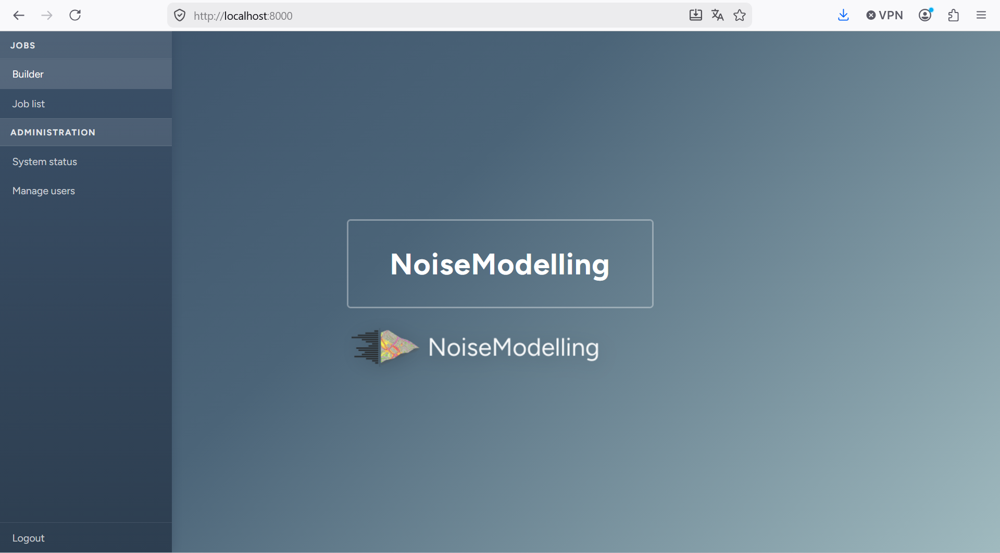
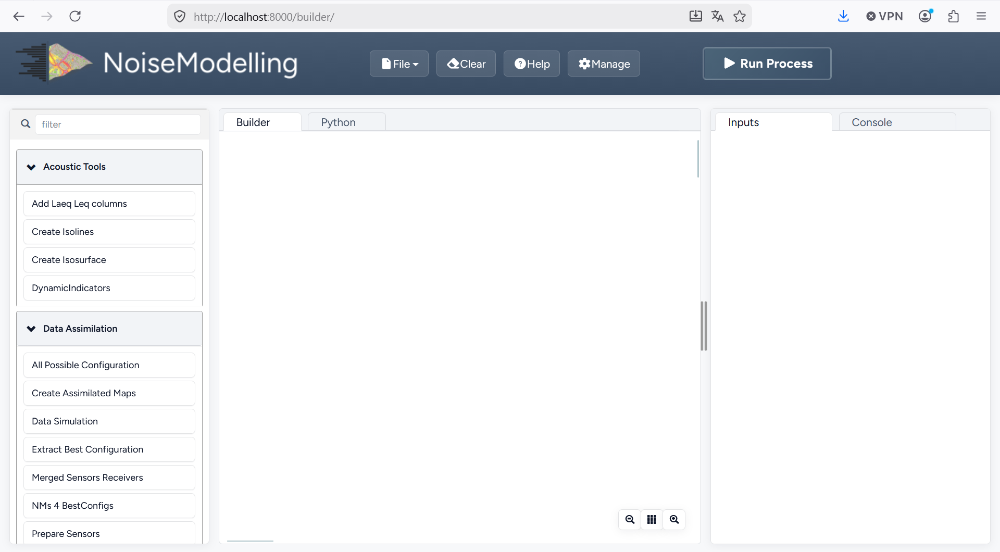

Installation guide
^^^^^^^^^^^^^^^^^^^^^^^^^

Step 1 : Requirements
~~~~~~~~~~~~~~~~~~~~~~~~~

Since NoiseModelling is developed with the `Java language`_, you will need to install the Java Runtime Environment (JRE) on your computer to use the application.

NoiseModelling requires Java >= 25. Any version of Java 25 or later is supported.

.. _Java language : https://en.wikipedia.org/wiki/Java_(programming_language)

Windows
----------

If you are launching NoiseModelling thanks to the ``NoiseModelling_xxx_install.exe`` file, the JRE is already inside, so **you don't have anything to do**.

If you are not using the ``.exe`` file, you have to launch NoiseModelling thanks to the ```start_windows.bat`` file (in the ``NoiseModelling_xxx.zip`` release file). In this case, Java >= 25  has to be installed before.

Download and install Java: choose between `OpenJDK`_ or `Oracle`_ versions.

.. _this document : https://confluence.atlassian.com/doc/setting-the-java_home-variable-in-windows-8895.html


Linux or Mac
-------------

If not already done, you have to install the Java version >= 25.

#. Check whether Java is already installed::

      java -version

   The command should print a version starting with ``25``. Otherwise, install Java first.

#. Download and install Java: choose between `OpenJDK`_ or `Oracle`_ versions.

#. Find the installation path to use for ``JAVA_HOME``.

   *On Linux*::

      readlink -f "$(command -v java)"

   This prints a path ending with ``/bin/java`` (for example
   ``/usr/lib/jvm/java-25-openjdk-amd64/bin/java``); ``JAVA_HOME`` is the parent
   directory of ``bin`` (here ``/usr/lib/jvm/java-25-openjdk-amd64``).

   *On macOS*::

      /usr/libexec/java_home -v latest

   This prints the directory that must be used as ``JAVA_HOME`` for Java.

#. Set the ``JAVA_HOME`` environment variable and update your ``PATH`` (adapt the
   path with the one found above)::

      export JAVA_HOME=/usr/lib/jvm/java-25-openjdk-amd64
      export PATH="$JAVA_HOME/bin:$PATH"

   On macOS you can also use::

      export JAVA_HOME=$(/usr/libexec/java_home -v latest)
      export PATH="$JAVA_HOME/bin:$PATH"

#. Verify that ``JAVA_HOME`` is correctly set::

      echo $JAVA_HOME

   You should get the Java directory (for example
   ``/usr/lib/jvm/java-25-openjdk-amd64``). If this is not the case, you are
   invited to follow the steps `proposed here`_.

.. _proposed here: https://stackoverflow.com/questions/24641536/how-to-set-java-home-in-linux-for-all-users
.. _OpenJDK : https://www.azul.com/downloads/
.. _Oracle : https://www.oracle.com/java/technologies/downloads/

.. _sec_download:

Step 2: Download NoiseModelling
~~~~~~~~~~~~~~~~~~~~~~~~~~~~~~~~~~~~~~~~~

Download the latest release of NoiseModelling on `Github`_.

* Windows: you can directly download and run the ``NoiseModelling_*.exe`` installer file *(or you can also follow the Linux instructions below if you have a working JRE, see previous step)*
* MacOS: you can directly download and run the ``NoiseModelling_*.dmg`` installer file *(or you can also follow the Linux instructions below if you have  a working JRE, see previous step)*
* Linux : download the ``NoiseModelling_6.x.x.zip`` file and unzip it into a chosen directory

.. warning::
    The chosen directory can be anywhere, but make sure you have write access. If you are using a company computer, the Program Files folder is probably not a good idea.

.. warning::
    For **Linux** and **Mac** users, please make sure your Java environment is correctly set up (see previous step). **Windows** users who are using the ``.exe`` file are not concerned, since the Java Runtime Environment is **already embedded**.

.. _Github : https://github.com/Universite-Gustave-Eiffel/NoiseModelling/releases

.. _sec_start_nm:

Step 3: Start NoiseModelling GUI
~~~~~~~~~~~~~~~~~~~~~~~~~~~~~~~~~~~~~~~~~

As described on the page ":doc:`Architecture`", NoiseModelling can be used through a Graphical User Interface (GUI) in a web browser.

In this tutorial, we will use the default, already configured H2GIS database.

These tools (WPS Builder and H2GIS) are already included in the archive, so you don't have to install them separately.

To launch NoiseModelling with the GUI, start it from a command prompt (terminal). This will start a local server on your computer, which provides the GUI as a web application.

Please execute:

* Windows: ``NoiseModelling.exe`` or ``NoiseModelling_xxx\start_windows.bat``
* Linux or Mac: ``NoiseModelling_xxx/start_linux_macos.sh`` *(make sure the file is allowed to be executed before running it)*

.. tip::
    NoiseModelling will stay open as long as the command window is open. If you close it, NoiseModelling will automatically stop and the GUI will no longer be available.

.. _H2GIS : http://www.h2gis.org/Load input files

Step 4: Open NoiseModelling GUI
~~~~~~~~~~~~~~~~~~~~~~~~~~~~~~~~~~~~~~~~~

The NoiseModelling GUI is built using the :doc:`WPS_Builder` component and runs as a web application provided by the local server started in Step 3.

By running NoiseModelling your default web browser should have been opened to the http://localhost:8000 address. If not please go to this URL, if something went wrong you should have more information on your terminal.



    Noise Modelling GUI landing page

Click ``builder`` to open the builder.



You are now ready to discover the power of NoiseModelling!