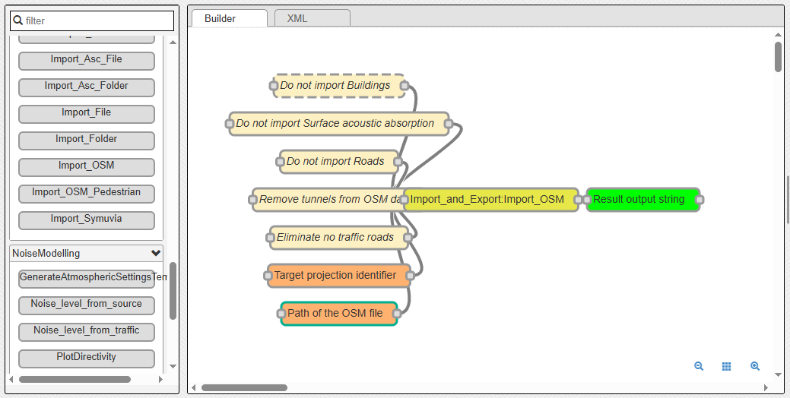
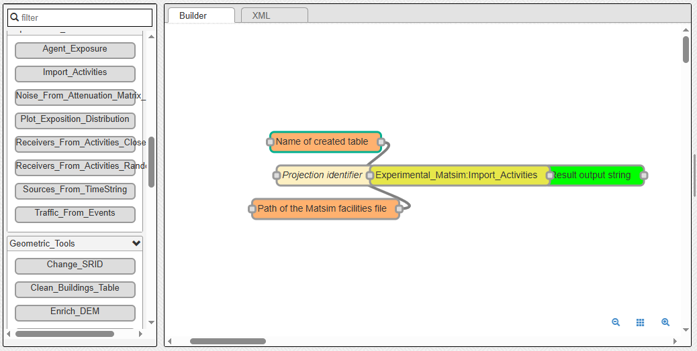
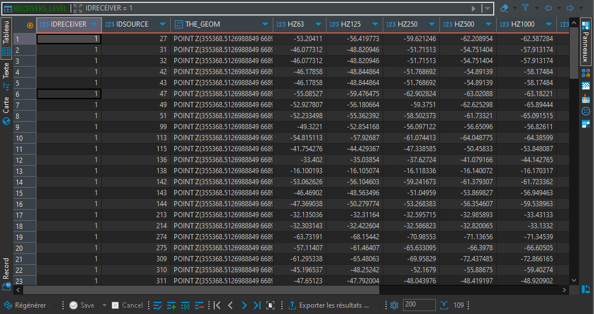

MATSim - GUI
^^^^^^^^^^^^^^^^^^^^^^^^^^^^^^^^^^^^

Introduction
~~~~~~~~~~~~~~~

MATSim (https://matsim.org/) is an open-source framework for implementing large-scale agent-based transport simulations.
In this tutorial we will learn how to import the output of a successful MATSim simulation into NoiseModelling.
The idea is to use the traffic data from MATSim for NoiseModelling road noise emission.
Then we will leverage the fact that MATSim is a multi-agent simulator. We will import MATSim agent's positions to calculate their noise exposition throughout the simulated day.

For this tutorial, we'll look into a simulation of the `island in the center of Nantes`_, the 6th most populated city in France.

.. _island in the center of Nantes: https://www.openstreetmap.org/way/157597537

Prerequisites
~~~~~~~~~~~~~~~~~

- You need to have a working installation of the latest NoiseModelling version
- A basic knowledge of what the MATSim traffic simulator does and how it works is preferable
- (optional) A working installation of DBeaver (https://dbeaver.io/) can be useful to visualize the NoiseModelling database tables
- (optional) A working installation of Simunto Via (https://www.simunto.com/via/) can be useful for visualizing the MATSim scenario
- (optional) A working installation of QGis (https://www.qgis.org/) can be useful to visualize resulting GIS data

The data
~~~~~~~~~~~~~~~

You can download and unzip the data in any folder from here : https://github.com/Universite-Gustave-Eiffel/NoiseModelling/releases/download/v3.3.1/scenario_matsim.zip

The data folder should contain the following files :

- ``nantes_ile.osm.pbf`` : the Openstreetmap data of the area. We'll use it to import buildings into NoiseModelling.
- ``network.csv`` : A file containing the 'true' geometries of the road segments (called "links" in MATSim)
- ``output_events.xml.gz`` : A file containing the list of MATSim events from the simulation.
- ``output_facilities.xml.gz`` : A file containing the list of facilities, the agent's activity locations.
- ``output_network.xml.gz`` : A file containing the MATSim road network, a list of nodes and links.
- ``output_plans.xml.gz`` : A file containing the list of agents and their final schedule, or plan.

Step 1 : Import Buildings
~~~~~~~~~~~~~~~~~~~~~~~~~~~~~~~~~~~~~~~

The first thing we're going to do is to import buildings.
We use the ``Import_OSM`` WPS block to do that. Simply put the ``nantes_ile.osm.pbf`` path in the 'pathFile' input and set the 'SRID' input to `2154`_ *(which is the EPSG code for the french regulatory system)*.

.. _2154: https://epsg.io/2154

You should end up with a ``BUILDINGS`` table containing the island buildings.

Step 2 : Import MATSim Traffic Data
~~~~~~~~~~~~~~~~~~~~~~~~~~~~~~~~~~~~~~~

Now we can import the traffic data from the MATSim simulation.
To do that, we use the ``Traffic_From_Events`` WPS block.

The mandatory inputs are :

- ``folder`` : the path of the MATSim folder, here it is where you put the content of the ``scenario_matsim.zip`` file
- ``timeSlice`` : wich represents the time period you want to aggregate the traffic data over. Here let's use the "quarter" option.

One optional but very important input is the ``Network CSV`` file path. The idea is that when the MATSim scenario was run, the link geometries were simplified to save computation time.
This simplification of roads geometry is a bad thing for NoiseModelling since we take buidlings into account (simplified links can pass through buildings) and since source-receiver distance has a big impact on noise levels.
That's why the ``network.csv`` file is given with the other data files. It contains the "real" geometry of links before MATSim simplification process (FYI, This is obtained by setting the 'outputDetailedLinkGeometryFile' option to a file name in the ``pt2matsim`` config file).

An other important parameter is the ``populationFactor``. This corresponds to the downscaling factor that was used to generate the list of agents. Typically, this list of agents is generated based on the available census and survey data for an administrative area.
Here, for our use case, the MAtsim scenario and it's agents were generated by using only 1% of the area total population (that is a population factor of 0.01).

You can explore the other options by reading their descriptions. Here we are going to set them as follows:

- Network CSV file: ``/path/to/your/scenario_matsim/network.csv``
- Export additionnal traffic data ? : ``true``
- Calculate All vehicles noise source ?: ``true``
- Path of the matsim output folder: ``/path/to/your/scenario_matsim``
- populationFactor: ``0.01``
- Time Quantification: ``quarter``
- outTableName: "" (not set, use default)
- Skip unused links ?: ``true``
- Projection identifier: ``2154``
- ignoreAgents: "" (not set)

You should end up with a ``MATSIM_ROADS`` table containing the links ids and their geometry and a ``MATSIM_ROADS_LW`` table containing the noise power level of each link per 15 min time slice.

Step 3 : Import MATSim Activities
~~~~~~~~~~~~~~~~~~~~~~~~~~~~~~~~~~~~~~~

The next step consists in importing the activities locations from the MATSim simulation.In MATSim, activities are also called facilities.

Let's use the ``Import_Activities`` WPS bloc. The inputs descriptions are quite straightforward :

- Name of created table: ``ACTIVITIES``
- Projection identifier: ``2154``
- Path of MatSim facilities file: ``/path/to/your/scenario_mastim/output_facilities.xml.gz``

You should end up with a ``ACTIVITIES`` table containing the activities location, and few other properties.

Step 4 : Assign a Receiver to each Activity
~~~~~~~~~~~~~~~~~~~~~~~~~~~~~~~~~~~~~~~~~~~~~~~~~

Now, if you look closely, activities are placed in unorthodox locations, sometimes in the river, sometimes in buildings, etc.
This is irrelevant for a MATSim simulation but here we want to calculate noise levels, so we need properly placed receivers.

So we want to assign a properly placed receiver for every activity we imported. We do that in 2 steps :

1. we calculate all the "valid" receiver positions using the ``Building_Grid`` WPS bloc
2. we choose, for each activity the right receiver.

There are 2 ways to execute step 4.2. We can simply choose the closest receiver for every activity, using the ``Receivers_From_Activity_Closest`` WPS bloc.
Or we can randomly choose a receiver on the closest building of each activity using the ``Receivers_From_Activity_Random`` WPS bloc.

Here we are going to use the latter way, the random one.

Let's calculate all the receivers around our buildings using the ``Building_Grid`` WPS bloc with the following inputs :

- Buildings table table : ``BUILDINGS``
- Distance between receivers : ``5.0``
- height : ``4.0``

That will place receviers around all the buildings, at 4 meter high and 5 meters apart.

Now, we must use the ``Receivers_From_Activity_Random`` WPS bloc. The inputs are simple, you just have to specify the names of the previously created tables

- Name of created table: ``ACTIVITY_RECEIVERS``
- Name of the table containing the activities: ``ACTIVITIES``
- Name of the table containing the buildings: ``BUILDINGS``
- Name of the table containing the receivers: ``RECEIVERS``

You should end up with a ``ACTIVITY_RECEIVERS`` table containing the new location (``THE_GEOM``, in blue below) as well as the orignal matsim position (``ORIGIN_GEOM``, in red below).
You can inspect the results to see where each activity is placed now.

Step 5 : Calculate Noise Attenuation Matrix
~~~~~~~~~~~~~~~~~~~~~~~~~~~~~~~~~~~~~~~~~~~~~~

In this step, we want to calculate and store the noise propagation part of NoiseModelling.
We need this because we actually have several power spectrum for every road segment, one for every timestep of 15min.
In the end we want to have a noise map every 15 minutes (96 maps in total). If we do that directly, by calling something like ``Noise_level_from_source`` WPS bloc 96 times, we would be calculating the exact same noise propagation 96 times.

So the process is as follows :

1. we generate a SOURCE table, using the ``MATSIM_ROADS`` table.
2. We use that table as input of the ``Noise_level_from_source`` WPS bloc and setting the ``confExportSourceId`` input paramter.

The ``confExportSourceId`` parameter will actually ouput, for every recevier, the list of sources that contribute to the resulting levels, with the source-receiver noise attenuation.

We'll then use this attenuation matrix in the next steps to get the 96 noise maps.

Calculate the attenuation matrix
----------------------------------

Let's use the previously generated table to launch our propagation calculation.

As explained before, we'll use the Noise_level_from_source WPS bloc with the 'confExportSourceId' parameter enabled.
For more details about the different parameters, browse the NoiseModelling general documentation.

The parameters we will use are the following :

- Buildings table name: ``BUILDINGS``
- Receivers table name: ``ACTIVITY_RECEIVERS``
- Sources table name: ``MATSIM_ROADS``
- Maximum source-receiver distance: ``250``
- Maximum source reflexion distance: ``50``
- Order of reflexion: ``1``
- Separate receiver level by source identifier: ``true``
- Diffraction on vertical edges: ``false``
- Diffraction on horizontal edges: ``true``

We should end up with a table called ``RECEIVERS_LEVEL`` that contains a list of contributing source attenuation for every receiver.
We can see such a list for the receiver n°1 in the figure below:

Step 6 : Calculate Noise Maps
~~~~~~~~~~~~~~~~~~~~~~~~~~~~~~~~~~~~~~~~~~~~~~

We have noise power levels every 15 minutes in the ``MATSIM_ROADS_LW`` table, and a source-receiver noise attenuation matrix in the ``RECEIVERS_LEVEL`` table.
We just need to combine the two to get receivers noise levels, noise maps, every 15 minutes.

This is the purpose of the ``Noise_From_Attenuation_Matrix_MatSim`` WPS bloc.
We just have set the right tables as input as follows :

- Attenuation matrix table name: ``RECEIVERS_LEVEL``
- Output table name: ``RESULT_GEOM``
- Table name of the MATSIM table containing the roads LW stats per timeBin: ``MATSIM_ROADS_LW``
- Table name of the MATSIM table containing the roads geometries: ``MATSIM_ROADS``

.. figure:: images/matsim/noise_map_wps.png
   :align: center
S
It takes some time but in the end you should get a noise spectrum for every receiver every 15 minutes in the table ``RESULT_GEOM``.

We have our noise maps !

Visualization
~~~~~~~~~~~~~~~~~~~~~

Export the data
----------------

Here we'll look at a nice way to look at the results with QGIS.

First we need to export the ``RESULT_GEOM`` table data into a Shapefile.
We'll simply use the ``Export_Table WPS`` bloc with the following parameters :

- Name of the table: ``RESULT_GEOM``
- Path of the file you want to export: ``/path/to/wherever/results.shp``

.. figure:: images/matsim/results_export_wps.png
   :align: center

View it in QGIS
---------------------

.. role::  raw-html(raw)
    :format: html

Let's go into QGIS. We are going to import 2 layers : an osm background and our results.

.. note::
    For those who are new to GIS and want to get started with QGIS, we advise you to follow `this tutorial`_ as a start.

.. _this tutorial : https://docs.qgis.org/3.22/en/docs/training_manual/basic_map/index.html

- In ``Layer`` :raw-html:`&rarr;` ``Add Layer`` :raw-html:`&rarr;` ``Add vector layer``, you can enter the path of your ``results.shp`` file. Then click on ``Add``.
- In ``Layer`` :raw-html:`&rarr;` ``Add Layer`` :raw-html:`&rarr;` ``Add XYZ Layer``, you can add the OpenStreetMap background.

You should see a lot of points all of the same color.

We now need to choose a timeslice we want to visualize, let's pick the timeBin of 10h (36000 seconds).
If you right click on the receivers layer and click on ``Filter...`` you should see the filter dialog.

To filter results for the 10h00_10h15 time period you can enter the following filter query :

  ``TIME = 36000``

The last step is to color the dots based on the LEQA field.
Here is my configuration :

.. figure:: images/matsim/symbology_results_qgis.png
   :align: center

And the final result, between 10h00 and 10h15 :

