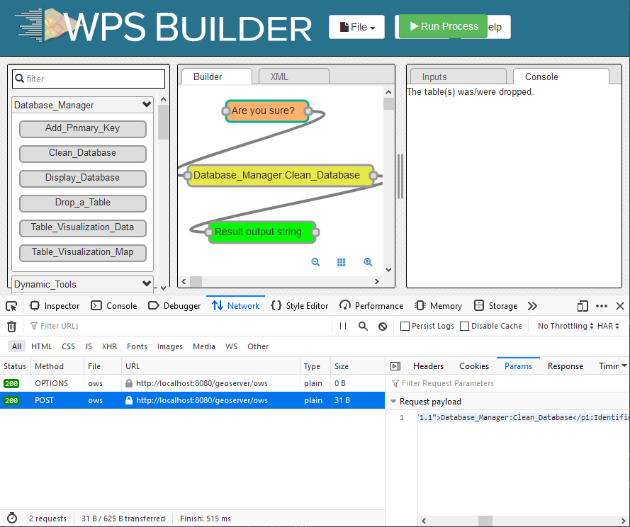

Use NoiseModelling by scripting
^^^^^^^^^^^^^^^^^^^^^^^^^^^^^^^^^^^^

Introduction
~~~~~~~~~~~~~~~~~~~~~~~~~~~~~~

You master the use of the "WPS Builder" user interface.
Now you want to stop using this interface and run the processes with your favorite programming language.

Well, know that it is possible, and it's actually quite simple!

All you have to do is to prepare the HTTP calls you will make to Geoserver.

The Web Processing Service API
~~~~~~~~~~~~~~~~~~~~~~~~~~~~~~

The WPS is not something we did on our own. It's a standardized interface very well established in the geospatial community. So you will find a lot of documentation and libraries.

You can first learn more about it:

https://en.wikipedia.org/wiki/Web_Processing_Service

How it works
~~~~~~~~~~~~~~~~~~~~~~~~~~~~~~

Processing scripts are hosted by a `GeoServer`_ instance. This software contain a web server that listen for localhost requests.

What your scripts need to do is simply access this web server like a web browser would. The difficulty being the creation of the entries expected by the service.

.. figure:: images/wps_api.png
   :height: 600px
   :align: center

.. _Geoserver: https://geoserver.org/

Method to easily find inputs query
~~~~~~~~~~~~~~~~~~~~~~~~~~~~~~~~~~

The ``POST`` request must contain the expected inputs.

You can use your navigator debug mode with the WPS Builder GUI in order to generate the inputs for you.

Once in WPS GUI, press ``F12`` key to enter debug mode, then click on network tab:

From here, click on ``Run process``, now you have the complete url and query to copy-paste into your script.

Get started using Python
~~~~~~~~~~~~~~~~~~~~~~~~~~~~~~

The following script run the exact WPS blocks used in the Get Started tutorial.

We can use the ``String.Template`` class in order to substitute our inputs.

``urllib.request`` module is also helpful for post queries.

.. literalinclude:: scripts/get_started.py
   :language: python
   :linenos:
