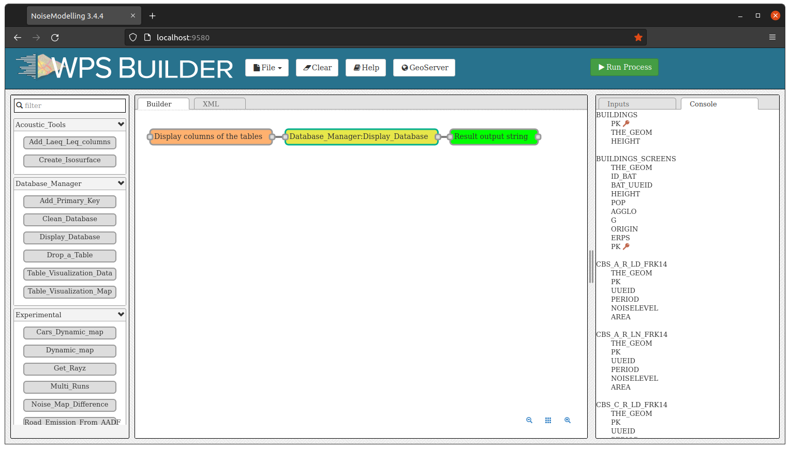
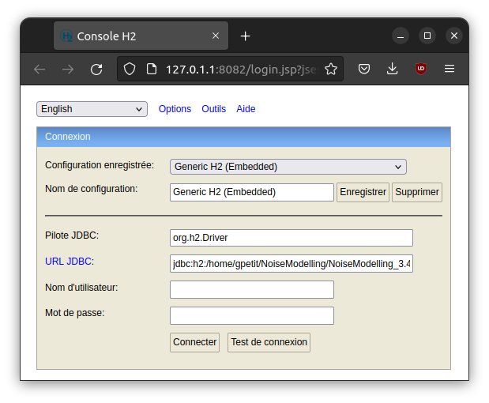
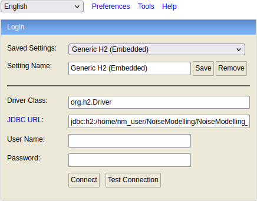
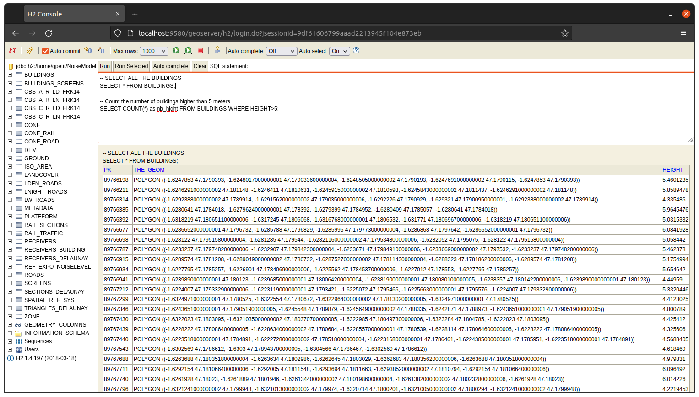
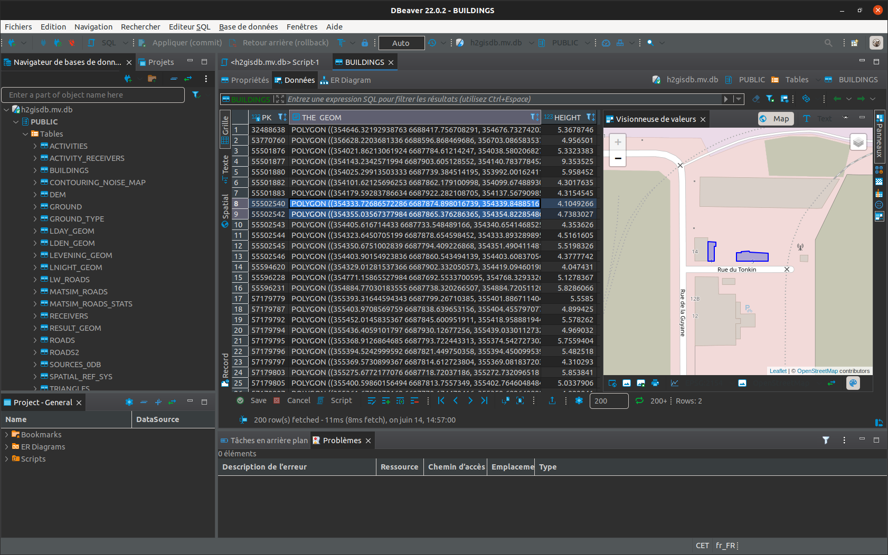

Access NoiseModelling database
^^^^^^^^^^^^^^^^^^^^^^^^^^^^^^^^^

Introduction
~~~~~~~~~~~~~~~~~~~~~~~~~~~~~~

NoiseModelling has been preconfigured to use `H2`_ / `H2GIS`_ as the default database (to store and manage all the needed data).

This database does not need to be configured or installed on the system. It's transparent to users.

.. tip ::
    Many spatial processing are possible with H2GIS. Please have a look to the numerous functions on the `H2GIS website`_.

.. _H2GIS website: http://www.h2gis.org/docs/dev/functions/

To visualize and manage NoiseModelling data (*e.g* roads, buildings or landcover layers) you have the choice between the three following approaches *(listed from simple to advanced)*:

#. Use WPS blocks (inside)
#. Use H2/H2GIS web client
#. Use DBeaver client

1. Use WPS blocks
~~~~~~~~~~~~~~~~~~~~~~~~~~~~~~

Once NoiseModelling UI is launched (open `http://localhost:9580/ <http://localhost:9580/>`_ in your web browser), you can manage your data thanks to the ``Database_Manager`` WPS blocks folder *(on the left side)*. In particular, you can do these actions:

- ``Add_Primary_Key``: allows to add a primary key on a column of a specific layer (table)
- ``Clean_Database``: remove all the layers (tables) from NoiseModelling *(can be useful when starting a new project)*
- ``Display_Database``: list all the layers (tables) and the columns inside
- ``Drop_a_Table``: remove the selected layer (table) from NoiseModelling
- ``Table_Visualization_Data``: display the layer (table) as an array of values  
- ``Table_Visualization_Map``: if the layer (table) is geographic (contains geometry(ies)), display the data in a map 

Below is an illustration with the ``Display_Database`` WPS block

2. Use H2/H2GIS web client
~~~~~~~~~~~~~~~~~~~~~~~~~~~~~~

If you want to have full capabilities on visualization, edition and processing on data, you may need to connect to the database thanks to the H2/H2GIS web interface.

To do so, follow these steps:

#. download the `H2/H2GIS v.2.0`_ database client (which is used with NoiseModelling 4.0)
#. unzip the ``h2gis-dist-2.0.0-bin.zip`` file
#. in the ``/h2gis-standalone/`` folder, double-click on the ``h2gis-dist-2.0.0-SNAPSHOT`.jar`` file to launch the web client *(depending on your Operating System, you may need to allow the execution of this file)*
#. the H2/H2GIS web client should be opened in your default web browser (the URL looks like this ``http://127.0.1.1:8082/login.jsp?jsessionid=08ef3ad5d6838b614cf91b42e10bca8f``)

.. _H2/H2GIS v.2.0 : https://github.com/orbisgis/h2gis/releases/download/v2.0.0/h2gis-dist-2.0.0-bin.zip

In the connexion panel, you have to specify the following informations:

- ``Driver Class``: the driver that allows to connect to a specific database. Here we want to connect to a H2 db, so let the default value ``org.h2.Driver``
- ``JDBC URL``: the JDBC address of the NoiseModelling database. By default, this database is placed in here ``/.../data_dir/h2gisdb.mv.db``. So, fill this text area with ``jdbc:h2:/.../data_dir/h2gisdb.mv.db``. 
- ``User name``: the db user name. By default, keep the empty value
- ``Password``: the db password. By default, keep the empty value

.. warning::
    If you want to open the database while NoiseModelling is running, you have to add ``;AUTO_SERVER=TRUE`` after the ``JDBC URL``. If not, you will only be able to open the database once NoiseModelling is closed.

Below is an example, with a database located on the computer here: ``/home/nm_user/NoiseModelling/NoiseModelling_4.0/data_dir/h2gisdb.mv.db``. We want to open the db while NoiseModelling is running.

- ``JDBC URL``: ``jdbc:h2:/home/nm_user/NoiseModelling/NoiseModelling_4.0/data_dir/h2gisdb.mv.db;AUTO_SERVER=TRUE``
- ``User name``: *empty*
- ``Password``: *empty*

.. warning::
    The URL is here adapted to Linux or Mac users. Windows user may adapt the address by replacing ``/`` by ``\`` and the drive name.

Once done, click on ``Connect``

In the new interface, you discover a full database manager, with the list of tables on the left side, a SQL console (where you can execute all the instructions you want, independently of NoiseModelling) and a result panel. 

.. _Geoserver: http://geoserver.org/
.. _H2 : https://www.h2database.com
.. _H2GIS : http://h2gis.org/
.. _PostgreSQL: https://www.postgresql.org/
.. _PostGIS: https://postgis.net/

3. Use DBeaver client
~~~~~~~~~~~~~~~~~~~~~~~~~~~~~~

`DBeaver`_ is a free and open-source universal SQL / database client for developers and database administrators. DBeaver is able (among others) to connect to `H2`_/`H2GIS`_ database or to `PostgreSQL`_/`PostGIS`_.

.. _DBeaver: https://dbeaver.io/

You can download DBeaver on this `webpage`_.

.. _webpage: https://dbeaver.io/download/

Connect DBeaver to your database
----------------------------------

#. Run DBeaver
#. Add a new connection
#. If you use a H2GIS type databse, please select ``H2GIS embedded``
#. Point the database path by clicking on ``Browse ...``. By default the database is placed in the ``NoiseModelling/data_dir`` directory and is named ``h2gisdb.mv.db``.
#. In the ``Path`` text area, remove ``.mv.db`` at the end of the address
#. If you want to open the database while NoiseModelling is running, add ``;AUTO_SERVER=TRUE`` at the end of the path (you should have something like this ``/home/nm_user/NoiseModelling/NoiseModelling_4.0/data_dir/h2gisdb;AUTO_SERVER=TRUE``)
#. Click on ``Terminate`` to open your dabatase!

.. warning ::
    Dependending on the DBeaver version, the interface may ask you to ``Save`` instead of ``Opening`` the existing db. Once you click on ``Save``, a panel will warns you that ``h2gisdb.mv.db`` already exists and will ask you if you want to ``Cancel`` or ``Replace`` : click on ``Replace``.

Now you can use the full potential of DBeaver and the H2GIS database. You can explore, display and manage your database.

