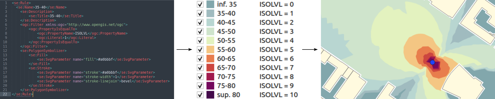
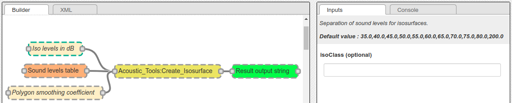
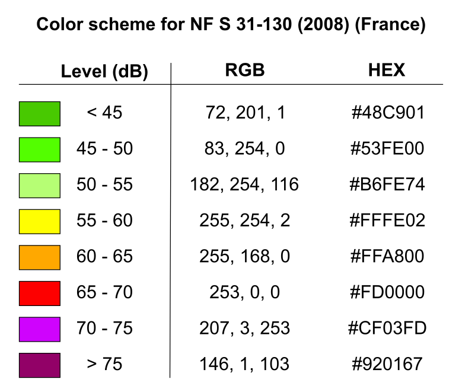
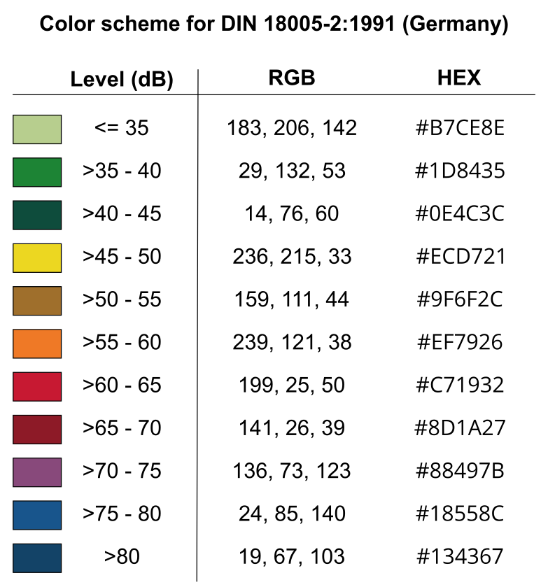
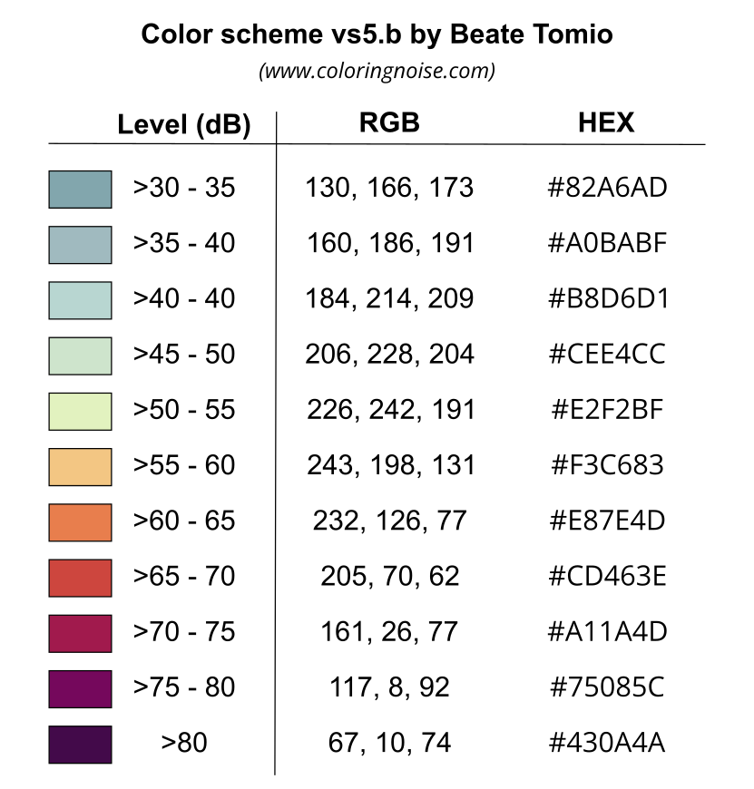

Noise Map Color Scheme
^^^^^^^^^^^^^^^^^^^^^^

Below are presented some color schemes used to colorize noise isophones, produced in the ``CONTOURING_NOISE_MAP`` layer. 

.. note::
    If you want to feed this list with other schemes, please contact us (see :doc:`Support` page).

Introduction
~~~~~~~~~~~~~~~~~~~~~~~~~~~~~~~~~

Creation of the Isosurfaces
**********************************

NoiseModelling can produce isophones (also called isosurfaces) thanks to the ``Acoustic_Tools:Create_Isosurface`` script. In this script, an optionnal parameter called ``Iso levels in dB`` allows the user to specify the thresholds used to generate the surfaces.

By default, the thresholds are 35, 40, 45, 50, 55, 60, 65, 70, 75, 80, 200. In the resulting ``CONTOURING_NOISE_MAP`` layer, these values are then converted into integer and stored in the ``ISOLVL`` column. The first threshold is equal to ``0``. The second one is equal to ``1`` ... *(See table below)*.

.. csv-table:: Correspondence between default thresholds and ``ISOLVL`` values
   :file: ./images/Noise_Map_Color_Scheme/default_thresholds.csv
   :widths: 30, 35, 35
   :header-rows: 1

.. warning::
    So the ``ISOLVL`` values directly depends on the ``Iso levels in dB`` thresholds. When applying a style (see below), you must check that this parameter feets with the classes defined in the ``.sld`` file.

SLD file
*****************

For each of the color schemes presented below, a cartographic style, following the "`Style Layer Descriptor`_" formalism, is provided as an ``.sld`` file.
This ``.sld`` file can be loaded in many GIS applications, such as `QGIS`_. The classification is made on the ``ISOLVL`` column, in the ``CONTOURING_NOISE_MAP`` table.

.. _Style Layer Descriptor: https://www.ogc.org/standards/sld
.. _QGIS : https://qgis.org/

.. note::
    For those who are new to GIS and want to get started with QGIS, we advise you to follow `this tutorial`_ as a start.

    To know how to load an ``.sld`` file, you can also consult the NoiseModelling tutorial :doc:`Noise_Map_From_Point_Source` in the section "``Step 3 - Apply a color palette adapted to acoustics``" 

.. _this tutorial : https://docs.qgis.org/3.22/en/docs/training_manual/basic_map/index.html

French NF S31-130
~~~~~~~~~~~~~~~~~~~~~~~~~~~~~~~~~

The "`NF S31-130`_" is the standard currently in force in France.

* **French title**: "Acoustique Cartographie du bruit en milieu extérieur Élaboration des cartes et représentation graphique"
* **English title**: "Acoustics - Cartography of outside environment noise - Drawing up of maps and graphical representation"
* **Last update**: 2008

.. _NF S31-130: https://www.boutique.afnor.org/fr-fr/norme/nf-s31130/acoustique-cartographie-du-bruit-en-milieu-exterieur-elaboration-des-cartes/fa151801/32365

Color scheme
*****************

SLD file
*****************

The SLD representation of this color scheme is available here : `Style NF S31-130`_

.. _Style NF S31-130 : https://github.com/Universite-Gustave-Eiffel/NoiseModelling/blob/v4.0.2/Docs/styles/style_nf_s31-130.sld

.. warning ::
    This style will work only if you specified ``Iso levels in dB`` = ``45, 50, 55, 60, 65, 70, 75, 200`` when exectuting the ``Acoustic_Tools:Create_Isosurface`` script

German DIN 18005-2:1991
~~~~~~~~~~~~~~~~~~~~~~~~~~~~~~~~~

The "`DIN 18005-2:1991`_" is the standard currently in force in Germany.

* **German title**: "Schallschutz im Städtebau; Lärmkarten; Kartenmäßige Darstellung von Schallimmissionen"
* **English title**: "Noise abatement in town planning; noise maps; graphical representation of noise pollution"
* **Last update**: 1991

.. _DIN 18005-2:1991 : https://www.beuth.de/de/norm/din-18005-2/1741135

Color scheme
*****************

SLD file
*****************

The SLD representation of this color scheme is available here : `Style DIN 18005-2:1991`_

.. _Style DIN 18005-2:1991 : https://github.com/Universite-Gustave-Eiffel/NoiseModelling/blob/v4.0.2/Docs/styles/style_din_18005-2.sld

.. warning ::
    This style will work only if you specified ``Iso levels in dB`` = ``35, 40, 45, 50, 55, 60, 65, 70, 75, 80, 200`` when exectuting the ``Acoustic_Tools:Create_Isosurface`` script

Italian Normativa tecnica UNI 9884
~~~~~~~~~~~~~~~~~~~~~~~~~~~~~~~~~~~~~

The "`Normativa tecnica UNI 9884`_" is a standard currently used in Italy.

* **Italian title**: "Acustica. Caratterizzazione acustica del territorio mediante la descrizione del rumore ambientale"
* **English title**: "Acoustics. Acoustic characterisation of the territory through the description of environmental noise"
* **Last update**: 1991

.. _Normativa tecnica UNI 9884 : https://www.beuth.de/de/norm/din-18005-2/1741135

Color scheme
*****************

.. csv-table:: Norma UNI 9884 - Convenzioni per la rappresentazione delle mappe di rumore
   :file: ./images/Noise_Map_Color_Scheme/UNI_9884.csv
   :widths: 50, 50
   :header-rows: 1

We can see that the thresholds and colors defined in the table above are the same values as the ones defined in "German DIN 18005-2:1991".

SLD file
*****************

Since this norm is almost the same as "German DIN 18005-2:1991", you are invited to use the German SLD file, available here : `Style DIN 18005-2:1991`_

.. _Style DIN 18005-2:1991 : https://github.com/Universite-Gustave-Eiffel/NoiseModelling/blob/v4.0.2/Docs/styles/style_din_18005-2.sld

.. warning ::
    This style will work only if you specified ``Iso levels in dB`` = ``35, 40, 45, 50, 55, 60, 65, 70, 75, 80, 200`` when exectuting the ``Acoustic_Tools:Create_Isosurface`` script

Coloring Noise
~~~~~~~~~~~~~~~~~~~~~~~~~~~~~~~~~

The "`Coloring Noise`_" scheme is a proposition made by Beate Tomio, within her PhD.

* **English title**: Coloring Noise - A color scheme for visualizing noise immission in maps
* **Description**: The creation process of this color scheme is presented on `Beate's website`_
* **Last update**: 2016

.. _Coloring Noise : https://www.coloringnoise.com/theoretical_background/new-color-scheme/
.. _Beate's website : https://www.coloringnoise.com/

Color scheme
*****************

SLD file
*****************

The SLD representation of this color scheme is available here : `Style Coloring Noise`_

.. _Style Coloring Noise : https://github.com/Universite-Gustave-Eiffel/NoiseModelling/blob/v4.0.2/Docs/styles/style_beate_tomio.sld

.. warning ::
    This style will work only if you specified ``Iso levels in dB`` = ``35, 40, 45, 50, 55, 60, 65, 70, 75, 80, 200`` when exectuting the ``Acoustic_Tools:Create_Isosurface`` script

Create your own .SLD file
~~~~~~~~~~~~~~~~~~~~~~~~~~~~~~~~~

The ``.sld`` is an ``.xml`` file that may be opened and edited in most of the text editor. So you can easily modify existing ``.sld`` files to feet with your needs.

SLD structure
*****************

An ``.sld`` file is made of ``rules`` (``<se:Rule>``). A rule has a name (``<se:Name>``), a description (``<se:Title>``) and is applied on some specific values (Filter) and for one symbol.

Filter
-------

The rule is applied:

* thanks to an operator that indicates how to filter the table values. In the example below ``PropertyIsEqualTo`` indicates that an equality test will be made to select values. If the value in the column match with the one defined in the rule, the object (geometry) will be selected to apply the rule.
* on a specific column : ``<ogc:PropertyName>``. In the example below, ``ISOLVL``. If the column does not exist in the table or if the name is not written exactly in the same way, your rule will not work.
* for a specific value : ``<ogc:Literal>``. In the example below, ``1``. So for each objetcs that have ``1`` in the column ``ISOLVL`` the rule will be applied

Symbol
-------
For one rule, we can define how the symbol will be displayed. In our case, the symbol is a polygon (the isosufrce). In the SLD langage, a polygon is called a ``PolygonSymbolizer``. This object has two main caracteristics:

* The fill : ``<se:Fill>``
    * a color, exprimed with an hexadecimal code. In the example below, `#a0bbbf`_
* The stroke : ``<se:Stroke>``
    * a color, exprimed with an hexadecimal code. In the example below, `#a0bbbf`_ *(we choosed to have the same color for fill and stroke for esthetic purpose, but you can change it)*
    * a width (``stroke-width``). In the example below, 1
    * a ``stroke-linejoin`` option that defines how two segments may join. ``bevel`` is the default option

.. _#a0bbbf : https://www.color-hex.com/color/a0bbbf

Below is an extraction from an ``.sld`` file that illustrates all these points seen before.

::

    <se:Rule>
      <se:Name>35-40</se:Name>
        <se:Description>
            <se:Title>35-40</se:Title>
        </se:Description>
        <ogc:Filter xmlns:ogc="http://www.opengis.net/ogc">
            <ogc:PropertyIsEqualTo>
              <ogc:PropertyName>ISOLVL</ogc:PropertyName>
              <ogc:Literal>1</ogc:Literal>
            </ogc:PropertyIsEqualTo>
        </ogc:Filter>
        <se:PolygonSymbolizer>
            <se:Fill>
              <se:SvgParameter name="fill">#a0bbbf</se:SvgParameter>
            </se:Fill>
            <se:Stroke>
              <se:SvgParameter name="stroke">#a0bbbf</se:SvgParameter>
              <se:SvgParameter name="stroke-width">1</se:SvgParameter>
              <se:SvgParameter name="stroke-linejoin">bevel</se:SvgParameter>
            </se:Stroke>
        </se:PolygonSymbolizer>
    </se:Rule>
