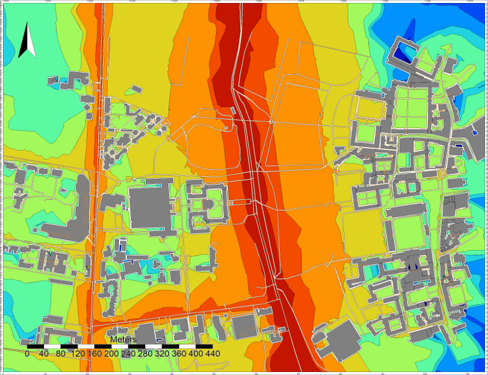

Noise Map from OSM - GUI
^^^^^^^^^^^^^^^^^^^^^^^^^^^^^^^^^^^^

In this tutorial, we are going to produce a noise map, using `OpenStreetMap`_ (OSM) data. The exercice will be made through NoiseModelling with Graphic User Interface (GUI).

.. _OpenStreetMap : https://www.openstreetmap.org/

Prerequisites
~~~~~~~~~~~~~~~~~

* You need at least NoiseModelling v.3.0.6; the best is always to use last release
* We assume you already installed/configured Java and installed NoiseModelling. If not, follow Step 1 in ":doc:`Get_Started_GUI`" page

.. warning::
   If you have just finished the ":doc:`Get_Started_GUI`" tutorial, please clean your database with the WPS block ``Clean_Database``. Don't forget to check the ``Are you sure`` check box before running the process. 

Step 1:  Get OSM data
~~~~~~~~~~~~~~~~~~~~~~~~~~~~~~~~~~~~~~~

.. note::
   OpenStreetMap data can be downloaded in various formats. The main ones are `.osm`, `.osm.gz` and `.osm.pbf` (`read more`_). For this example, we will use `.osm.pbf` file, which is a compressed version of `.osm`.

.. _read more : https://wiki.openstreetmap.org/wiki/OSM_file_formats

Download OSM data
------------------------------------------------

.. role::  raw-html(raw)
    :format: html

#. Go to https://extract.bbbike.org/ website. This platform is built on top of OpenStreetMap database and allows you to extract data in a very simple way. 
#. In the "Format" drop-down list, choose ``Protocolbuffer (PBF)``
#. Give a name to the area you will download *(this information is used to name your extraction request)*
#. Enter your email, so that BBBike will be able to send you the download link once your data are ready *(no data collection for commercial purpose)*.
#. Zoom in on the area you want to download *(be careful, depending on the zoom level, the file you will get may be very heavy)*
#. Click on the ``here`` icon to create the bounding box. If you click on the bbox, you can then make modification.
#. When ready, click on ``extract`` button.

In the email you will receive from BBBike, use the link to download your data. You will get a file called ``planet_xx.xx,xx.xx.osm.pbf`` 

.. warning::
   To avoid potential upcoming errors rename the file ``planet_xx.xx,xx.xx.osm.pbf`` to something simpler (*e.g.* ``my_area.osm.pbf``).

.. note::
   Developped by `Wolfram Schneider`_, BBBike is a free of charge service (for non-professional purpose). If you like Wolfram's job and wants to help him support the server costs, you are invited to `donate`_.

.. _Wolfram Schneider : https://wolfram.schneider.org/
.. _donate : https://extract.bbbike.org/community.html#donate

Import to the database
------------------------------------------------

To import the ``.pbf`` file into the NoiseModelling database, we use the ``Import_OSM`` WPS block (note that this block also allows to load ``.osm`` or ``.osm.gz`` files).

#. ``Target projection identifier``: enter the corresponding SRID *(see note below)* (*e.g.* ``2154`` for french Lambert 93)
#. ``Path of the OSM file``: enter the adress of your ``my_area.osm.pbf`` file (*e.g.* ``/home/noisemodelling/my_area.osm.pbf``)
#. If needeed, check the 4 other optionnal options
#. When ready, click on the green ``Run Process`` button

Once done, three tables must be created: ``BUILDINGS``, ``GROUND`` and ``ROADS``

.. note::
   About the Coordinate System (EPSG code)
   
   In several input files, you need to specify coordinates, *e.g* road network. You can't use the WGS84 coordinates (i.e. GPS coordinates). Acoustic propagation formulas make the assumption that coordinates are metric. Many countries and regions have custom coordinate system defined, optimized for usages in their appropriate areas. It might be best to ask some GIS specialists in your region of interest what the most commonly used local coordinate system is and use that as well for your data. If you don’t have any clue about what coordinate system is used in your region, it might be best to use the Universal Transverse Mercator coordinate system. This coordinate system divides the world into multiple bands, each six degrees width and separated into a northern and southern part, which is called UTM zones (see http://en.wikipedia.org/wiki/UTM_zones#UTM_zone for more details). For each zone, an optimized coordinate system is defined. Choose the UTM zone which covers your region (Wikipedia has a nice map showing the zones) and use its coordinate system.

   Here is the map : https://upload.wikimedia.org/wikipedia/commons/e/ed/Utm-zones.jpg

.. warning::
   * The current import script from OpenStreetMap may (in few specific cases) produce geometries incompatible with NoiseModelling. If an area has a problem, try to reduce the area. A much more robust version of this script will be available soon. 
   * As OSM does not include data on road traffic flows, default values are assigned according to the "`Good Practice Guide for Strategic Noise Mapping and the Production of Associated Data on Noise Exposure`_ - Version 2".

.. _Good Practice Guide for Strategic Noise Mapping and the Production of Associated Data on Noise Exposure: https://sicaweb.cedex.es/docs/documentacion/Good-Practice-Guide-for-Strategic-Noise-Mapping.pdf

Step 2: Visualize OSM data
~~~~~~~~~~~~~~~~~~~~~~~~~~~~~~~~~~~~~~~~~~~~~~~~~~~~~~

Now, to be sure that OSM data are corresponding to our need, we can take time to visualize them. To do so, we have various possibilities:

With NoiseModelling GUI
--------------------------------

* The contents of the database can be viewed using ``Display_Database`` WPS script.
* A spatial layer can be visualized using ``Table_Visualization_Map`` WPS script.
* A data table can be visualized using ``Table_Visualization_Data`` WPS script.

With H2 or DBeaver client
------------------------------------

While NoiseModelling is open, if you are working with the default H2/H2GIS database, you can display your database in both the H2 / H2GIS web interface and DBeaver. To do so, just follow the :doc:`NoiseModelling_db` page.

Export tables into files
--------------------------------

* Export a table: It is also possible to export the tables via ``Export_Table`` WPS script, in Shapefile, CSV or GeoJSON format.

* View the files: Then open these files into your preferred Geographic Information System (*e.g* `QGIS`_, `OrbisGIS`_, ...). You can then graphically visualize your geometries layer, but also the data contained in it. Take the time to familiarize yourself with your chosen GIS.

* Add a background map: Most of the GIS allow you to add an `WMS`_ OSM `background map`_: (see an `example with QGIS`_)

* Change colors: Most of the GIS allow you to change layer colors (*e.g.* ``GROUND`` layer in green, ``BUILDINGS`` in gray, ``ROADS`` in red).

.. _OrbisGIS: http://orbisgis.org/
.. _QGIS: http://qgis.org/
.. _WMS : https://www.ogc.org/standards/wms
.. _background map : https://wiki.openstreetmap.org/wiki/Tile_servers
.. _example with QGIS: https://wiki.openstreetmap.org/wiki/QGIS

Step 3: Generate a Receiver table
~~~~~~~~~~~~~~~~~~~~~~~~~~~~~~~~~~~~~~~~~~~~~~~~~~~~~~

The locations of noise level evaluation points needs to be defined.

Use ``Delaunay_Grid`` with the previously generated BUILDINGS table as the buildings table and ROADS as *Sources table name*.
Other parameters are optional.

Don't forget to view your resulting layer in ``WPSBuilder`` or in your GIS to check that it meets your expectations.

This processing block will give the possibility to generate a noise map later.

Step 4: Associate emission noise level with roads
~~~~~~~~~~~~~~~~~~~~~~~~~~~~~~~~~~~~~~~~~~~~~~~~~~~~~~

The ``Road_Emission_from_Traffic`` block is used to generate a road layer, called ``LW_ROADS``, containing LW emission noise level values in accordance with the emission laws of the CNOSSOS model. The format of the input road layer can be found in the description of the WPS Block.

Don't forget to view your resulting layers *(see Step 2)* to check that it meets your expectations.

Step 5: Source to Receiver Propagation
~~~~~~~~~~~~~~~~~~~~~~~~~~~~~~~~~~~~~~~~~~~~~~~~~~~~~~

The ``Noise_level_from_source`` block allows to generate a layer of receiver points with associated sound levels corresponding to the sound level emitted by the sources (created table ``LW_ROADS``) propagated to the receivers according to the CNOSSOS-EU. propagation laws.

Step 6: Create Isosurfaces map
~~~~~~~~~~~~~~~~~~~~~~~~~~~~~~~~~~~~~~~~~~~~~~~~~~

Create an interpolation of levels between receivers points using the block ``Create_Isosurface``.

Set ``LDEN_GEOM`` as ``Name of the noise table``.

Step 7: View the result
~~~~~~~~~~~~~~~~~~~~~~~~~~~~~~~~~~~~~~~~~~~~~~~~~~

Export
--------------
You can then export the output table ``CONTOURING_NOISE_MAP`` via ``Export_Table`` in Shapefile or GeoJSON format.

View
--------------
You can view this layer in your favorite GIS. You can then apply a color gradient on ``ISOLVL`` field; the noise level intervals are in ``ISOLABEL`` field.

