Noise Map from Point Source - GUI
^^^^^^^^^^^^^^^^^^^^^^^^^^^^^^^^^^^^

In this tutorial, we are going to produce a noise map, based on a unique source point. The exercice will be made through NoiseModelling with Graphic User Interface (GUI).

To make it more simple, we will use the data used in the :doc:`Get_Started_GUI` tutorial.

This tutorial is divided in 5 steps:

#. Create the source point
#. Import data in NoiseModelling
#. Generate the noise map
#. Play with options
#. Take into account directivity

Step 1: Create the source point
~~~~~~~~~~~~~~~~~~~~~~~~~~~~~~~~~~~~~~~~~~~~~

To create the source point, we will use the free and opensource GIS software `QGIS`_.

.. _QGIS: http://qgis.org/

.. note::
    For those who are new to GIS and want to get started with QGIS, we advise you to follow `this tutorial`_ as a start.

.. _this tutorial : https://docs.qgis.org/3.22/en/docs/training_manual/basic_map/index.html

Load data into QGIS
-------------------------

Once installed, launch QGIS and load the three ``buildings.shp``, ``roads.shp`` and ``ground_type.shp`` files (that are in the folder ``../NoiseModelling_5.0.0/data_dir/data/wpsdata/``). To do so, you can just drag & drop these files into the ``Layers`` menu (bottom left of the user interface). Or you can also select them thanks to the dedicated panel opened via the ``Layer / Add a layer / Add a vectorial layer... /`` menu (or use ``Ctrl+Maj+V`` shortcut)

You should see your input data in the map as below:

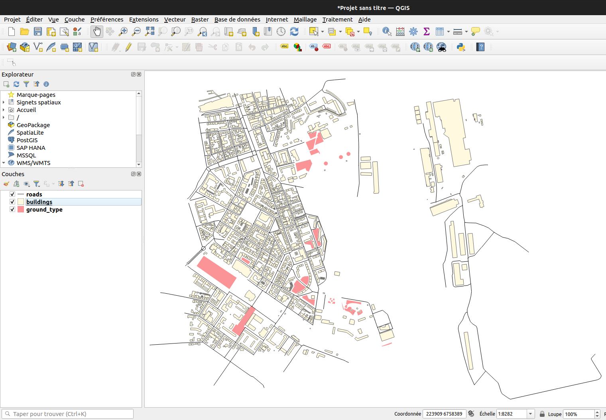

Initialize the source point layer
----------------------------------

In QGIS, we will create a new empty layer called ``Point_Source`` in which we will add the source point.

To do so, click on the ``Layer / Create Layer / New Temporary Scratch Layer... /`` menu. In the opened dialog, fill the detailed information below :

* ``File name`` : ``Point_Source``
* ``Geometry type`` : choose ``Point`` in the dropdown list
* ``Include Z dimension`` : check the box. This way the created point will be defined with X, Y and Z coordinates
* In the projection system dropdown list, choose a metric system. Here we will choose the one used for the buildings, roads and ground_type layers, that are in metropolitan France : Lambert 93 system = ``EPSG:2154`` (if the system is not present in the dropdown list, use the ``Globe`` icon on the right to find it)

In the ``New field`` part, fill the information below: 

* ``Name`` : PK . Unique id (Primary Key)
* ``Type`` : Integer
* ``Length`` : 2

Once done, click on ``Add to Fields List``. Then redo this step with the following informations:

* ``Name`` : HZD500 . Source noise level during the day (D) at a frequency of 500 Hz
* ``Type`` : Decimal number
* ``Length`` : 5
* ``Precision`` : 2

You should have something like this

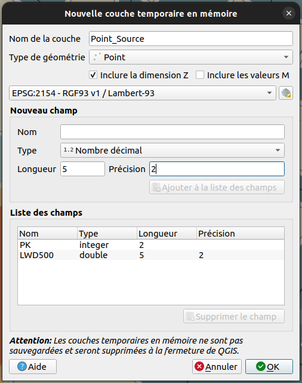

Once done, click on ``OK`` button. The new layer ``Point_Source`` should appear in your ``Layers`` panel.

Add a new source point
-------------------------

Now we have an empty layer. It's time to feed it with a point geometry. 

By default, the new temporary layer is already turned into edtion mode. If not, you can activate it thanks to these two options:

* In the ``Layers`` panel, select the ``Point_Source`` layer and make a right-click. Choose ``Toggle Editing``
* or you can click on the "Yellow pencil" icon in the toolbar

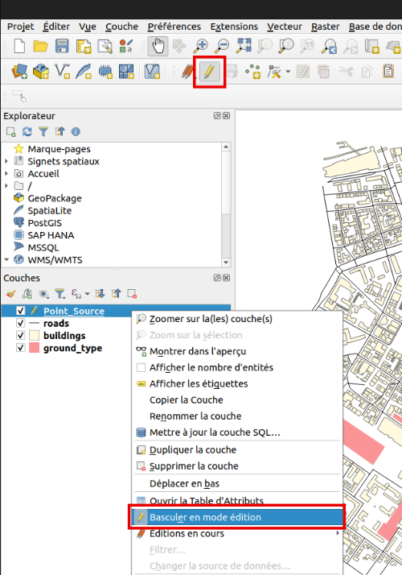

Now we can add a new point, by clicking on the dedicated icon (see illustration below) and then by clicking somewhere in the map.

To have an interesting resulting noise map, choose to place your source point next to buildings.

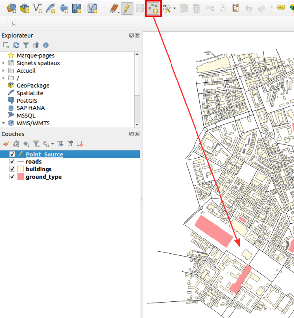

Click on the map where you want to create the source point. Once clicked, a new dialog appears and you are invited to fill the following attributes:

* ``PK``: 1
* ``HZD500`` : 90

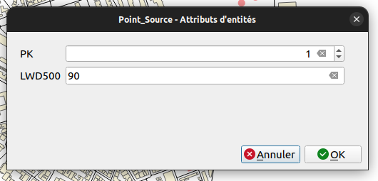

Once done, click on ``OK``. The source point is now visible in the map (the blue point in the illustration below).

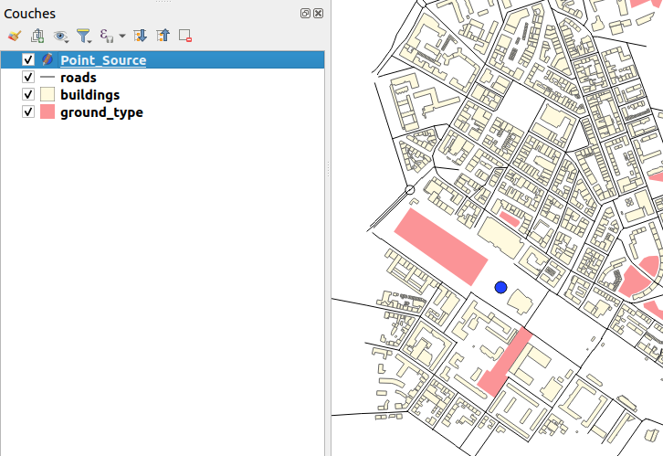

Now, we have to save this temporary layer into a flat file. To do so, just make a right-click on the layer name and choose the  ``Make permanent`` option.

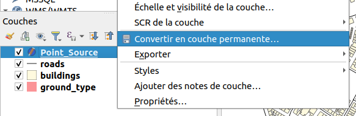

In the new dialog, select ``GeoJSON`` file format and then define the path and the name of your resulting .geojson file. Press ``OK`` when ready.

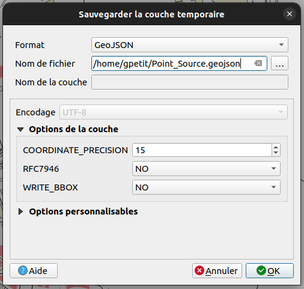

Your ``Point_Source.geojson`` file is now ready to be imported in NoiseModelling.

For your information, you can open ``.geojson`` files in most of text editor. If you do so with ``Point_Source.geojson``, you will have something like this:

::

   {
   "type": "FeatureCollection",
   "name": "Point_Source",
   "crs": {"type": "name", "properties": { "name": "urn:ogc:def:crs:EPSG::2154" } },
   "features": [{"type": "Feature", "properties": { "PK": 1, "HZD500": 90.0 },
                 "geometry": {"type": "Point", "coordinates": [223771.0727, 6757583.2983, 0.0]} 
                }]
   }

Step 2: Import input data in NoiseModelling
~~~~~~~~~~~~~~~~~~~~~~~~~~~~~~~~~~~~~~~~~~~~~

Once NoiseModelling is launched (see ``Step 2: Start NoiseModelling GUI`` in :doc:`Get_Started_GUI` page), load the four ``BUILDINGS``, ``ROADS`` and ``GROUND_TYPE``, ``POINT_SOURCE`` layers (see ``Step 4: Load input files`` for more details).

If you use the ``Database_Manager:Display_Database`` WPS script, you should see your four tables like below:

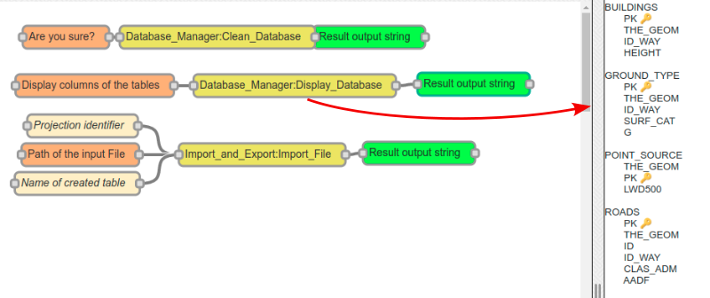

Step 3: Generate the noise map
~~~~~~~~~~~~~~~~~~~~~~~~~~~~~~~~~~~~~~~~~~~~~~~~~~

We are now ready to generate the noise map, based on a unique source point.

Create the receivers grid
---------------------------

Use the ``Receivers:Delaunay_Grid`` WPS script. Fill the two following mandatory parameters *(in orange)* and click on ``Run Process`` button:

* ``Source table name`` : ``POINT_SOURCE``
* ``Buildings table name`` : ``BUILDINGS``

Once done, you should have two new tables : ``RECEIVERS`` *(illustrated below with the purple small points)* and ``TRIANGLES``

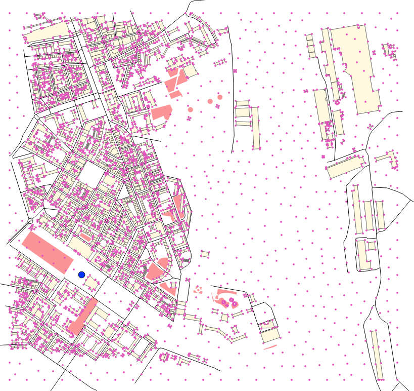

Calculate noise levels
---------------------------

Use the ``NoiseModelling:Noise_level_from_source`` WPS script. Fill the three following mandatory parameters *(in orange)*:

* ``Source table name`` : ``POINT_SOURCE``
* ``Receivers table name`` : ``RECEIVERS``
* ``Buildings table name`` : ``BUILDINGS``

Once ready, click on ``Run Process`` button.

You should then have this message: ``Calculation Done ! RECEIVERS_LEVEL table(s) have been created.``

Generate noise level isosurfaces
----------------------------------

Use the ``Acoustic_Tools:Create_Isosurface`` WPS script. Fill the following mandatory parameter *(in orange)* and click on ``Run Process`` button:

* ``Sound levels table`` : ``RECEIVERS_LEVEL``

You should have this message: ``Table CONTOURING_NOISE_MAP created``

Now, you can export this table into a .shapefile, using the ``Import_and_Export:Export_Table`` WPS script.

You can then visualize this file into QGIS *(just load the file as seen before)*. The resulting table *(in grey)* is illustred below

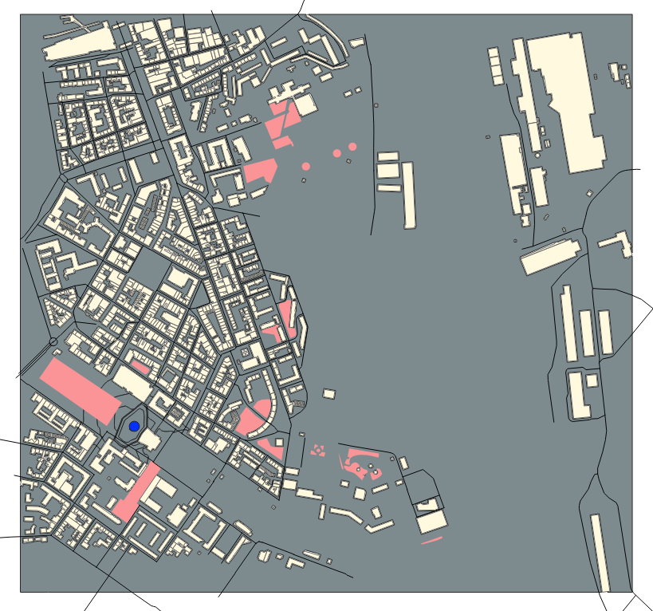

Filter the table according to a single period (ex. DEN):

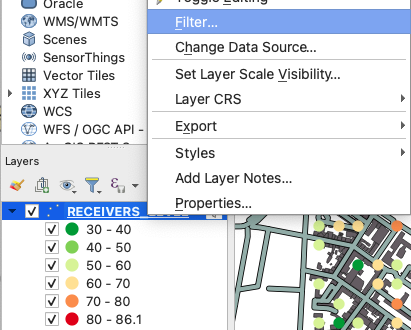

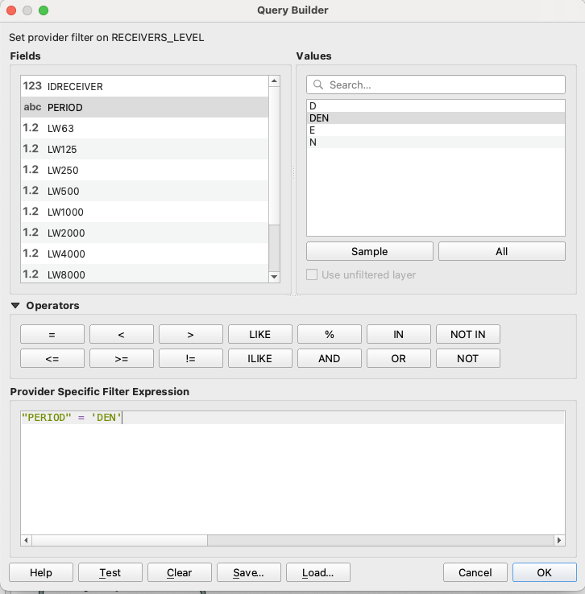

Apply a color palette adapted to acoustics
-----------------------------------------------

In QGIS, since the isosurface table is not easy to read *(everything is grey in our example)*, we will change the color palette to have colors depending on the noise levels. This information is present in the field ``ISOLVL`` in the attributes table. To open it, just select the layer ``CONTOURING_NOISE_MAP`` and press ``F6``.

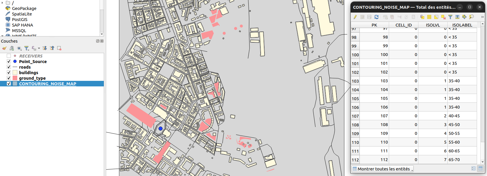

To adapt the colors, we will apply a cartographic style. This style:

* has been proposed by B. Tomio (Weninger) in *"A Color Scheme for the Presentation of Sound Immission in Maps : Requirements and Principles for Design"* (see `publication`_ and `website`_)
* is provided *(by NoiseModelling team)* as a ``.sld`` *(Style Layer Descriptor)* file and can be downloaded `here`_ 

.. _publication : https://www.semanticscholar.org/paper/A-Color-Scheme-for-the-Presentation-of-Sound-in-%3A-Weninger/a72d13fcc53488567b45a08a78f969c7b3552ac0

.. _website : https://www.coloringnoise.com/theoretical_background/new-color-scheme/

.. _here : https://github.com/Universite-Gustave-Eiffel/NoiseModelling/blob/v4.0.2/Docs/styles/style_beate_tomio.sld

.. note::
   If you want to know more about noise map styles, you should read the ":doc:`Noise_Map_Color_Scheme`" page.

Once downloaded, make a double click on the layer ``CONTOURING_NOISE_MAP``. It will opens the property panel. Here, click on the ``Symbology`` tab.
In the ``Style`` menu *(at the bottom)*, choose ``Load style``. Then in the opened dialog, click on the ``...`` icon to search the ``style_beate_tomio.sld`` file. Once selected, click on ``Load style``.

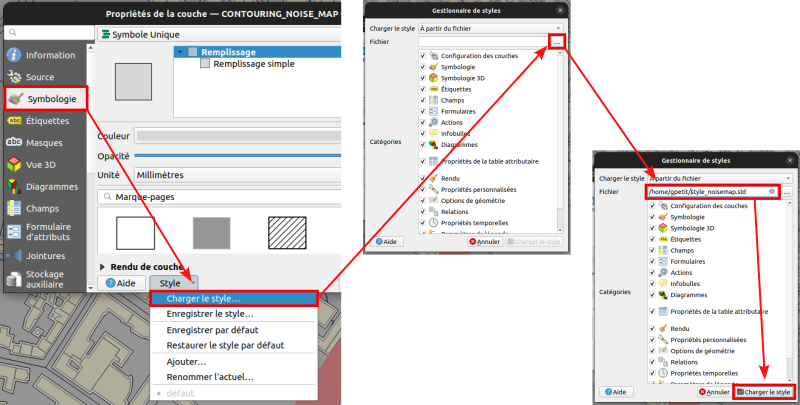

The style with its different colors is now displayed. 

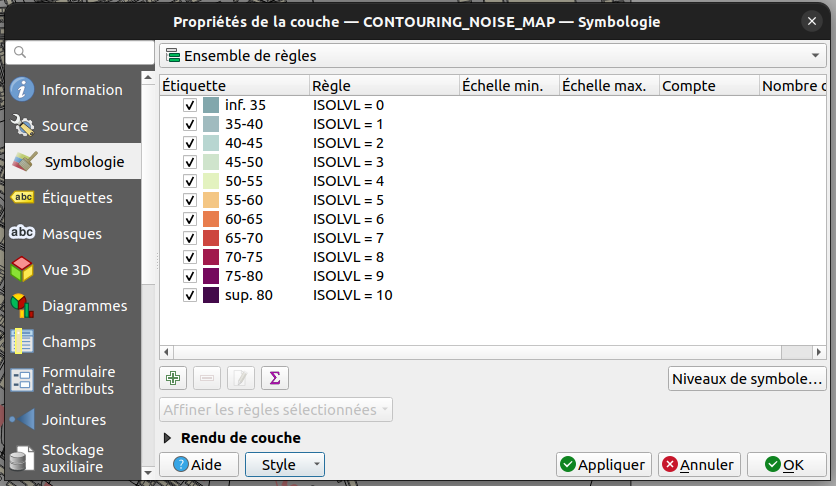

Press ``OK`` to apply and close the dialog. Your noise map is now well colorized and you can navigate into it to see the influence of buildings on noise levels.

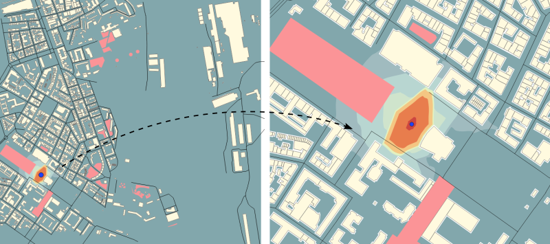

Step 4: Change the default parameters
~~~~~~~~~~~~~~~~~~~~~~~~~~~~~~~~~~~~~~~~~~~~~~~~~~

To produce this noise map, we used, in most of WPS scripts, default parameters (*e.g* the height of the source, the number of reflections, the air temperature, …). You are prompted to redo some of the previous steps by changing some of the settings. You will then be able to visually see what impact they have on the final noise map.

.. note::
   To change optionnal parameters *(the yellow boxes)* just select them and fill the needed informations in the right-side menu.

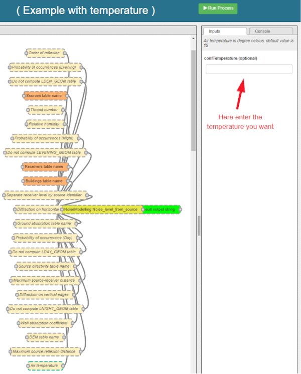

Step 5 (bonus): Change the directivity
~~~~~~~~~~~~~~~~~~~~~~~~~~~~~~~~~~~~~~~~~~~~~~~~~~

In this bonus step, we will manage with the directivity. To do so, we will apply the following method:

#. Get directivity
#. Update the ``Source_Point`` table
#. Import needed data into NoiseModelling
#. Produce the noise map, taking into acount directivity parameters

Directivity
-----------------------------------------------

The directivity table aims at modeling a realistic directional noise source. To do so, we associate to each "Theta-Phi" pair an attenuation in dB.

* ``DIR_ID`` : identifier of the directivity sphere
* ``THETA`` : vertical angle in degrees, 0 (front), -90 (bottom), 90 (top), from -90 to 90
* ``PHI``: horizontal angle in degrees, 0 (front) / 90 (right), from 0 to 360
* ``HZ500`` : attenuation levels in dB for 500 Hz

Each of the sound sources has its own directivity. For the exercise we will use the directivity of a train, which is provided in the file `Directivity.csv`_ and which you are invited to download.

.. _Directivity.csv: https://github.com/Universite-Gustave-Eiffel/NoiseModelling/blob/v4.0.1/Docs/data/Directivity.csv

.. csv-table:: Extract from the directivity table (Directivity.csv)
   :file: ./data/Directivity_short.csv
   :widths: 25, 25, 25, 25
   :header-rows: 1

Below is an illustration generated from train directivity formula.

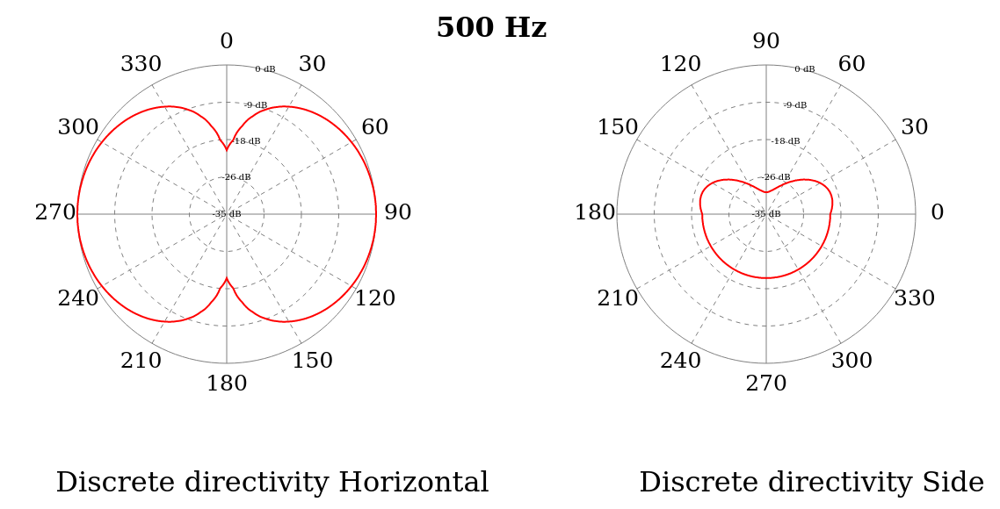

Update source point table
-----------------------------------------------

To play with directivity, we need to add 4 fields in the source point table:

* Yaw
   * ``Name`` : YAW
   * ``Description`` : Source horizontal orientation in degrees. For points 0° North, 90° East. For lines 0° line direction, 90° right of the line direction.
   * ``Type`` : Decimal number
   * ``Length`` : 4
* Pitch
   * ``Name`` : PITCH 
   * ``Description`` : Source vertical orientation in degrees. 0° front, 90° top, -90° bottom. (FLOAT).
   * ``Type`` : Decimal number
   * ``Length`` : 4
* Roll
   * ``Name`` : ROLL 
   * ``Description`` : Source roll in degrees
   * ``Type`` : Decimal number
   * ``Length`` : 4
* Direction identififier
   * ``Name`` : DIR_ID
   * ``Description`` : Identifier of the directivity sphere from tableSourceDirectivity parameter or train directivity if not provided -> OMNIDIRECTIONAL(0), ROLLING(1), TRACTIONA(2), TRACTIONB(3), AERODYNAMICA(4), AERODYNAMICB(5), BRIDGE(6)
   * ``Type`` : Integer
   * ``Length`` : 2

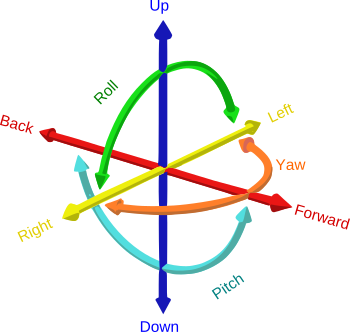

.. note::
   Source image: GregorDS, `CC BY-SA 4.0`_, via `Wikimedia Commons`_

.. _CC BY-SA 4.0 : https://creativecommons.org/licenses/by-sa/4.0
.. _Wikimedia Commons : https://commons.wikimedia.org/wiki/File:6DOF.svg

In our example, we will update the ``Point_Source.geojson`` file to add these columns and to fill them with new information. To do so, just edit the file into a text editor and replace the following lines. Save it once done.

::

   { "PK": 1, "HZD500": 100.0}

by

::

   { "PK": 1, "HZD500": 100.0, "YAW": 45, "PITCH": 0, "ROLL": 0, "DIR_ID" : 1 }

Here we can see that the Yaw is setted to 45°. Pitch and Roll are equal to 0, and the directivity is defined as ``1``  and will refer to the directivy table (see below).

So your final .geojson file should look like this

::

   {
   "type": "FeatureCollection",
   "name": "Point_Source",
   "crs": {"type": "name", "properties": { "name": "urn:ogc:def:crs:EPSG::2154" } },
   "features": [{"type": "Feature", "properties": { "PK": 1, "HZD500": 100.0, "YAW": 45, "PITCH": 0, "ROLL": 0, "DIR_ID" : 1 },
                 "geometry": {"type": "Point", "coordinates": [223771.0727, 6757583.2983, 0.0]} 
                }]
   }

Import data
-----------------------------------------------

Now, in NoiseModelling we have to:

* Import the ``Directivy.csv`` file
* Reimport the ``Point_Source.geojson`` file in order to take into account the changes
* Import the ``dem.geojson`` file, which is placed here ``./NoiseModelling_5.0.0/data_dir/data/wpsdata/dem.geojson``. By taking into account the ground elevation, this file will help us to get better results.

To do so, just use the ``Import_and_Export:Import_Table`` WPS script.

Generate the Delaunay triangulation
-----------------------------------------------

Use the ``Receivers:Delaunay_Grid`` WPS script. Fill the following parameters and click on ``Run Process`` button:

* ``Sources table name`` : ``POINT_SOURCE``
* ``Maximum Area`` : ``60``  
* ``Buildings table name``: ``BUILDINGS``
* ``Height`` : ``1.6``

Compute noise level from source
-----------------------------------------------

Use the ``NoiseModelling:Noise_level_from_source`` WPS script. Fill the following parameters and click on ``Run Process`` button:

* ``Sources table name`` : ``POINT_SOURCE``
* ``Buildings table name`` : ``BUILDINGS``
* ``Receivers table name`` : ``RECEIVERS``
* ``Ground absorption table name`` : ``GROUND_TYPE``
* ``Source directivity table name`` : ``DIRECTIVITY``
* ``Maximum source-receiver distance`` : ``800``
* ``DEM table name`` : ``DEM``

Create isosurface
-----------------------------------------------

Use the ``Acoustic_Tools:Create_Isosurface`` WPS script. Fill the following parameters and click on ``Run Process`` button:

* ``Sound levels table`` : ``RECEIVERS_LEVEL``
* ``Polygon smoothing coefficient`` : 0.4

Export and visualize resulting tables
-----------------------------------------------

Use the ``Import_and_Export:Export_Table`` WPS script to export the ``CONTOURING_NOISE_MAP`` table into a shapefile called ``CONTOURING_NOISE_MAP_DIRECTIVITY``.

Then, load ``CONTOURING_NOISE_MAP_DIRECTIVITY.shp`` into QGIS and filter the period to ``DEN``. Apply the ``noisemap_style.sld`` style, and compare with ``CONTOURING_NOISE_MAP.shp`` produced in Step 3.

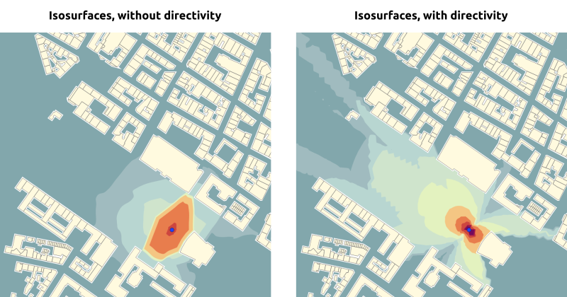
