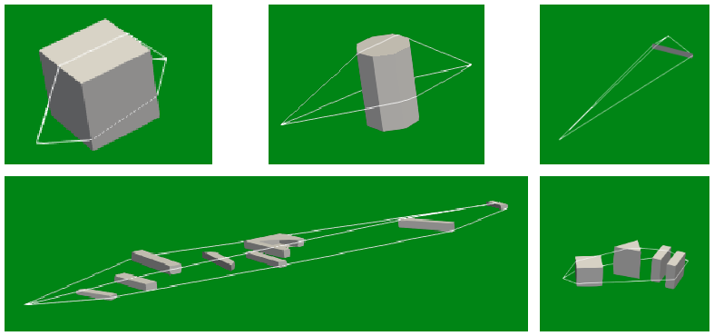

Numerical Model
^^^^^^^^^^^^^^^^^^^^^^^^^^^^^^^^^^^^

Emission Numerical Model
~~~~~~~~~~~~~~~~~~~~~~~~~~~~~~~~~~~~~~~~~
Traffic emission model
----------------------
The emission model of the implemented traffic is the `CNOSSOS-EU`_ model.

.. note::
    Current model includes the emission coefficients ``a`` and ``b`` presented in the `report "Amendments for CNOSSOS-EU" (Kok, 2019)`_

Other emission models
----------------------

Other emission models are not included within the release 3.0.

Ray Tracing
~~~~~~~~~~~~~~~~~~~~~~~~~~~~~~~~~~~~~~~~~
The ray tracing algorithm is a rubber-band like algorithm as specified in `CNOSSOS-EU`_. 

.. warning::
    - Rays backwards to the source or receiver are not taken into account. For example, if a receiver is located inside a U-shaped building, only diffractions on horizontal edges will be taken into account.

Propagation Numerical Model
~~~~~~~~~~~~~~~~~~~~~~~~~~~~~~~~~~~~~~~~~
The emission model of the implemented traffic is the `CNOSSOS-EU`_ model.

.. warning::
    - The rays under favorable conditions are subject to `questioning`_. The current version is not final.
    - The Rayleigh criterion is subject to `questioning`_. The current version does not integrate calculation that involve this criterion.
    - Taking into account 15 degrees obstacles are subject to `questioning`_. The current version doesn't integrate calculation that involve 15 degrees obstacles.

.. _questioning: https://www.rivm.nl/bibliotheek/rapporten/2019-0023.pdf

.. _report "Amendments for CNOSSOS-EU" (Kok, 2019): https://www.rivm.nl/bibliotheek/rapporten/2019-0023.pdf

.. _CNOSSOS-EU: https://circabc.europa.eu/sd/a/9566c5b9-8607-4118-8427-906dab7632e2/Directive_2015_996_EN.pdfde

