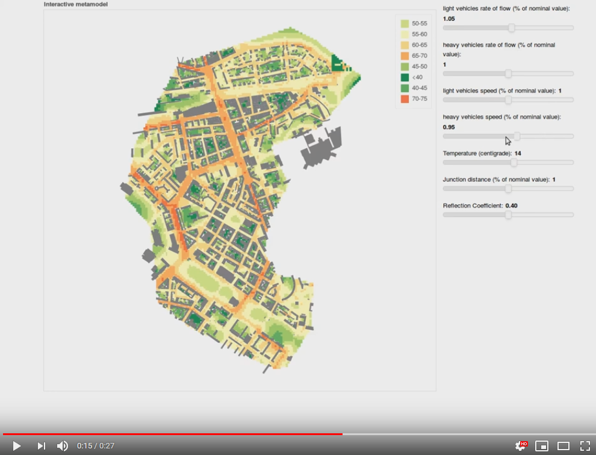
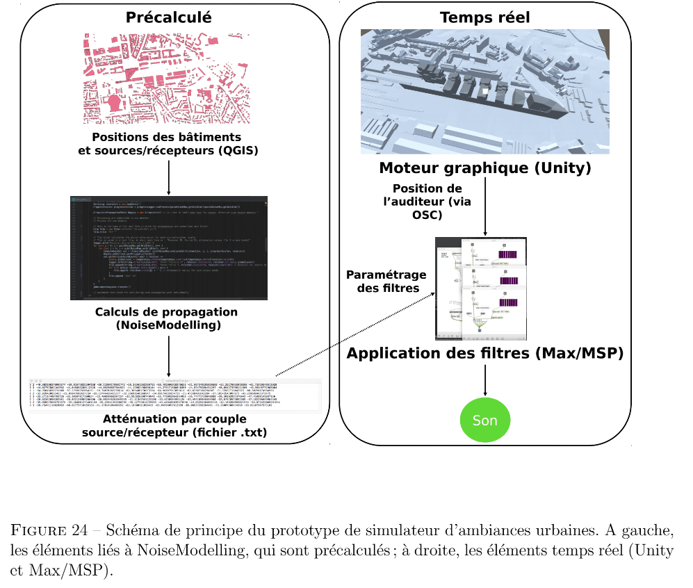

.. _My target:

Scientific production 
^^^^^^^^^^^^^^^^^^^^^^^^^^^^^^^^^^^^^^^^^^^

Below is a non-exhaustive list of articles or presentations in which NoiseModelling is used.

Standard Noise maps
~~~~~~~~~~~~~~~~~~~~~~~~~

GRAZIUSO G., FRANCAVILLA A. B., MANCINI S., GUARNACCIA C., `Open-source software tools for strategic noise mapping: a case study <https://iopscience.iop.org/article/10.1088/1742-6596/2162/1/012014>`_, Journal of Physics: Conference Series, 2022, vol. 2162, 012014

AUMOND P., BOCHER E., ECOTIERE D., FORTIN N., GAUVREAU B., GUILLAUME G., PETIT G., `Improvement of city noise map production processes and sensitivity analysis to noise models inputs <http://www.sea-acustica.es/fileadmin/Madeira21/ID122.pdf>`_, Euronoise Conference Proceedings, 2021, p. 1128

NOURMOHAMMADI Z., LILASATHAPORNKIT T., ASHFAQ M., et al., `Mapping Urban Environmental Performance with Emerging Data Sources: A Case of Urban Greenery and Traffic Noise in Sydney, Australia <https://www.mdpi.com/2071-1050/13/2/605>`_, Sustainability, 2021, vol. 13, n° 2, p. 605

BAEZA J. L., SIEVERT J. L., LANDWEHR A., et al., `CityScope Platform for Real-Time Analysis and Decision-Support in Urban Design Competitions <https://www.igi-global.com/article/cityscope-platform-for-real-time-analysis-and-decision-support-in-urban-design-competitions/278826>`_, International Journal of E-Planning Research (IJEPR), 2021, vol. 10, n° 4, p. 1-17

WANG Z., NOVACK T., YAN Y., ZIPF A., `Quiet Route Planning for Pedestrians in Traffic Noise Polluted Environments <https://ieeexplore.ieee.org/document/9139350/>`_, IEEE Transactions on Intelligent Transportation Systems, 2020

AUMOND P., FORTIN N., CAN A., `Overview of the NoiseModelling open-source software version 3 and its applications <https://www.ingentaconnect.com/contentone/ince/incecp/2020/00000261/00000004/art00003>`_, INTER-NOISE and NOISE-CON Congress and Conference Proceedings, 2020, vol. 261, n°4, p. 2005-2011

Dynamic Noise maps
~~~~~~~~~~~~~~~~~~~~~~~~~

MONTENEGRO, A. L., MELLUSO, D., STASI, G., PANCI, A., BOLOGNESE, M., PALAZZUOLI, D., ... & LICITRA, G., `An open-source pipeline in noise modelling and noise exposure reduction in a port city.<https://www.researchgate.net/profile/Alexandra-Montenegro/publication/382072874_An_open-source_pipeline_in_noise_modelling_and_noise_exposure_reduction_in_a_port_city/links/668bdf59f3b61c4e2cb7e962/An-open-source-pipeline-in-noise-modelling-and-noise-exposure-reduction-in-a-port-city.pdf>`_, In Proceedings of the 30th International Congress on Sound and Vibration (ICSV30), 2024.

BACLET S., VENKATARAMAN S., RUMPLER R., BILLSJÖ R., HORVATH J., ÖSTERLUND P. E., `From strategic noise maps to receiver-centric noise exposure sensitivity mapping <https://www.sciencedirect.com/science/article/pii/S1361920921004089>`_, Transportation Research Part D: Transport and Environment, 2022, vol. 102 *(Noise mapping, Road traffic noise, Population exposure, Road network sensitivity)*

BACLET S., VENKATARAMAN S., RUMPLER R., `A methodology to assess the impact of driving noise from individual vehicles in an urban environment <http://axaco.s3.amazonaws.com/uploads/2021/06/07/MIHmJYsH/rev2021-032.pdf>`_, Resource Efficient Vehicles Conference, 2021.

LE BESCOND V., CAN A., AUMOND P., GASTINEAU P., `Open-source modeling chain for the dynamic assessment of road traffic noise exposure <https://www.sciencedirect.com/science/article/pii/S1361920921000973>`_, Transportation Research Part D: Transport and Environment, 2021, vol. 94, 102793 (Watch a `short presentation <https://youtu.be/jNCG0qQrsrE>`_ on Youtube)

CAN A., AUMOND P., BECARIE, C., LECLERCQ, L., `Dynamic approach for the study of the spatial impact of road traffic noise at peak hours <https://pub.dega-akustik.de/ICA2019/data/articles/000646.pdf>`_, Proceedings of the 23rd International Congress on Acoustics, Aachen, Allemagne, 09-13 September, 2019

QUINTERO G., AUMOND P., CAN A., BALASTEGUI A., ROMEU J., `Statistical requirements for noise mapping based on mobile measurements using bikes <https://www.sciencedirect.com/science/article/abs/pii/S0003682X19302087>`_, Applied Acoustics, 156, 271-278, 2019 

.. figure:: images/examples/Exposure.PNG
    :align: center
    :width: 75%
    :target: https://www.youtube.com/watch?v=jl8tASDr-uQ&t=133s

.. centered::
  https://www.youtube.com/watch?v=jl8tASDr-uQ&t=133s

CAN A., AUMOND P., BECARIE C., LECLERCQ L., `Approche dynamique pour l’étude de l’emprise spatiale du bruit de trafic routier aux heures de pointe <https://hal.archives-ouvertes.fr/hal-02482315>`_, Recherche en Transport Sécurité, 2018

Probabilistic & Multi-sources Noise maps
~~~~~~~~~~~~~~~~~~~~~~~~~~~~~~~~~~~~~~~~~~~~~~~~~

ALIONTE C-G., COMEAGA D-C., `Noise assessment of the small-scale wind farm <https://doi.org/10.1051/e3sconf/201911202011>`_, In : E3S Web of Conferences. EDP Sciences, 2019

AUMOND P., CAN A., `Probabilistic modeling framework to predict traffic sound distribution <https://www.euronoise2018.eu/docs/papers/86_Euronoise2018.pdf>`_, Proceedings of Euronoise, Hersonissos, Crete, 27-31 May 2018

AUMOND P., JACQUESSON L., CAN A., `Probabilistic modeling framework for multisource sound mapping <https://www.sciencedirect.com/science/article/pii/S0003682X17311283>`_, Applied Acoustics, 139, 34-43, 2018

Sensitivity Analysis & data assimilation
~~~~~~~~~~~~~~~~~~~~~~~~~~~~~~~~~~~~~~~~~~~~~~~~~~~

LESIEUR A., MALLET V., AUMOND P., CAN A., `Data assimilation for urban noise mapping with a meta-model <https://www.sciencedirect.com/science/article/pii/S0003682X21000311>`_, Applied Acoustics, 2021, vol. 176, 107938, 

AUMOND P., CAN A., MALLET V., GAUVREAU B., GUILLAUME G., `Global sensitivity analysis of a noise mapping model based on open-source software <https://www.sciencedirect.com/science/article/abs/pii/S0003682X20310021>`_, Applied Acoustics, 2021, vol. 176, 107899 

LESIEUR A., AUMOND P., MALLET V., et al., `Meta-modeling for urban noise mapping <https://asa.scitation.org/doi/10.1121/10.0002866>`_. The Journal of the Acoustical Society of America, 2020, vol. 148, no 6, p. 3671-3681 

.. centered::
  https://www.youtube.com/watch?v=orc5ZbN2dlY

AUMOND P., CAN A., MALLET V., GAUVREAU B., GUILLAUME G., `Global sensitivity analysis for urban noise modelling <https://pub.dega-akustik.de/ICA2019/data/articles/000637.pdf>`_, Proceedings of the 23rd International Congress on Acoustics, Aachen, Allemagne, 09-13 September, 2019

Auralisation
~~~~~~~~~~~~~~~~~~~~~~~~~

ROHRLICH F. , VERRON C. (Noise Makers), *Captation et Simulation d’Ambiances Urbaines Spatialisées*, 2018-2019

