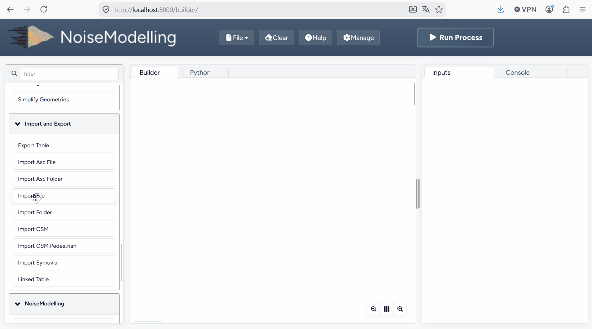
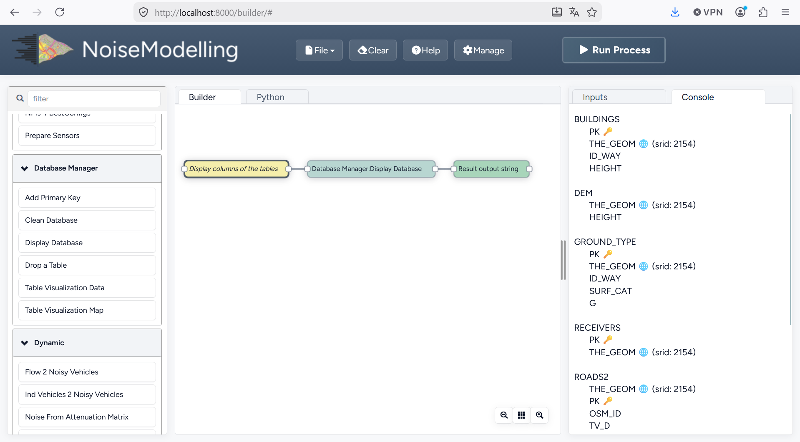
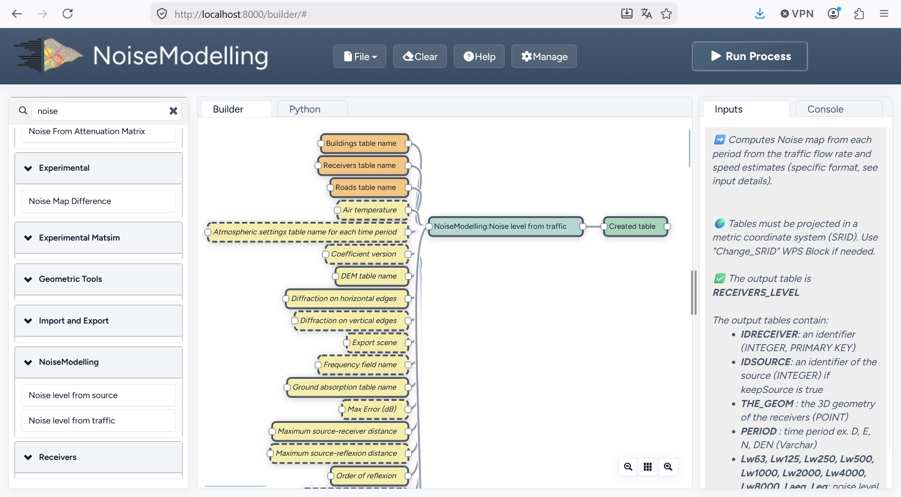
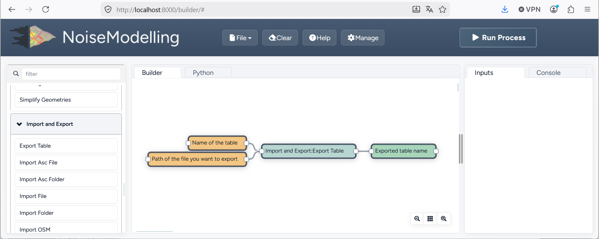
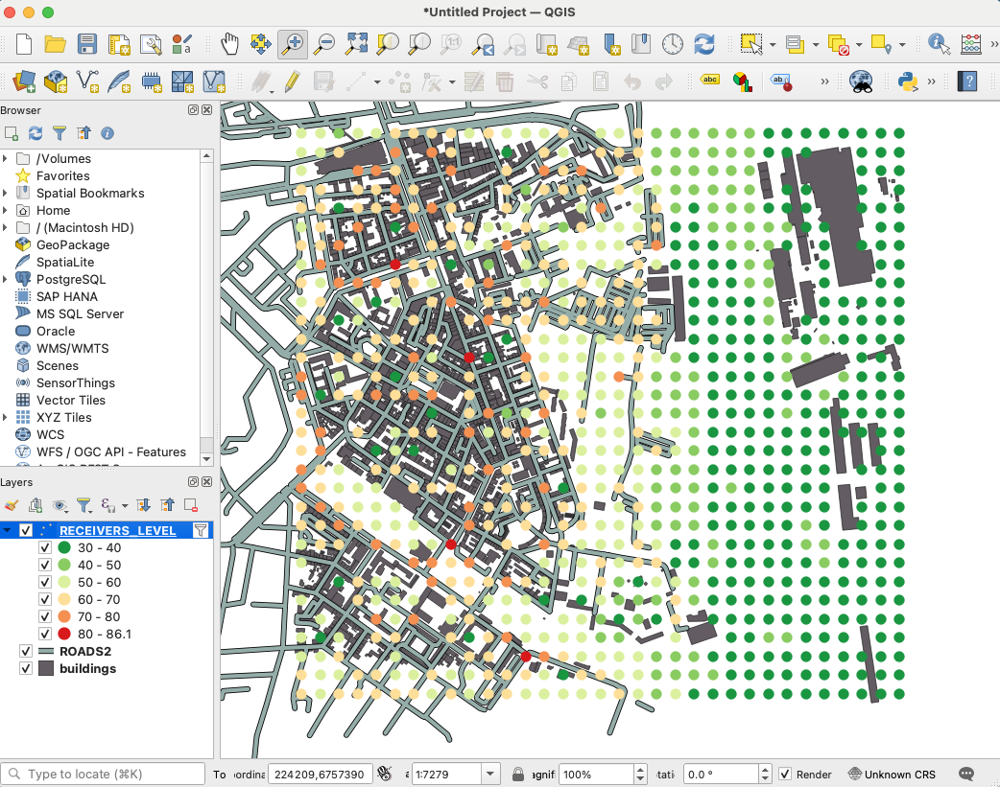
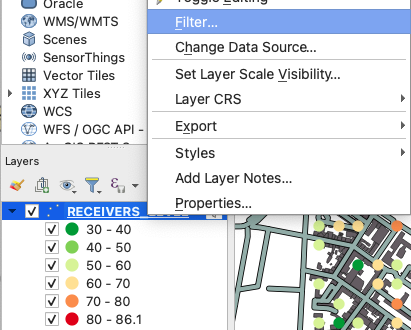
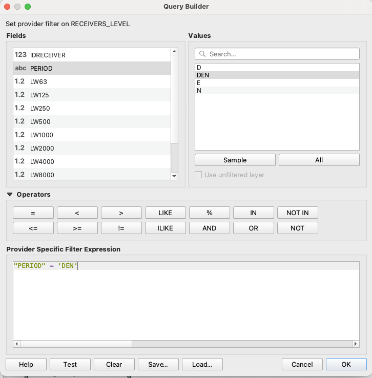
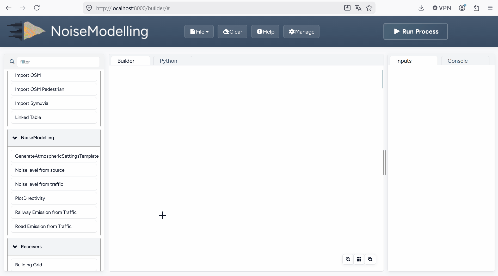

Get Started - GUI
^^^^^^^^^^^^^^^^^^^^^^^^^^^^^^^^^^^^

Below we present a simple example to help you discover NoiseModelling through its Graphical User Interface (GUI).

Step 1: Open NoiseModelling
~~~~~~~~~~~~~~~~~~~~~~~~~~~~~~~~~~~~~~~~~

See :ref:`sec_start_nm` in the :doc:`Installation_guide`.

Step 2: Load input files
~~~~~~~~~~~~~~~~~~~~~~~~~~~~~~~~~~~~~~~~~

To compute your first noise map, you need to load input geographic files into the NoiseModelling database.

In this tutorial, we have 5 layers, zoomed in on the city center of `Lorient`_ (France): Buildings, Roads, Ground type, Topography (DEM) and Receivers.

.. _Lorient : https://www.openstreetmap.org/relation/30305

In the ``resources/`` sub-folder of the NoiseModelling installation, you will find all the data that will be used in the tutorials.

You will import these layers into your database using the ``Import File`` blocks.

- Drag the ``Import File`` block into the Builder window
- Select the ``Path of the input File`` box and enter ``resources/buildings.shp`` in the ``pathFile`` field *(on the right-side column)*
- Then click on ``Run Process`` after selecting one of the input/output boxes of your process

Repeat this operation for the 4 other files:

- ``resources/ground_type.shp``
- ``resources/receivers.shp``
- ``resources/ROADS2.shp``
- ``resources/dem.geojson``

Files are uploaded to the database when the Console window displays the name of the layer.

.. note::
    - If you get the message ``Error opening database``, please refer to the note in :ref:`sec_download` in the :doc:`Installation_guide`.
    - The process is supposed to be quick (<5 sec.). In case of a timeout, try restarting NoiseModelling (see :ref:`sec_start_nm` in the :doc:`Installation_guide`).
    - Orange blocks are mandatory
    - Beige blocks are optional
    - If all input blocks are optional, you must modify at least one of these blocks to be able to run the process
    - Blocks get a solid border when they are ready to run
    - Read the :doc:`WPS_Builder` page for more information

Once done, you can check whether the tables were correctly imported into the database. To do so, drag/drop and execute the ``Display_Database`` WPS script (in the "Database_Manager" section). You should see on the right panel the table list (and their columns if you checked the option in the ``Display columns of the tables`` block).

Step 3: Convert road traffic into noise emission sources lines
~~~~~~~~~~~~~~~~~~~~~~~~~~~~~~~~~~~~~~~~~~~~~~~~~~~~~~~~~~~~~~~~~~~~~~~~~~~~~~~~~~

The first step is to convert the traffic information on the roads to noise levels (vehicles per hour to an average value in dB)

Drag & Drop the ``Road Emission from Traffic`` block into the WPS Builder window.

Enter the name of the corresponding table in your database:

- Roads table name: ``ROADS2`` This table contains the road geometries with traffic data for day, evening and night

When ready, you can press ``Run Process``.

As a result, the table ``LW_ROADS`` will be created in your database. This table contain the noise emission of your roads. The next step will run a simulation of the noise propagation to the receivers position.

Step 4: Run Calculation
~~~~~~~~~~~~~~~~~~~~~~~~~~~~~~~~~~~~~~~~~

To run the calculation, drag the ``Noise_level_from_sources`` block into the WPS Builder window.

Then, select the orange blocks and enter the name of the corresponding table in your database:

- Building table name: ``BUILDINGS``
- Source table name: ``LW_ROADS`` This table contains the road geometries with the noise emission values for day, evening and night
- Receivers table name: ``RECEIVERS`` Locations where noise levels are evaluated
- DEM table name: ``DEM`` Digital elevation model
- Ground absorption table: ``GROUND_TYPE`` Nature of the ground
- Diffraction on horizontal edges: ``☑`` check it (sound propagation goes over buildings)
- Maximum source-receiver distance: set ``2000`` meters (do not look for sound sources further than 2 km)
- Order of reflection: set ``0`` to disable it (faster but less accurate)

The beige blocks correspond to optional parameters (e.g. ``DEM table name``, ``Ground absorption table name``, ``Diffraction on vertical edges``, ...).

When ready, you can press ``Run Process``.

As a result, the table ``RECEIVERS_LEVEL`` will be created in your database. This table corresponds to the noise levels computed at receiver points. The column PERIOD corresponds to the 4 different periods of the day (D, E, N and DEN).

Step 5: Export (& see) the results
~~~~~~~~~~~~~~~~~~~~~~~~~~~~~~~~~~~~~~~~~

You can now export the output tables *(one by one)* in your preferred export format using the ``Export_Table`` block, giving the path of the file you want to create.

.. warning::
    Don't forget to add the file extension (*e.g.* ``c:/home/receivers_level.geojson`` or ``c:/home/receivers_level.shp``). (Read more info about file extensions here: :doc:`Tutorials_FAQ`)

For example, you can export the tables in ``.shp`` format. This format can be read with most GIS tools such as the free and open-source `QGIS`_ and `SAGA`_ software.

.. _QGIS : https://www.qgis.org/fr/site/
.. _SAGA : http://www.saga-gis.org/en/index.html

.. note::
    For those who are new to GIS and want to get started with QGIS, we advise you to follow `this tutorial`_.

.. _this tutorial : https://docs.qgis.org/3.22/en/docs/training_manual/basic_map/index.html

To obtain the following image, use the styling options in your GIS and assign a color gradient to the ``LAEQ`` column of your exported ``RECEIVERS_LEVEL`` table.

To display the result for a specific period, filter the rendering by the field PERIOD in QGIS.

   Popup menu

   Filter window

.. tip::
    Now that you have made your first noise map (congratulations!), you can try again by adding or changing optional parameters to see the differences.

Step 6: Know the possibilities
~~~~~~~~~~~~~~~~~~~~~~~~~~~~~~~~~~~~~~~~~

Now that you have finished this introduction tutorial, take the time to read the description of each of the WPS blocks available in your NoiseModelling version.

By clicking on each of the inputs or outputs, you will find a lot of information.

