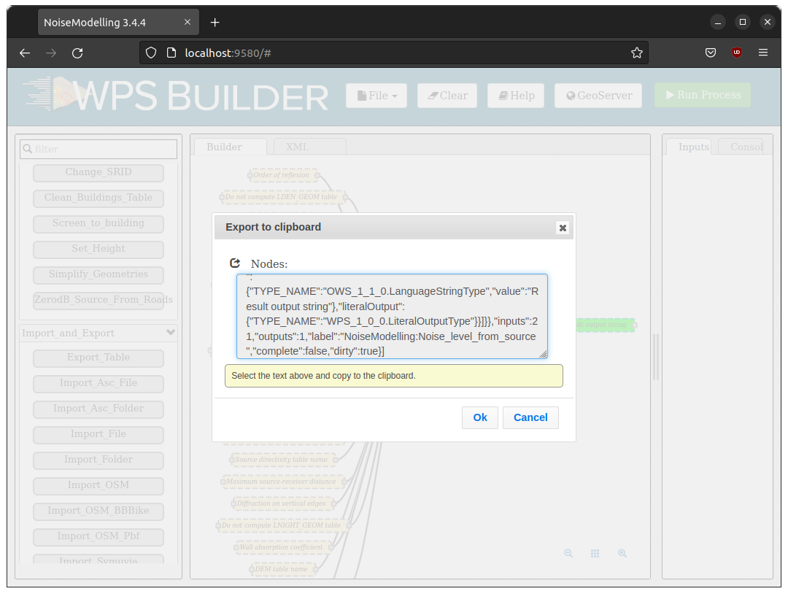

WPS Builder
^^^^^^^^^^^^^^^^^^^^^^^^^^^^^^^^^^^^

What is WPS Builder ?
~~~~~~~~~~~~~~~~~~~~~~~~~~~
WPS Builder allows to creates graphical process workflows that can be easily executed and reproduced. It allows Web Processing Services to operate through a user interface.

We have developed a version of WPS Builder adapted to the needs of NoiseModelling. This version being very close to the original version initially developped by former Boundlessgeo company.


Frequently Asked Question
~~~~~~~~~~~~~~~~~~~~~~~~~~


What do the colors correspond to?
---------------------------------
- Orange block are mandatory
- Beige blocks are optional
- Green block are unfortunately useless *(not due to NoiseModelling)*
- Blocks get solid border when they are ready

Can I save my WPS Builder project?
------------------------------------

Yes. To save your WPS Builder project you two possibilities:

#. Save in the local browser storage
#. Export into a JSON file

1. Local browser
*****************
Click on the ``File`` icon and then choose ``Save to local browser storage``. This way, your working environment will saved in the memory of your web browser.

Once you restart NoiseModelling, you can reload this environment by clicking on ``File / Open from local browser storage``

2. Export into JSON
********************

Click on the ``File`` icon and then choose ``Export to clipboard``. In the opening panel, you have a JSON text that you can copy / paste and save into a ```.txt`` or ``json`` file.



Once you restart NoiseModelling, you can reload this environment by clicking on ``File / Import clipboard``. In the opening panel, paste your JSON text and click ``Ok``.


Why everything is wrong when I use "Enter"?
---------------------------------------------

Don't click on your ``Enter`` keyboard key, it refreshes web page.

I can't link process block between them?
----------------------------------------

It is normal... this feature has not yet been implemented!
