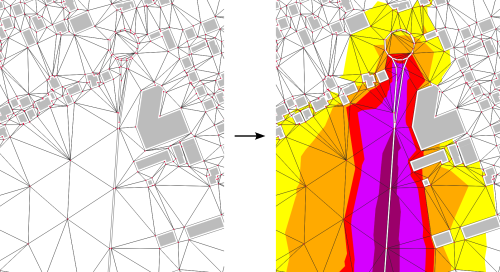

.. DO NOT UPDATE THIS FILE!!
.. This document has been automatically generated with noisemodelling-tutorial-01/src/main/java/org/noise_planet/nmtutorial01/GenerateFunctionsDocs.java

Create Isosurface
=================

Create isosurfaces from a NoiseModelling resulting table and its associated TRIANGLES table.

Overview
--------

➡️ Create isosurfaces from a NoiseModelling resulting table and its associated TRIANGLES table.
🚨 The triangle table must have been created using the WPS block "Receivers/Delaunay_Grid".   ✅ The output table is called CONTOURING_NOISE_MAP

Arguments
---------

Mandatory inputs
~~~~~~~~~~~~~~~~

``resultTable``
   Name of the sound levels table, generated from "Noise_level_from_source". (STRING) Example : RECEIVERS_LEVEL.

``isoClass``
   Separation of sound levels for isosurfaces. First range is from -∞ to first value excluded. The first value included to next value excluded.. Read this documentation for more information about sound levels classes.

``resultTableField``
   Field to read in the result table to make the iso surface.

``keepTriangles``
   Point inside areas with the same iso levels are kept so elevation variation into same iso level areas will be preserved but the output data size will be higher. Keeping triangles will reduce significantly the computation time.

``smoothCoefficient``
   This coefficient (Bezier curve coefficient) will smooth the generated isosurfaces.  If equal to 0, it disables the smoothing step and will keep the altitude of final polygons (3D geojson can be viewed on https://kepler.gl). Use this option with keepTriangles to keep the altitude variation into same iso level areas.

Output
------

``result``
   Name of the output table containing the isosurfaces. The table is created in the same schema as the input result table. (STRING)

Function Signatures
-------------------

The script exposes one entry point:

* ``exec(Connection connection, input)``
