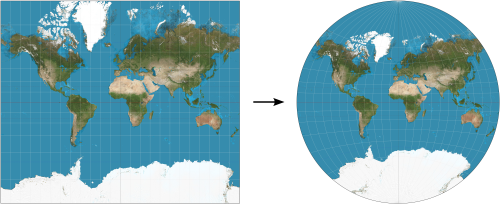

Change_SRID
===========

Change or set the SRID of a table.

Overview
--------

``Change_SRID.groovy`` assigns a new Spatial Reference Identifier, or SRID, to the specified table.

If the table already has an associated SRID, geometries are reprojected to the new SRID.

If the table has no associated SRID, the new SRID is assigned without reprojecting geometries.

Arguments
---------

Mandatory inputs
~~~~~~~~~~~~~~~~

``newSRID``
   New projection identifier, or SRID, of the table.

   It should be an EPSG code.

   Type: ``Integer``

``tableName``
   Name of the table whose SRID should be changed or set.

   Type: ``String``

Output
------

``result``
   Result output string. This output type does not allow blocks to be linked together.

   Type: ``String``

Function Signatures
-------------------

The script exposes one entry point:

* ``exec(Connection connection, input)``

Execution Notes
---------------

The script comments and inline behavior show the following:

* It preserves non-geometry columns when rebuilding the table.
* If the table already has a primary key, it restores that primary key after recreating the table.
* When the current SRID equals the requested SRID, it returns a message instead of modifying the table.

