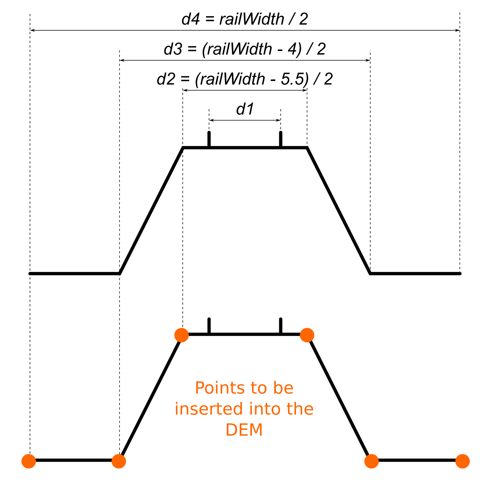

Enrich_DEM
==========

Enrich a DEM with multiple input layers.

Overview
--------

``Enrich_DEM.groovy`` inserts altimetric points from several input layers into a DEM.

It works with:

* a DEM to enrich
* orographic lines
* a hydrographic network
* roads
* railways

It produces a new enriched DEM table.

Arguments
---------

Mandatory inputs
~~~~~~~~~~~~~~~~

``inputDEM``
   Input DEM table to enrich.

   Type: ``String``

``inputOro``
   Input orography table.

   Type: ``String``

``inputHydro``
   Input hydrographic network table.

   Type: ``String``

``inputRoad``
   Input roads table.

   Type: ``String``

``roadWidth``
   Name of the column storing road width.

   Type: ``String``

``inputRail``
   Input railways table.

   Type: ``String``

``railWidth``
   Name of the column storing railway width.

   Type: ``String``

Optional inputs
~~~~~~~~~~~~~~~

``inputSRID``
   SRID of the input tables.

   If not specified, the DEM SRID is used.

   Type: ``Integer``

``hRoad``
   Roads platform height in meters.

   Default: ``0``

   Type: ``Double``

``hRail``
   Rail platform height in meters.

   Default: ``0.5``

   Type: ``Double``

``outputSuffixe``
   Suffix applied to the resulting table name.

   Default: ``ENRICHED``

   Type: ``String``

Output
------

``result``
   Result output string. This output type does not allow blocks to be linked together.

   Type: ``String``

Function Signatures
-------------------

The script exposes two functions:

* ``exec(Connection connection, Map input)``
* ``parseScript(String sqlInstructions, Sql sql, ProgressVisitor progressVisitor, Logger logger)``

Execution Notes
---------------

The script comments and inline behavior show the following:

* It builds and executes a generated SQL workflow step by step.
* It densifies input lines and projects their Z values into new DEM points.
* It removes DEM points near road and rail platforms before inserting platform-derived points.
* The final output table name is based on the input DEM plus the requested suffix.

