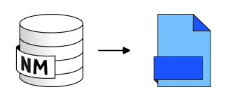

.. DO NOT UPDATE THIS FILE!!
.. This document has been automatically generated with noisemodelling-scripts/src/main/java/org/noise_planet/noisemodelling/webserver/script/GenerateFunctionsDocs.java

Export Table
============

Overview
--------

➡️ Export table from the database into a local file.
Valid file extensions: csv, dbf, geojson, gpx, bz2, gz, osm, shp, tsv, fgb

Arguments
---------

Mandatory inputs
~~~~~~~~~~~~~~~~

``exportPath`` — *Path of the file you want to export*
   📂 Path of the file, including its extension.  For example: c:/home/receivers.geojson

   Type: ``String``

``tableToExport`` — *Name of the table*
   Table Name or SQL Query Option 1: Simple table name Enter the name of an existing table, e.g.: mytable  Option 2: SQL query with parenthesis Wrap your SELECT query in parenthesis to export filtered or joined data Example: (SELECT * FROM mytable WHERE field = 1)

   Type: ``String``

Output
------

``result`` — *Exported table name*
   The name of the exported table, can be used as input for another process

   Type: ``String``

