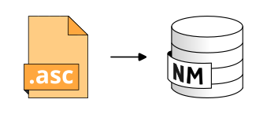

.. DO NOT UPDATE THIS FILE!!
.. This document has been automatically generated with noisemodelling-tutorial-01/src/main/java/org/noise_planet/nmtutorial01/GenerateFunctionsDocs.java

Import Asc File
===============

Import Asc File.

Overview
--------

➡️ Import ESRI Ascii Raster file and convert into a Digital Elevation Model (DEM) compatible with NoiseModelling (X,Y,Z).
Valid file extensions : asc and asc.gz .  ✅ The output table is called: DEM and contain: - THE_GEOM: the 3D point cloud of the DEM (POINT)

Arguments
---------

Mandatory inputs
~~~~~~~~~~~~~~~~

``pathFile``
   📂 Path of the ESRI Ascii Raster file you want to import, including its extension. Can be gzip compressed.  For example: c:/home/receivers.asc or c:/home/receivers.asc.gz

Optional inputs
~~~~~~~~~~~~~~~

``inputSRID``
   🌍 Original projection identifier (also called SRID) of the .asc files.  It should be an EPSG code, an integer with 4 or 5 digits (ex: 3857 is Pseudo-Mercator projection).

   Default: ``4326``

``fence``
   Create DEM table only in the provided polygon

``downscale``
   Divide the number of rows and columns read by the following coefficient (FLOAT)

   Default: ``1.0``

Output
------

``result``
   This type of result does not allow the blocks to be linked together.

Function Signatures
-------------------

The script exposes one entry point:

* ``exec(Connection connection, input)``
