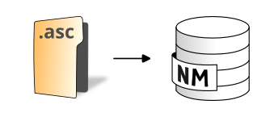

.. DO NOT UPDATE THIS FILE!!
.. This document has been automatically generated with noisemodelling-scripts/src/main/java/org/noise_planet/noisemodelling/webserver/script/GenerateFunctionsDocs.java

Import Asc Folder
=================

Import all .asc files from a folder

Overview
--------

➡️ Import all files with .asc extension from a folder to the database
✅ The resulting tables will have the same name as the input files

Arguments
---------

Mandatory inputs
~~~~~~~~~~~~~~~~

``pathFolder`` — *Path of the folder*
   📂 Path of the folder  For example: c:/home/inputdata/

   Type: ``String``

Optional inputs
~~~~~~~~~~~~~~~

``downscale`` — *Skip pixels on each axis*
   Divide the number of rows and columns read by the following coefficient (FLOAT)

   Type: ``Integer``

   Default: ``1.0``

``inputSRID`` — *Projection identifier*
   🌍 Original projection identifier (also called SRID) of the .asc file.  It should be an EPSG code, an integer with 4 or 5 digits (ex: 3857 is Pseudo-Mercator projection)

   Type: ``Integer``

   Default: ``4326``

Output
------

``result`` — *Result output string*
   This type of result does not allow the blocks to be linked together.

   Type: ``String``

