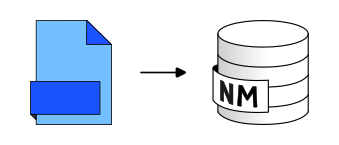

Import_File
===========

Import a file into the database.

Overview
--------

``Import_File.groovy`` imports a file into the database.

Supported input formats include ``csv``, ``dbf``, ``geojson``, ``json``, ``geojson.gz``, ``gpx``, ``osm``, ``osm.gz``, ``osm.bz2``, ``shp``, ``fgb``, and ``tsv``.

Arguments
---------

Mandatory inputs
~~~~~~~~~~~~~~~~

``pathFile``
   Path of the input file, including its extension.

   Type: ``String``

Optional inputs
~~~~~~~~~~~~~~~

``inputSRID``
   Original projection identifier of the input table when needed.

   Default: ``4326``

   Type: ``Integer``

``tableName``
   Name of the output table to create.

   By default, the file name without extension is used.

   Type: ``String``

``ifTableExists``
   Action to take if the destination table already exists.

   Allowed values:

   * ``Overwrite``
   * ``Skip import``
   * ``Raise error``

   Default: ``Overwrite``

   Type: ``String``

Output
------

``outputTable``
   Name of the created table.

   Type: ``String``

Function Signatures
-------------------

The script exposes two entry points:

* ``exec(Connection connection, Map input, ProgressVisitor progress)``
* ``exec(Connection connection, Map input)``

The second form calls the first one with an ``EmptyProgressVisitor``.

Execution Notes
---------------

The script comments and inline behavior show the following:

* It derives the output table name from the file name when no table name is provided.
* It can overwrite, skip, or fail when the destination table exists.
* For geometric tables, it creates a spatial index and assigns or validates the SRID.
* If a ``PK`` column exists and no primary key is already defined, it attempts to promote ``PK`` to a primary key.

