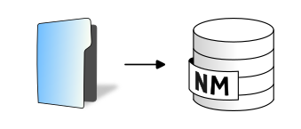

.. DO NOT UPDATE THIS FILE!!
.. This document has been automatically generated with noisemodelling-tutorial-01/src/main/java/org/noise_planet/nmtutorial01/GenerateFunctionsDocs.java

Import Folder
=============

Import all files from a folder

Overview
--------

➡️ Import all files with a specified extension from a folder to the database.
Valid file extensions: csv, dbf, geojson, gpx, bz2, gz, osm, shp, tsv. ✅ The resulting tables will have the same name as the input files

Arguments
---------

Mandatory inputs
~~~~~~~~~~~~~~~~

``pathFolder``
   📂 Path of the folder   For example : c:/home/inputdata/

``importExt``
   Extension to import.  For example: shp

Optional inputs
~~~~~~~~~~~~~~~

``inputSRID``
   🌍 Original projection identifier (also called SRID) of your table.  It should be an EPSG code, an integer with 4 or 5 digits (ex: 3857 is Pseudo-Mercator projection).  This entry is optional because many formats already include the projection and you can also import files without geometry attributes. If the table is geometric and if this parameter is not filled and:- the file has a .prj file associated: the SRID is deduced from the .prj - the file has no .prj file associated: we apply the WGS84 (EPSG:4326) code

   Default: ``4326``

Output
------

``result``
   This type of result does not allow the blocks to be linked together.

Function Signatures
-------------------

The script exposes one entry point:

* ``exec(Connection connection, input)``
