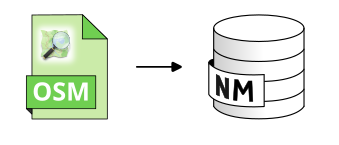

Import_OSM
==========

Import BUILDINGS, GROUND, and ROADS tables from OSM.

Overview
--------

``Import_OSM.groovy`` converts ``.osm``, ``.osm.gz``, or ``.osm.pbf`` files into NoiseModelling input tables.

It can create:

* ``BUILDINGS``
* ``GROUND``
* ``ROADS``

The user can choose to skip creation of some of these tables.

Arguments
---------

Mandatory inputs
~~~~~~~~~~~~~~~~

``pathFile``
   Path of the OSM file, including extension.

   Supported extensions are ``.osm``, ``.osm.gz``, and ``.osm.pbf``.

   Type: ``String``

``targetSRID``
   Target projection identifier of the created tables.

   It must be metric.

   Type: ``Integer``

Optional inputs
~~~~~~~~~~~~~~~

``ignoreBuilding``
   If checked, do not create the ``BUILDINGS`` table.

   Type: ``Boolean``

``ignoreGround``
   If checked, do not create the ``GROUND`` table.

   Type: ``Boolean``

``ignoreRoads``
   If checked, do not create the ``ROADS`` table.

   Type: ``Boolean``

``removeTunnels``
   If checked, remove roads tagged ``tunnel=yes``.

   Type: ``Boolean``

``eliminateNoTrafficRoads``
   If checked, keep only a documented subset of traffic-relevant OSM road types.

   Type: ``Boolean``

Output
------

``result``
   Result output string. This output type does not allow blocks to be linked together.

   Type: ``String``

Function Signatures
-------------------

The script exposes one main entry point:

* ``exec(Connection connection, input)``

Execution Notes
---------------

The script comments and inline behavior show the following:

* It reads OSM data through Osmosis or XML readers depending on the file extension.
* It builds cleaned ``BUILDINGS``, ``GROUND``, and ``ROADS`` tables with spatial indexes.
* For roads, it assigns default traffic values and pavement identifiers from OSM road importance.
* For buildings, it estimates height from OSM attributes when available, otherwise uses defaults.

