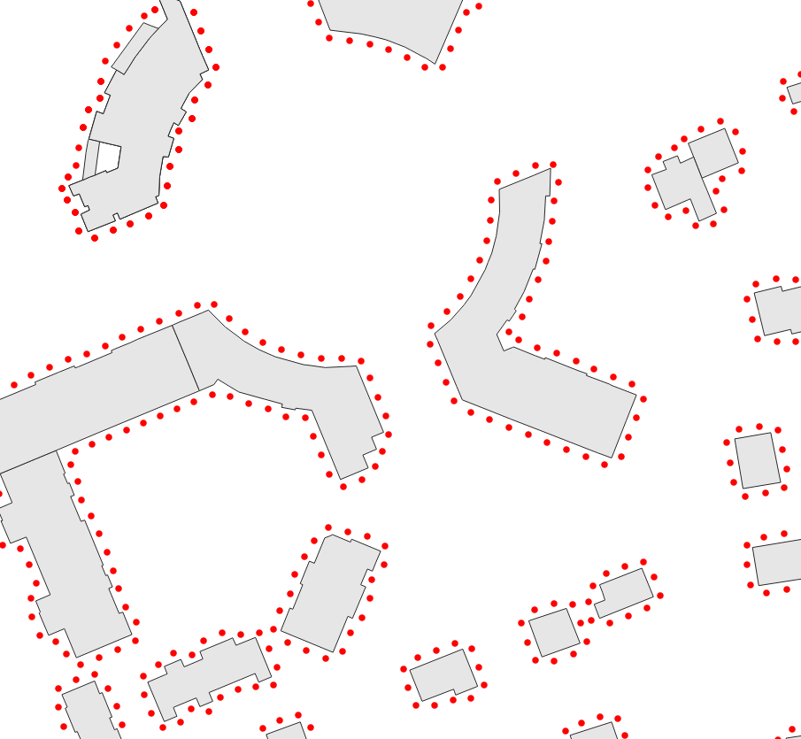

.. DO NOT UPDATE THIS FILE!!
.. This document has been automatically generated with noisemodelling-scripts/src/main/java/org/noise_planet/noisemodelling/webserver/script/GenerateFunctionsDocs.java

Building Grid
=============

Buildings Grid

Overview
--------

➡️ Generates receivers, 2m around the building facades, at a given height.
✅ The output table is called RECEIVERS and contain a field build_pk corresponding to the primary key of the buildings table

Arguments
---------

Mandatory inputs
~~~~~~~~~~~~~~~~

``tableBuilding`` — *Buildings table name*
   Name of the Buildings table.
   The table must contain:
   
   *  THE_GEOM : the 2D geometry of the building (POLYGON or MULTIPOLYGON)
   
   *  HEIGHT : the height of the building (in meter) (FLOAT)
   
   *  POP : (optional field) building population to add in the receiver attribute (FLOAT)

   Type: ``String``

Optional inputs
~~~~~~~~~~~~~~~

``delta`` — *Distance between receivers*
   Distance between receivers (in the Cartesian plane - in meter) (FLOAT)

   Type: ``Double``

   Default: ``10``

``distance`` — *Distance from wall*
   Distance between the receivers and the wall, in metres (FLOAT)

   Type: ``Double``

   Default: ``2``

``fence`` — *Extent filter*
   Create receivers only in the provided polygon (fence)

   Type: ``Geometry``

``fenceTableName`` — *Filter using table bounding box*
   Filter receivers, using the bounding box of the given table name:
   
   *  Extract the bounding box of the specified table,
   
   *  then create only receivers on the table bounding box.
   
   The given table must contain:
   
   *  THE_GEOM : any geometry type.

   Type: ``String``

``height`` — *Height*
   Height of receivers (in meter) (FLOAT)

   Type: ``Double``

   Default: ``4``

``sourcesTableName`` — *Sources table name*
   Keep only receivers that are at least 1 meter from the provided source geometries.The source geometries table must contain:
   
   *  THE_GEOM : any geometry type.

   Type: ``String``

Output
------

``result`` — *Created table*
   Name of the table containing the results of the computation. Can be used as input for another process.

   Type: ``String``

