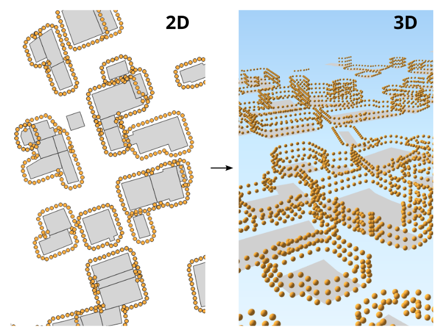

.. DO NOT UPDATE THIS FILE!!
.. This document has been automatically generated with noisemodelling-scripts/src/main/java/org/noise_planet/noisemodelling/webserver/script/GenerateFunctionsDocs.java

Building Grid3D
===============

Buildings Grid

Overview
--------

➡️ Generates 3D receivers around the buildings and at different levels.
Main parameters:

* "Height between levels": coupled with the building height, allows to determine the number of levels,

* "Distance from wall": set the distance between the receivers and the building facades,

* "Distance between receivers": set the number of receivers around the buildings.

✅ The output table is called RECEIVERS

Arguments
---------

Mandatory inputs
~~~~~~~~~~~~~~~~

``tableBuilding`` — *Buildings table name*
   Name of the Buildings table.
   The table must contain:
   
   *  THE_GEOM : the 2D geometry of the building (POLYGON or MULTIPOLYGON)
   
   *  HEIGHT : the height of the building (in meter) (FLOAT)
   
   *  POP : building population to add in the receiver attribute (FLOAT) (Optional)

   Type: ``String``

Optional inputs
~~~~~~~~~~~~~~~

``delta`` — *Distance between receivers*
   Distance between receivers (in the Cartesian plane - in meters) (FLOAT)

   Type: ``Double``

   Default: ``10``

``distance`` — *Distance from wall*
   Distance between the receivers and the wall, in metres (FLOAT)

   Type: ``Double``

   Default: ``2``

``fence`` — *Extent filter*
   Create receivers only in the provided polygon (fence)

   Type: ``Geometry``

``fenceTableName`` — *Filter using table bounding box*
   Filter receivers, using the bounding box of the given table name:
   
   *  Extract the bounding box of the specified table,
   
   *  then create only receivers on the table bounding box.
   
   The given table must contain:
   
   *  THE_GEOM : any geometry type.

   Type: ``String``

``heightLevels`` — *Height between levels*
   Height between each level of receivers, in meters (FLOAT)

   Type: ``Double``

   Default: ``2.5``

``sourcesTableName`` — *Sources table name*
   Keep only receivers that are at least 1 meter from the provided source geometries.The source geometries table must contain:
   
   *  THE_GEOM : any geometry type

   Type: ``String``

Output
------

``result`` — *Created table*
   Name of the table containing the results of the computation. Can be used as input for another process.

   Type: ``String``

