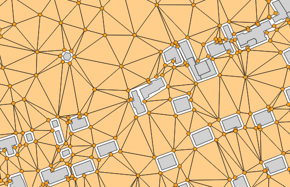

.. DO NOT UPDATE THIS FILE!!
.. This document has been automatically generated with noisemodelling-tutorial-01/src/main/java/org/noise_planet/nmtutorial01/GenerateFunctionsDocs.java

Delaunay Grid
=============

Overview
--------

➡️ Computes a Delaunay grid of receivers.
The grid will be based on:

*  the BUILDINGS table extent (option by default)

*  OR a single Geometry "fence" (Extent filter).

✅ Two tables are returned:

*  RECEIVERS

*  TRIANGLES

Arguments
---------

Mandatory inputs
~~~~~~~~~~~~~~~~

``tableBuilding``
   Name of the Buildings table.
   The table must contain:
   
   *   THE_GEOM  : the 2D geometry of the building (POLYGON or MULTIPOLYGON)

``sourcesTableName``
   Name of the Road table.
   Receivers will not be created on the specified road width

Optional inputs
~~~~~~~~~~~~~~~

``fenceTableName``
   Use the extent of a geometry table (e.g., from a shapefile) to limit receiver area

``fence``
   Create receivers only in the provided polygon (fence)

``maxCellDist``
   Maximum distance used to split the domain into sub-domains (in meters) (FLOAT).
   In a logic of optimization of processing times, it allows to limit the number of objects (buildings, roads, …) stored in memory during the Delaunay

   Default: ``600``

``skipCellNoSourcesMinimalDistance``
   If provided, a sub-domain will not be computed if no sources geometries are near x meters from the sub-domain area

``roadWidth``
   Set Road Width (in meters) (FLOAT). No receivers closer than road width distance will be created.  You can set 0m if you don't want to insert roads in the output but still want to skip cells without sources using the 'Skip cell no sources minimal distance'

   Default: ``2``

``buildingBuffer``
   Do not add receivers closer than this distance to buildings (in

   Default: ``2``

``maxArea``
   Set Maximum Area (in m2) (FLOAT). No triangles larger than provided area will be created.Smaller area will create more receivers.

   Default: ``2500``

``height``
   Receiver height relative to the ground (in meters) (FLOAT).

   Default: ``4``

``outputTableName``
   Name of the output table. Do not write the name of a table that contains a space.

   Default: ``RECEIVERS``

``isoSurfaceInBuildings``
   If enabled, isosurfaces will be visible at the location of buildings

   Default: ``false``

``fenceNegativeBuffer``
   Reduce the fence(parameter, or sound sources and buildings extent) used to generate receivers positions. You should set here the maximum propagation distance (in meters) (FLOAT).

   Default: ``0``

``exportTrianglesGeometries``
   If enabled, the TRIANGLES table will contain the geometry of each triangle.

   Default: ``false``

Output
------

``result``
   Name of the table containing the results of the computation. Can be used as input for another process.

Function Signatures
-------------------

The script exposes one entry point:

* ``exec(Connection connection, input)``
