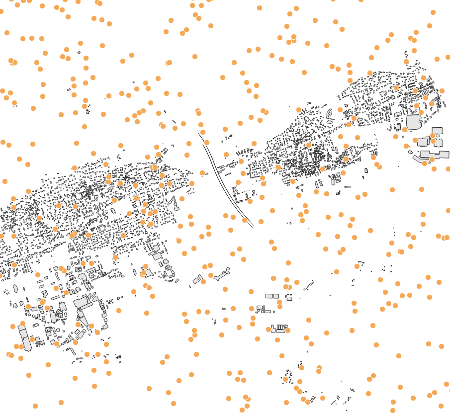

Random Grid
===========

Overview
--------

Computes a random set of receiver points within the extent of the buildings and sources tables, or within a provided fence. The script creates a ``RECEIVERS`` table and removes points that fall too close to buildings or sources.

Arguments
---------

``buildingTableName``
  Buildings table name. The table must contain ``THE_GEOM`` and ``HEIGHT``.

``sourcesTableName``
  Sources table name. Receivers closer than 1 meter to the provided source geometries are removed.

``nReceivers``
  Optional number of random receivers to generate. Default: ``100``.

  .. image:: receivers_random_nReceivers.png
     :alt: Number of receivers
     :width: 95%
     :align: center

``height``
  Optional receiver height in meters. Default: ``4``.

``fence``
  Optional polygon geometry used to restrict receiver creation. The script comments specify WGS84 (EPSG:4326) input for this parameter.

``fenceTableName``
  Optional table name used to derive a bounding box filter from its ``THE_GEOM`` column.

Output
------

The script returns the created ``RECEIVERS`` table name.

Function Signatures
-------------------

.. code-block:: groovy

   def exec(Connection connection, Map input)

Execution Notes
---------------

- The script builds a random point cloud inside the chosen computation envelope, then filters invalid receivers.
- If no fence is provided, the envelope is computed from the combined extent of the sources and buildings tables.
- A direct ``fence`` geometry is reprojected to the detected SRID before filtering.
- Receivers closer than 1 meter to buildings or sources are deleted before the primary key is added.
- A spatial index is created on the ``RECEIVERS`` table.
