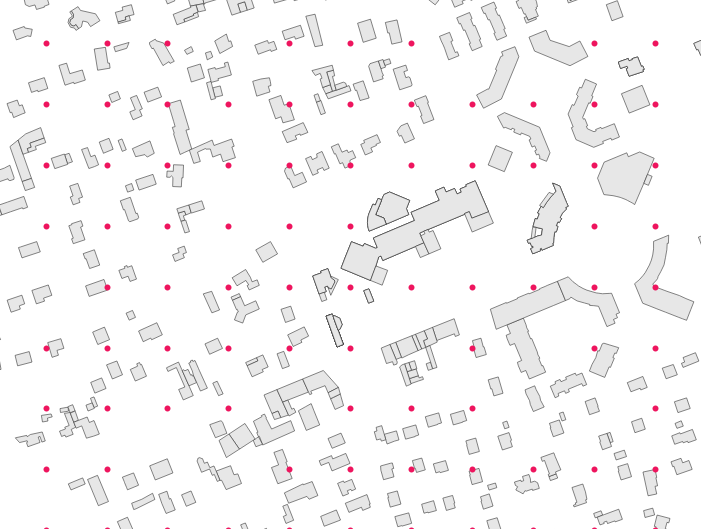

.. DO NOT UPDATE THIS FILE!!
.. This document has been automatically generated with noisemodelling-scripts/src/main/java/org/noise_planet/noisemodelling/webserver/script/GenerateFunctionsDocs.java

Regular Grid
============

Overview
--------

➡️ Computes a regular grid of receivers.
The receivers are spaced at a distance "delta" (Offset) in the Cartesian plane in meters.  The grid will be based on:

*  the BUILDINGS table extent (option by default)

*  OR a single Geometry "fence" (see "Extent filter" parameter).

✅ The output table is called RECEIVERS

Arguments
---------

Mandatory inputs
~~~~~~~~~~~~~~~~

``fenceTableName`` — *Table bounding box name*
   Using the bounding box of the given table name, define the envelope of the output grid:
   
   *  Extract the bounding box of the specified table,
   
   *  then create only receivers on the table bounding box.
   
   The given table must contain:
   
   *  THE_GEOM : any geometry type with the appropriate SRID

   Type: ``String``

Optional inputs
~~~~~~~~~~~~~~~

``buildingTableName`` — *Buildings table name*
   Name of the Buildings table. Receivers inside buildings will be removed.The table must contain:
   
   *  THE_GEOM  : the 2D geometry of the building (POLYGON or MULTIPOLYGON)

   Type: ``String``

``delta`` — *Offset*
   Offset in the Cartesian plane (in meters)

   Type: ``Double``

   Default: ``10``

``fence`` — *Extent filter*
   Create receivers only in the provided polygon (fence)

   Type: ``Geometry``

``height`` — *Height*
   Height of receivers (in meter) (FLOAT)

   Type: ``Double``

   Default: ``4``

``outputTriangleTable`` — *Output triangle table*
   Output a triangle table in order to be used to generate iso contours with Create_Isosurface

   Type: ``Boolean``

``receiverstablename`` — *Name of receivers table*
   Name of the output table. Do not write the name of a table that contains a space

   Type: ``String``

   Default: ``RECEIVERS``

``sourcesTableName`` — *Sources table name*
   Keep only receivers at least at 1 meters of provided sources geometries  The given table must contain:
   
   *  THE_GEOM : any geometry type.

   Type: ``String``

Output
------

``result`` — *Created table*
   Name of the table containing the results of the computation. Can be used as input for another process.

   Type: ``String``

