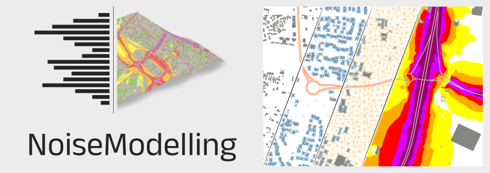

.. NoiseModelling documentation master file, created by
   sphinx-quickstart on Tue Oct  8 17:50:48 2019.
   You can adapt this file completely to your liking, but it should at least
   contain the root `toctree` directive.

NoiseModelling v5.0 User Guide
==========================================

Welcome on the **official NoiseModelling v5.0 User Guide**.

NoiseModelling is a library capable of producing noise maps. 
It can be freely used either for research and education, as well as by experts in a professional use.

A general overview of the model (v3.4.5 - September 2020) can be found in `this video`_.

* for **more information** on NoiseModelling, visit the `offical NoiseModelling website`_
* to **contribute to NoiseModelling** source code, follow the ":doc:`Get_Started_Dev`" page
* for **more information** for the final results with the reference results in ISO/TR 17534-4: 2020 follow the ":doc:`Cnossos_Report`" page
* to **contact the support / development team**, 
    - open an `issue`_ or a write a `message`_ *(we prefer these two options)*
    - send us an email at contact@noise-planet.org  

.. _issue : https://github.com/Universite-Gustave-Eiffel/NoiseModelling/issues
.. _message : https://github.com/Universite-Gustave-Eiffel/NoiseModelling/discussions
.. _this video : https://www.youtube.com/watch?v=V1-niMT9cYE&t=1s
.. _offical NoiseModelling website : http://noise-planet.org/noisemodelling.html

What's new with the v5.0?
---------------------------

Since the release v5.0, NoiseModelling validate the `CNOSSOS-EU`_ standard method for the noise emission (road and rail (for France)) and with noise propagation (read ":doc:`Numerical_Model`" and ":doc:`Validation`" ":doc:`Cnossos_report`"  pages for more information).

Time periods are not limited to Day Evening and Night anymore. You can provide the sound source emission for any period you want. You can also define a specific atmospheric condition for each time period now.

The computation time has been decreased. The separation between path finding and attenuation has been done in preparation to the implementation of more noise propagation model (ex. Harmonoise).

Packaging
**************

On the NoiseModelling latest `release page`_, three packages of NoiseModelling are proposed:

* ``NoiseModelling_5.0.0.zip`` : cross-platform version, with GUI (Graphic User Interface)
* ``NoiseModelling_5.0.0_install.exe`` : windows installer, with GUI
* ``NoiseModelling_5.0.0_without_gui.zip`` : version without GUI. Usefull to run NoiseModelling using command lines (read ":doc:`Get_Started_Script`" page for more info)

.. _release page : https://github.com/Universite-Gustave-Eiffel/NoiseModelling/releases/latest

Authors
---------------------------

NoiseModelling project is leaded by acousticians from the *Joint Research Unit in Environmental Acoustics* (`UMRAE`_, Université Gustave Eiffel - Cerema) and Geographic Information Science specialists from `Lab-STICC`_ laboratory (CNRS - DECIDE Team).

The NoiseModelling team owns the majority of the authorship of this application, but any external contributions are warmly welcomed.

.. _UMRAE: https://www.umrae.fr/
.. _Lab-STICC: https://labsticc.fr

Licence
---------------------------

NoiseModelling and its documentation are distributed for free under GPL v3 :doc:`License`. 

Publications
---------------------------

NoiseModelling was initially developed in a research context, which has led to numerous scientific publications. For more information, have a look to ":doc:`Scientific_production`" page. 
To quote this tool, please use the bibliographic reference below:

.. note::
    Erwan Bocher, Gwenaël Guillaume, Judicaël Picaut, Gwendall Petit, Nicolas Fortin. *NoiseModelling: An Open Source GIS Based Tool to Produce Environmental Noise Maps*. ISPRS International Journal of Geo-Information, MDPI, 2019, 8 (3), pp.130. (`10.3390/ijgi8030130`_)

.. _10.3390/ijgi8030130: https://www.mdpi.com/2220-9964/8/3/130

Fundings
---------------------------

*Research projects:*

- `ANR Eval-PDU`_ (ANR-08-VILL-0005) 2008-2011
- `ANR VegDUD`_ (ANR-09-VILL-0007) 2009-2014
- `ANR CENSE`_ (ANR-16-CE22-0012) 2017-2021
- `Nature4cities`_ (N4C) project, funded by European Union’s Horizon 2020 research and innovation programme under grant agreement N°730468
- `PlaMADE`_ 2020-2022

*Institutional (public) fundings:*

- `Université Gustave Eiffel`_ (formerly Ifsttar, formerly LCPC), `CNRS`_, `Cerema`_, `Université Bretagne Sud`_, `Ecole Centrale de Nantes`_

*Private fundings:*

- Airbus Urban Mobility

.. _ANR Eval-PDU : https://anr.fr/Projet-ANR-08-VILL-0005
.. _ANR VegDUD : https://anr.fr/Projet-ANR-09-VILL-0007
.. _ANR CENSE : https://anr.fr/Projet-ANR-16-CE22-0012
.. _Nature4cities : https://www.nature4cities.eu/
.. _PlaMADE : https://www.cerema.fr/fr/projets/plamade-plate-forme-mutualisee-aide-au-diagnostic

.. _Université Gustave Eiffel: https://www.univ-gustave-eiffel.fr/
.. _CNRS: https://www.cnrs.fr
.. _Cerema: https://www.cerema.fr/
.. _Université Bretagne Sud: https://www.univ-ubs.fr/
.. _Ecole Centrale de Nantes: https://www.ec-nantes.fr/

------------

.. warning::
    - The official documentation is available in English only
    -  Some illustrations may refer to previous versions of NoiseModelling
    -  If you observe some mistakes or errors, please open an issue `here`_ or contact us at contact@noise-planet.org
    -  You are also welcome to contribute to the documentation (click on *"Edit on Github"* - top of the page)

.. _here: https://github.com/Universite-Gustave-Eiffel/NoiseModelling/issues

.. toctree::
    :maxdepth: 2
    :caption: NoiseModelling presentation
    
    Architecture
    Numerical_Model
    Validation
    Scientific_production

.. toctree::
    :maxdepth: 1
    :caption: Input tables & parameters

    Input_buildings
    Input_roads
    Input_source
    Input_railways
    Input_ground
    Input_dem
    Input_directivity
    Input_receivers
    Input_acoustics
    
.. toctree::
    :maxdepth: 2
    :caption: Tutorials

    Requirements
    Get_Started_GUI
    Noise_Map_From_OSM_Tutorial
    Noise_Map_From_Point_Source
    Matsim_Tutorial
    Dynamic_Tutorial
    Get_Started_Script
    Tutorials_FAQ

.. toctree::
    :maxdepth: 2
    :caption: User Interface

    WPS_Blocks
    WPS_Builder

.. toctree::
    :maxdepth: 2
    :caption: For Advanced Users

    Own_Wps
    NoiseModelling_db
    NoiseModellingOnPostGIS

.. toctree::
    :maxdepth: 2
    :caption: For Developers

    Get_Started_Dev
    Cnossos_Report

.. toctree::
    :maxdepth: 2
    :caption: Appendices

    Noise_Map_Color_Scheme
    Support
    License
    Glossary

Indices and tables
==================

* :ref:`genindex`
* :ref:`modindex`
* :ref:`search`
