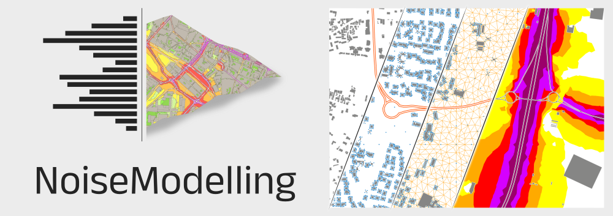

.. NoiseModelling documentation master file, created by
   sphinx-quickstart on Tue Oct  8 17:50:48 2019.
   You can adapt this file completely to your liking, but it should at least
   contain the root `toctree` directive.

NoiseModelling User Guide
==========================================

Welcome on the **official NoiseModelling User Guide**.

NoiseModelling is a free and open-source Java library for producing environmental noise maps from local to national scales, implementing CNOSSOS‑EU road and rail noise emission and propagation methods while linking to H2GIS and PostGIS for spatial analysis.
It responds to the need for robust noise assessment in public health and environmental planning by enabling simulation and prediction of noise propagation for mitigation design and compliance with EU regulations.
The software can be used independently or through a graphical interface and is openly available to the research, education, and professional communities.
It has been widely used for strategic noise mapping, dynamic maps driven by traffic models or sensors, sensitivity studies, and investigations of particular sources such as emergency sirens and drones.

A general overview of the model (v3.4.5 - September 2020) can be found in `this video`_.

* for **more information** on NoiseModelling, visit the `offical NoiseModelling website`_
* to **contribute to NoiseModelling** source code, follow the ":doc:`Get_Started_Dev`" page
* for **more information** for the final results with the reference results in ISO/TR 17534-4: 2020 follow the ":doc:`Cnossos_Report`" page
* to **contact the support / development team**, 
    - open an `issue`_ or a write a `message`_ *(we prefer these two options)*
    - send us an email at contact@noise-planet.org  

.. _issue : https://github.com/Universite-Gustave-Eiffel/NoiseModelling/issues
.. _message : https://github.com/Universite-Gustave-Eiffel/NoiseModelling/discussions
.. _this video : https://www.youtube.com/watch?v=V1-niMT9cYE&t=1s
.. _offical NoiseModelling website : http://noise-planet.org/noisemodelling.html

Packaging
**************

The latest `release page`_ offers three NoiseModelling packages:

* ``NoiseModelling_X.X.X.zip``: A cross-platform version for Windows, Linux, and macOS. It includes the web GUI and a command-line interface. Please check the :doc:`Tutorial_Requirements` before installing, and refer to :doc:`Tutorial_Get_Started_Script` for CLI usage.
* ``NoiseModelling_X.X.X_install.exe``: A standalone Windows installer that includes the web GUI and a bundled Java Virtual Machine.
* ``NoiseModelling-X.X.X.gmg``: A standalone Mac OS installer that includes the web GUI and a bundled Java Virtual Machine.

In addition, a Docker image is provided in the `packages page`_.

.. _CNOSSOS-EU: https://publications.jrc.ec.europa.eu/repository/handle/JRC72550
.. _release page : https://github.com/Universite-Gustave-Eiffel/NoiseModelling/releases/latest
.. _packages page : https://github.com/Universite-Gustave-Eiffel/NoiseModelling/pkgs/container/noisemodelling

Authors
**************

NoiseModelling project is leaded by acousticians from the *Joint Research Unit in Environmental Acoustics* (`UMRAE`_, Université Gustave Eiffel - Cerema) and Geographic Information Science specialists from `Lab-STICC`_ laboratory (CNRS - DECIDE Team).

The NoiseModelling team owns the majority of the authorship of this application, but any external contributions are warmly welcomed.

.. _UMRAE: https://www.umrae.fr/
.. _Lab-STICC: https://labsticc.fr

Licence
**************

NoiseModelling and its documentation are distributed for free under GPL v3 :doc:`License`. 

Publications
**************

NoiseModelling was initially developed in a research context, which has led to numerous scientific publications. For more information, have a look to ":doc:`Scientific_production`" page. 
To quote this tool, please use the bibliographic reference below:

.. note::
    Erwan Bocher, Gwenaël Guillaume, Judicaël Picaut, Gwendall Petit, Nicolas Fortin. *NoiseModelling: An Open Source GIS Based Tool to Produce Environmental Noise Maps*. ISPRS International Journal of Geo-Information, MDPI, 2019, 8 (3), pp.130. (`10.3390/ijgi8030130`_)

.. _10.3390/ijgi8030130: https://www.mdpi.com/2220-9964/8/3/130

Fundings
**************

*Research projects:*

- OPTImisation technique et environnementale des moyens de lutte contre le gel en viticulture par Tours-Anti-Gel en Centre-Val de Loire (OptiTAG), funded by Région Centre Val de Loire & co-funded by European Union 2024-2027
- AMELIA, funded by the call "DIAT (Démonstrateurs d’IA frugale au service de la transition écologique) de la Banque des Territoires" 2024-2027
- `ANR SYMEXPO`_ (ANR-21-CE22-0022-01) 2021-2026
- Sampols 2.0: a disruptive solution for noise pollution monitoring (SIREN), funded by Eurostars 3 - BPI 2024-2025
- `Nature4cities`_ (N4C) project, funded by European Union’s Horizon 2020 research and innovation programme under grant agreement N°730468
- `ANR CENSE`_ (ANR-16-CE22-0012) 2017-2021
- `ANR VegDUD`_ (ANR-09-VILL-0007) 2009-2014
- `ANR Eval-PDU`_ (ANR-08-VILL-0005) 2008-2011

*Institutional (public) fundings:*

- `DGPR`_ 2020-2022 & 2025-27
- `Université Gustave Eiffel`_ (formerly Ifsttar, formerly LCPC), `CNRS`_, `Cerema`_, `Université Bretagne Sud`_, `Ecole Centrale de Nantes`_

*Private fundings:*

- Airbus Urban Mobility

.. _ANR Eval-PDU : https://anr.fr/Projet-ANR-08-VILL-0005
.. _ANR VegDUD : https://anr.fr/Projet-ANR-09-VILL-0007
.. _ANR CENSE : https://anr.fr/Projet-ANR-16-CE22-0012
.. _ANR SYMEXPO : https://symexpo.univ-gustave-eiffel.fr/
.. _Nature4cities : https://www.nature4cities.eu/
.. _DGPR : https://www.cerema.fr/fr/projets/plamade-plate-forme-mutualisee-aide-au-diagnostic

.. _Université Gustave Eiffel: https://www.univ-gustave-eiffel.fr/
.. _CNRS: https://www.cnrs.fr
.. _Cerema: https://www.cerema.fr/
.. _Université Bretagne Sud: https://www.univ-ubs.fr/
.. _Ecole Centrale de Nantes: https://www.ec-nantes.fr/

------------

.. warning::
    - The official documentation is available in English only
    -  Some illustrations may refer to previous versions of NoiseModelling
    -  If you observe some mistakes or errors, please open an issue `here`_ or contact us at contact@noise-planet.org
    -  You are also welcome to contribute to the documentation (click on *"Edit on Github"* - top of the page)

.. _here: https://github.com/Universite-Gustave-Eiffel/NoiseModelling/issues

.. toctree::
    :maxdepth: 2
    :caption: NoiseModelling presentation
    
    Architecture
    Numerical_Model
    Validation
    Scientific_production
    Community

.. toctree::
    :maxdepth: 1
    :caption: Input tables & parameters

    Input_buildings
    Input_roads
    Input_source
    Input_railways
    Input_ground
    Input_dem
    Input_directivity
    Input_receivers
    Input_acoustics
    
.. toctree::
    :maxdepth: 2
    :caption: Tutorials

    Tutorial_Requirements
    Tutorial_Get_Started_GUI
    Tutorial_Noise_Map_From_Point_Source
    Tutorial_Noise_Map_From_OSM
    Tutorial_Matsim
    Tutorial_Dynamic
    Tutorial_Data_Assimilation
    Tutorial_Get_Started_Script
    Tutorials_FAQ

.. toctree::
    :maxdepth: 2
    :caption: Functions

    Functions

.. toctree::
    :maxdepth: 2
    :caption: User Interface

    WPS_Blocks
    WPS_Builder

.. toctree::
    :maxdepth: 2
    :caption: For Advanced Users

    Own_Wps
    NoiseModelling_db
    NoiseModellingOnPostGIS

.. toctree::
    :maxdepth: 2
    :caption: For Developers

    Get_Started_Dev

.. toctree::
    :maxdepth: 2
    :caption: Appendices

    Cnossos_Report
    Noise_Map_Color_Scheme
    Support
    License
    Glossary

Indices and tables
==================

* :ref:`genindex`
* :ref:`modindex`
* :ref:`search`
