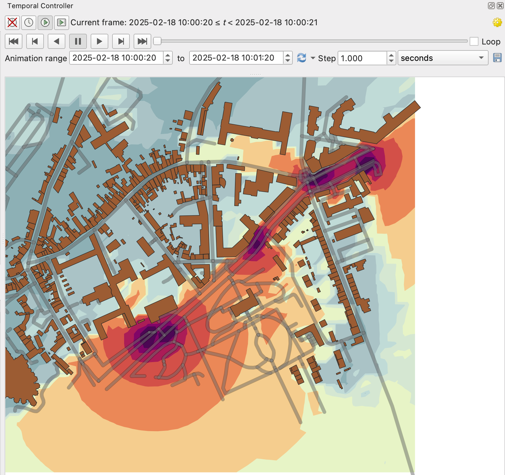
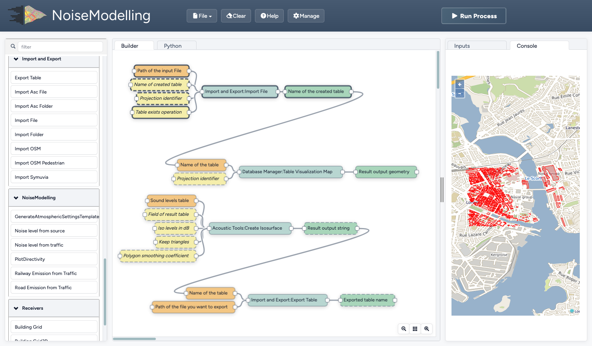

NoiseModelling
===============

NoiseModelling is a free and open-source Java library for producing environmental noise maps from local to national scales, implementing CNOSSOS‑EU road and rail noise emission and propagation methods while linking to H2GIS and PostGIS for spatial analysis.

It responds to the need for robust noise assessment in public health and environmental planning by enabling simulation and prediction of noise propagation for mitigation design and compliance with EU regulations.

The software can be used independently or through a graphical interface and is openly available to the research, education, and professional communities.

It has been widely used for strategic noise mapping, dynamic maps driven by traffic models or sensors, sensitivity studies, and investigations of particular sources such as emergency sirens and drones.

## Features

*   **CNOSSOS-EU Implementation:** Fully implements the European standard method (Commission Directive 2015/996) for road traffic and railway noise.
*   **Advanced Propagation Physics:**
    *   **Geometrical Attenuation:** Geometric dispersion of sound wave from point and line sources.
    *   **Atmospheric Absorption:** Frequency-dependent attenuation.
    *   **Ground Effect:** Impact of ground porosity (hard/soft) and terrain.
    *   **Diffraction:** Support for diffraction over and around obstacles (vertical and horizontal edges).
    *   **Specular Reflections:** Calculations for reflections on vertical surfaces like buildings and noise barriers with customizable order of reflection.
*   **Meteorological Conditions:** Support for both homogeneous and favorable propagation scenarios.
*   **Full Spectral Analysis:** Calculations performed across standard third/full octave bands (50 Hz to 10000 Hz).
*   **Emission Models:** Calculate noise emissions based on traffic flow, vehicle speed, and pavement type.
*   **Performance:** Optimized for large-scale urban areas using an embedded spatial database (H2GIS). The support for PostGIS is currently available but in progress.

### GIS & Data Integration
*   **Direct OSM Import:** Built-in tools to import and process OpenStreetMap data for buildings, road networks and ground absorption.
*   **Format Support:** Compatible with major GIS formats and database manager (DBeaver) through its spatial database library, including Shapefiles, GeoJSON, FlatGeobuf, Esri ASCII Grid etc.
*   **Topography Support:** Ability to integrate Digital Elevation Models (DEM) to account for terrain effects (Points and/or Lines).
*   **Spatial Analysis:** Advanced spatial queries to match noise levels with population data for exposure impact studies.

### Automation & Scripting
*   **Groovy Scripting:** Create and automate complex workflows using dynamic Groovy scripts.
*   **WPS Interface:** Exposes noise calculation processes as OGC Web Processing Services (WPS), allowing integration with WPS compatible tools.
*   **Java API:** Can be integrated as a library into existing Java applications for custom environmental modeling tools.
*   **Headless Mode:** Run simulations using the NoiseModelling Command Line Interface instead of using the user graphical interface.

### Deployment & Accessibility
*   **Web Interface:** User-friendly web-based GUI for configuring simulations and visualizing results.
*   **Docker Support:** Ready-to-use Docker images for quick deployment across different operating systems.
*   **Cross-Platform:** Runs on Windows, Linux, and macOS thanks to the Java runtime environment.
*   **Open Source:** Transparent algorithms and open-source license (GPLv3) ensuring reproducibility in scientific and regulatory contexts.

### Output & Visualization
*   **Noise Indicators:** Calculate standard indicators such as $L_{eq}$, $LA_{eq}$, $L_{den}$, $L_{day}$, $L_{evening}$, and $L_{night}$.
*   **Grid & Receiver Maps:** Generate noise maps on a regular grid, smooth adaptative Delaunay or at specific receiver points (e.g., building facades).
*   **Population Exposure:** Produce statistical reports on the number of people exposed to different noise levels.
*   **Seamless Export:** Export results directly to GIS software (like QGIS) for professional cartographic rendering.

### Dynamic Noise Mapping
*   **Time-Varying Simulations:** Go beyond static maps by generating noise levels at regular time intervals (e.g., every 15 minutes or hourly)
*   **Moving Source Integration:** Import spatio-temporal trajectories from traffic simulators like **SUMO**, **Symuvia**, or **MATSim**, as well as custom paths for moving sources like drones.
*   **Advanced Statistics:** Calculate dynamic indicators such as percentile levels ($L_{A10}$, $L_{A50}$, $L_{A90}$) and event-based metrics (e.g., number of exceedances).
*   **Stochastic Traffic Modeling:** Supports both Probabilistic and Poisson distribution methods to realistically simulate vehicle placement and flow on road networks.
*   **Temporal Visualization:** Compatible with the QGIS Temporal Controller for creating animated noise maps over time.

*Example: Navigating through a dynamic noise map using the QGIS Temporal Controller.*

*Example: The WPS Builder allows users to visually configure simulation parameters and execute spatial tasks.*

Documentation
---------------------------

An online documentation is available : [NOISEMODELLING DOCUMENTATION](https://noisemodelling.readthedocs.io/en/latest/).

Here you'll find a wealth of useful information, including many step-by-step tutorials on how to use NoiseModelling.

Stable release
---------------------------

The current stable version of NoiseModelling can be found here: [latest release](https://github.com/Universite-Gustave-Eiffel/NoiseModelling/releases/latest)

Deployment on a public server
---------------------------

**Containerized Environment:** Fully compatible with **Docker** and **Podman** for rapid, reproducible deployment across Linux, Windows, and macOS.

> [!TIP]
> For detailed setup procedures, including environment variables and configuration, visit the **[Docker Setup & Architecture Guide](https://noisemodelling.readthedocs.io/en/latest/Architecture.html#docker-setup)**.

Contribute
---------------------------

To **contribute to NoiseModelling** source code, please read our [CONTRIBUTING](CONTRIBUTING.md) guide and the ["Get Started Dev"](https://noisemodelling.readthedocs.io/en/latest/Get_Started_Dev.html) page

Help & Support
---------------------------

To ask for help or contact the development team, you can either:

- open an issue : https://github.com/Universite-Gustave-Eiffel/NoiseModelling/issues or a write a message : https://github.com/Universite-Gustave-Eiffel/NoiseModelling/discussions *(we prefer these two options)*
- send us an email at ``contact@noise-planet.org``

Authors
---------------------------

NoiseModelling project is leaded by acousticians from the *Joint Research Unit in Environmental Acoustics* ([UMRAE](https://www.umrae.fr/), Université Gustave Eiffel - Cerema) and Geographic Information Science specialists from [Lab-STICC](https://labsticc.fr) laboratory (CNRS - DECIDE Team).

The NoiseModelling team owns the majority of the authorship of this application, but any external contributions are warmly welcomed.

Licence
---------------------------

NoiseModelling and its documentation are distributed for free and under the open-source [GPL v3](https://noisemodelling.readthedocs.io/en/latest/License.html) licence.

Publications & Fundings
--------------------------------------

* [Scientific production](https://noisemodelling.readthedocs.io/en/latest/Scientific_production.html)
* [Fundings](https://noisemodelling.readthedocs.io/en/latest/index.html#fundings)
