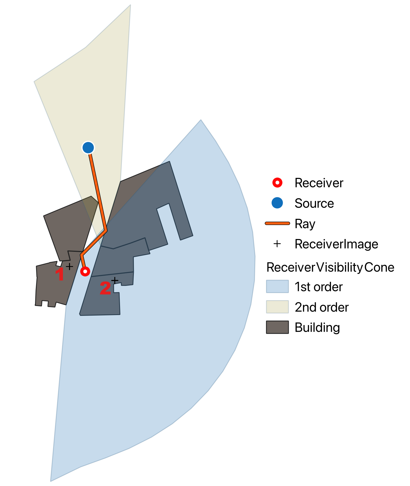

# Summary

NoiseModelling is a library capable of producing noise maps at a variety of scales, from neighbourhood and metropolitan level to large infrastructure covering entire countries.

The tool integrates the CNOSSOS-EU road and rail traffic noise emission and CNOSSOS-EU propagation models [@noauthor_commission_2015]. 

It is closely associated with the H2GIS [@bocher_h2gis_2015] and PostGIS [@mckenna_postgis_2022] spatial databases in order to handle spatial features and to facilitate cross-analysis with other spatial data.

The NoiseModelling java library can be used independently or controlled through a graphical user interface.

It is freely available for use by researchers, educational institutions and private companies.

# Statement of need

Noise has significant impacts on public health, confort and biodiversity. Prolonged exposure to high noise levels can lead to health issues such as stress, sleep disturbances, and cardiovascular diseases [@chen_environmental_2023]. Additionally, noise can disrupt ecosystems, affecting wildlife and altering the natural behaviors of species [@sordello_evidence_2020]. Including noise in environmental assessments is essential to better prevent its negative effects and supports the development of more sustainable planning strategies.

It is therefore crucial to simulate and predict noise propagation in various environments. This provides a quantitative understanding of sound sources, enabling, for example, the assessment of noise mitigation measures and regulatory compliance.

Since 2019 and Directive (EU) 2015/996 [@noauthor_commission_2015], the CNOSSOS-UE emission and propagation method must be used to produce strategic noise maps as described in Directive 2002/49/EC [@noauthor_commission_2002].

There is software that fully implements the CNOSSOS-EU method, but this is commercial closed-source software.

The NoiseModelling library has been developed jointly by Gustave Eiffel University and CNRS in an effort to provide the engineering and scientific communities around the world with a fully free and open-source software to compute and explore noise maps and experiment with the underlying models.

To date, NoiseModelling has been applied in a variety of research projects and practical scenarios, including, but not limited to:

- Standard noise maps of the main transport infrastructures [@aumond_strategic_2023].
- Dynamic noise maps from the coupling with several traffic models such as MATSim, SUMO and Symuvia [@le_bescond_open-source_2021], [@baclet_near-real-time_2023], [@quintero_statistical_2019].
- Sensitivity analysis of various aspects of the CNOSSOS-EU model [@aumond_global_2021].
- Dynamic noise map from noise sensors with data assimilation methods [@lesieur_data_2021].
- Noise quanitification of specific sources such as sirens [@siliezar_case_2023] or drones [@legriffon_drone_2024]

# Architecture

The overall architecture is illustrated on \autoref{fig:nm_architecture} and is described bellow.

NoiseModelling is made of four JAVA main librairies:

- noisemodelling-emission: to determine the sound power level of rail or road traffic,
- noisemodelling-pathfinder: to find the cut profiles between the source-receiver pairs,
- noisemodelling-propagation: to compute the noise attenuation between the source-receiver pairs,
- noisemodelling-jdbc: to connect NoiseModelling to a database.

Note that the noisemodelling-jdbc library (JDBC = Java DataBase Connectivity) is central since it allows the three others to communicate with each other as soon as the data are stored in a database. A connection wrapper facilitates the connection to the H2 database with its spatial extension H2GIS, as well as to a PostgreSQL database server with the PostGIS spatial extension.

For convenience, NoiseModelling is distributed with a user interface and can also be used via command line scripts.

# Numerical Model
## Emission models

The road and rail traffic emission models described in CNOSSOS-EU are implemented in NoiseModelling.

For road traffic, the user can choose coefficients between the Directive (EU) 2015/996 [@noauthor_commission_2015] and its amendment Directive (EU) 2021/1226 [@noauthor_commission_2021].

For rail traffic, the CNOSSOS-EU model is also implemented.

It is also possible to use custom emissions by entering noise power levels directly for point or line sound sources.

The code architecture permits other sound source types and/or other emission models to be implemented easily.

## Path-finding method

The calculation of acoustic propagation between a sound source and a receiver is based on the determination of the paths travelled by the sound wave, in particular:

* The direct path from the source to the receiver, with diffraction passing over horizontal digital elevation model or over horizontal building edges if an obstacle is present,
* The reflected path, due to the specular reflections of sound on building walls with a given maximum amount of consecutive reflections (the order of reflection),
* The diffracted path, due to the diffraction of sound around buildings on vertical edges.

Some paths are illustrated in \autoref{fig:path}.

The path-finding stage is the most time-consuming operation in the entire numerical simulation.

All objects in the simulation, such as building polygons, isolated walls and elements of the triangular elevation mesh, are placed in a fast R-Tree search structure.

When calculating specular reflections using the image-source method, the number of image sources increases rapidly with depth. This exponential growth is one of the main limitations of the image-source method for complex geometries or high-order reflections. Instead of generating image sources for each new source-receiver pair, NoiseModelling generates for each point receiver the image receiver's field of view for the walls within its range. When looking for potential walls for reflection, it is now limited to do the  intersection the position of the source point with receiver view cones. This method is illustrated in figures \autoref{fig:view_cones_all} and \autoref{fig:view_cones_valid}.
Those precomputed view cones eliminate a lot of non-valid series of specular reflections.

The output of the path-finding algorithm contains a list of vertical cut profiles between sources and receivers, covering obstacles information such as buildings and terrain.

## Propagation model

The CNOSSOS-EU propagation method describes how to compute the noise level at a given receiver location based on the various noise sources in its surrounding along with a detailed description of the environment (buildings, ground elevation, meteorological conditions etc.) [@noauthor_commission_2015].

Using the vertical cut profiles given by the path-finding algorithm, other propagation models than the CNOSSOS-EU one can be implemented.

## Validation

Major portion of the code base is covered by unit tests.

Tests that cover the model implementations are comparisons between the code and reference documents and independant CNOSSOS-EU implementations. For propagation and path-finding this is the ISO/TR 17534-4:2020 [@iso_isotr_2020]. For emission the comparison is done with independant implementations.
All discrepancies between our implementation and the references can be identified in the source code through dedicated tests. The most important tests are presented in a dedicated document.

# Community

A substantial effort is being made to help newcommers get started with NoiseModelling, through a clear documentation and through dedicated tutorials.

Every year since 2021, the community has gathered at NoiseModelling Days (https://noise-planet.org/noisemodelling_days.html). These one- or two-day online or hybrid sessions provide training for new users, as well as an opportunity to discuss the work carried out by experienced users. At this annual meeting, progress and prospects within the model are presented.

# Acknowledgements

We would like to thank Arnaud Can, Olivier Chiello, Ndeye Maguette Diagne, David Ecotière, Benoit Gauvreau, Gwenaël Guillaume, Adrien Le Bellec, Sylvain Palominos and Su Qi for their valuable contributions to this project.

# References
