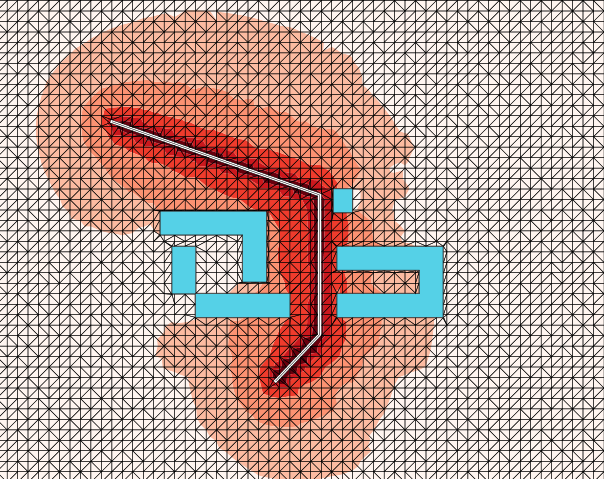
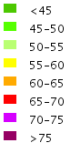
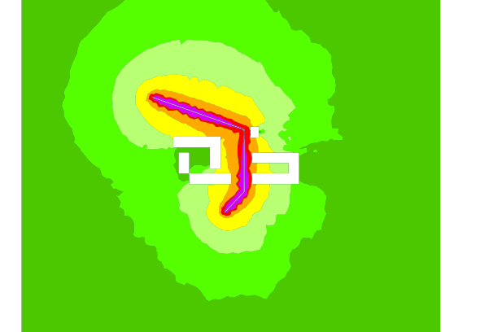

This demonstration is done entirely in the SQL console of OrbisGIS.

It presents the main steps for creating a noise map in a basic urban area. This demonstration does not need extra input data (geometries or traffic data), since building and road geometries, as well as traffic data, are created during the first three steps. In a "real calculation", operators should given the corresponding "real data".

Note that this demonstration could be a good course material for lessons for acoustic and geography (spatial analysis and urban planning).

Content of the demonstration:
 * create buildings table;
 * create roads table;
 * create traffic roads table;
 * translate the roads traffic into road noise source;
 * apply spectrum repartition on noise sources;
 * create a vectorial noise map, with standard ISO levels (NFS 31 130 standard).

## Create input data
### Create buildings geometries

```sql

-- make buildings table
drop table if exists buildings;
create table buildings ( the_geom GEOMETRY );

-- Insert 4 buildings
INSERT INTO buildings (the_geom) VALUES (ST_GeomFromText('MULTIPOLYGON (((0 20 0,20 20 0,20 60 0,0 60 0,0 20 0)))'));
INSERT INTO buildings (the_geom) VALUES (ST_GeomFromText('MULTIPOLYGON (((20 0 0,100 0 0, 100 20 0,20 20 0, 20 0 0)))'));
INSERT INTO buildings (the_geom) VALUES (ST_GeomFromText('MULTIPOLYGON (((80 30 0,80 90 0,-10 90 0,-10 70 0,60 70 0,60 30 0,80 30 0)))'));
INSERT INTO buildings (the_geom) VALUES (ST_GeomFromText('POLYGON ((137 89 0, 137 109 0, 153 109 0, 153 89 0, 137 89 0))'));
INSERT INTO buildings (the_geom) VALUES (ST_GeomFromText('MULTIPOLYGON (((140 0 0,230 0 0, 230 60 0, 140 60 0,140 40 0,210 40 0,210 20 0, 140 20 0, 140 0 0)))'));

```

### Create roads geometries

```sql

-- Make roads table (just geometries and road type)
drop table if exists roads_geom;
create table roads_geom ( the_geom GEOMETRY, NUM INTEGER, node_from INTEGER, node_to INTEGER, road_type INTEGER );

INSERT INTO roads_geom (the_geom,NUM,node_from,node_to,road_type) VALUES (ST_GeomFromText('LINESTRING (88 -54 0, 125 -15 2)'),0,0,1,53);
INSERT INTO roads_geom (the_geom,NUM,node_from,node_to,road_type) VALUES (ST_GeomFromText('LINESTRING (125 -15 2,125 104 4)'),1,1,2,53);
INSERT INTO roads_geom (the_geom,NUM,node_from,node_to,road_type) VALUES (ST_GeomFromText('LINESTRING (125 104 4,-51 166 0)'),2,2,3,53);
```


### Create roads traffic table

```sql

-- Make traffic information table
drop table if exists roads_traffic;
create table roads_traffic ( node_from INTEGER, node_to INTEGER, load_speed DOUBLE, junction_speed DOUBLE, max_speed DOUBLE, lightVehicleCount DOUBLE, heavyVehicleCount DOUBLE);

-- Insert traffic data
INSERT INTO roads_traffic (node_from,node_to,load_speed,junction_speed,max_speed,lightVehicleCount,heavyVehicleCount) VALUES (0,1,43,42,50,450,18);
INSERT INTO roads_traffic (node_from,node_to,load_speed,junction_speed,max_speed,lightVehicleCount,heavyVehicleCount) VALUES (1,0,43,42,50,650,10);
INSERT INTO roads_traffic (node_from,node_to,load_speed,junction_speed,max_speed,lightVehicleCount,heavyVehicleCount) VALUES (1,2,43,42,50,450,18);
INSERT INTO roads_traffic (node_from,node_to,load_speed,junction_speed,max_speed,lightVehicleCount,heavyVehicleCount) VALUES (2,1,43,42,50,650,10);
INSERT INTO roads_traffic (node_from,node_to,load_speed,junction_speed,max_speed,lightVehicleCount,heavyVehicleCount) VALUES (2,3,43,42,50,450,18);
INSERT INTO roads_traffic (node_from,node_to,load_speed,junction_speed,max_speed,lightVehicleCount,heavyVehicleCount) VALUES (3,2,46,45,50,650,10);
```

## Compute sound sources from traffic data

### Merge traffic with roads geometry

```sql
-- Duplicate geometries to give sound level for each traffic direction
drop table if exists roads_dir_one;
drop table if exists roads_dir_two;
CREATE TABLE roads_dir_one AS SELECT the_geom,road_type,load_speed,junction_speed,max_speed,lightVehicleCount,heavyVehicleCount FROM roads_geom as geo,roads_traffic traff WHERE geo.node_from=traff.node_from AND geo.node_to=traff.node_to;
CREATE TABLE roads_dir_two AS SELECT the_geom,road_type,load_speed,junction_speed,max_speed,lightVehicleCount,heavyVehicleCount FROM roads_geom as geo,roads_traffic traff WHERE geo.node_to=traff.node_from AND geo.node_from=traff.node_to;
-- Collapse two direction in one table
drop table if exists roads_geo_and_traffic;
CREATE TABLE roads_geo_and_traffic AS select * from roads_dir_one UNION select * from roads_dir_two;
```

### Compute the global sound level of light and heavy vehicles


```sql
-- Compute the sound level for each segment of roads
drop table if exists roads_src_global;
CREATE TABLE roads_src_global AS SELECT the_geom,BR_EvalSource(load_speed,lightVehicleCount,heavyVehicleCount,junction_speed,max_speed,road_type,ST_Z(ST_GeometryN(ST_ToMultiPoint(the_geom),1)),ST_Z(ST_GeometryN(ST_ToMultiPoint(the_geom),2)),ST_Length(the_geom),False) as db_m from roads_geo_and_traffic;
```
Documentation on BR_EvalSource : [Br_EvalSource function](https://github.com/Ifsttar/NoiseModelling/wiki/03-SQL-functions#br_evalsource)

### Compute the spectrum repartition ###

```sql
-- Apply frequency repartition of road noise level
drop table if exists roads_src;
CREATE TABLE roads_src AS SELECT the_geom,
BR_SpectrumRepartition(100,1,db_m) as db_m100,
BR_SpectrumRepartition(125,1,db_m) as db_m125,
BR_SpectrumRepartition(160,1,db_m) as db_m160,
BR_SpectrumRepartition(200,1,db_m) as db_m200,
BR_SpectrumRepartition(250,1,db_m) as db_m250,
BR_SpectrumRepartition(315,1,db_m) as db_m315,
BR_SpectrumRepartition(400,1,db_m) as db_m400,
BR_SpectrumRepartition(500,1,db_m) as db_m500,
BR_SpectrumRepartition(630,1,db_m) as db_m630,
BR_SpectrumRepartition(800,1,db_m) as db_m800,
BR_SpectrumRepartition(1000,1,db_m) as db_m1000,
BR_SpectrumRepartition(1250,1,db_m) as db_m1250,
BR_SpectrumRepartition(1600,1,db_m) as db_m1600,
BR_SpectrumRepartition(2000,1,db_m) as db_m2000,
BR_SpectrumRepartition(2500,1,db_m) as db_m2500,
BR_SpectrumRepartition(3150,1,db_m) as db_m3150,
BR_SpectrumRepartition(4000,1,db_m) as db_m4000,
BR_SpectrumRepartition(5000,1,db_m) as db_m5000 from roads_src_global;
```

Documentation on BR_SpectrumRepartition : [BR_SpectrumRepartition](https://github.com/Ifsttar/NoiseModelling/wiki/03-SQL-functions#br_spectrumrepartition)

Currently there is no way to set the computation envelope. BR_TRIGRID use the sound source envelope to make the noise map area. Then, to extend the noise map area we can introduce two sound source without significant sound level.

```sql

-- Just for extending noise map zone, add 2 -inf db source point to specify a "bounding box" of triangulation zone
INSERT INTO roads_src (the_geom, db_m100,db_m125,db_m160,db_m200,db_m250,db_m315,db_m400,db_m500,db_m630,
db_m800,db_m1000,db_m1250,db_m1600,db_m2000,db_m2500,db_m3150,db_m4000,db_m5000) VALUES (ST_GeomFromText('POINT( -300 -300 0 )'),Log10(0),Log10(0),Log10(0),Log10(0),Log10(0),Log10(0),Log10(0),Log10(0),Log10(0),Log10(0),Log10(0),Log10(0),Log10(0),Log10(0),Log10(0),Log10(0),Log10(0),Log10(0));
INSERT INTO roads_src (the_geom, db_m100,db_m125,db_m160,db_m200,db_m250,db_m315,db_m400,db_m500,db_m630,
db_m800,db_m1000,db_m1250,db_m1600,db_m2000,db_m2500,db_m3150,db_m4000,db_m5000) VALUES (ST_GeomFromText('POINT( 500 500 0 )'),Log10(0),Log10(0),Log10(0),Log10(0),Log10(0),Log10(0),Log10(0),Log10(0),Log10(0),Log10(0),Log10(0),Log10(0),Log10(0),Log10(0),Log10(0),Log10(0),Log10(0),Log10(0));
```

## Create the noise map

### Sound propagation
Call the function BR_TriGrid to compute the propagation of sound from sound sources to a Delaunay triangulation vertices.

BR_TriGrid(buildingsTable, sourcesTable, sourcesTableSoundFieldName, groundTypeTable, maximumPropagationDistance, maximumWallSeekingDistance, roadsWidth, receiversDensification, maximumAreaOfTriangle, soundReflectionOrder, soundDiffractionOrder, wallAlpha)
 
 - **buildingsTable** table identifier that contain a geometry column of type POLYGON.
 - **sourcesTable** table identifier that contain a geometry column of type POINT or LINESTRING.The table must contain the sound emission level in dB(A).
 - **sourcesTableSoundFieldName** prefix identifier of the emission level column. ex 'DB_M' for columns 'DB_M100' to 'DB_M5000'.  
 - **groundTypeTable** table identifier of the ground category table. This table must contain a geometry field of type POLYGON. And a column 'G' of type double between 0 and 1.
 dimensionless coefficient G:
    - Law, meadow, field of cereals G=1
    - Undergrowth (resinous or decidious) G=1
    - non-compacted earth G=0.7
    - Compacted earth, track G=0.3
    - Road surface G=0
    - Smooth concrete G=0
 - **maximumPropagationDistance** From a receiver, each source that are farther than this parameter are ignored. Recommended value, greater or equal to 750 meters. Greatly impacts performance and memory usage.
 - **maximumWallSeekingDistance** From the direct propagation line source-receiver, wall farther than this parameter are ignored for reflection and diffraction. Greatly impacts performance.
 - **roadsWidth** Start creating receivers from this distance. Should be superior than 1 meter.
 - **receiversDensification** Create additional receivers at this distance from sources. (0 to disable)
 - **maximumAreaOfTriangle** Maximum area for noise map triangular mesh. Smaller area means more receivers. Impacts performance.
 - **soundReflectionOrder** Maximum depth of wall reflection. Greatly impacts performance. Recommended value is 2.
 - **soundDiffractionOrder** Maximum depth of sound diffraction. Impacts performance. Recommended value is 1.
 - **wallAlpha** Wall absorption value. Between 0 and 1. Recommended value is 0.23 for concrete.


```sql
-- Sound propagation from sources through buildings
drop table if exists tri_lvl;
create table tri_lvl as SELECT * from BR_TriGrid('buildings','roads_src','DB_M','',750,50,1.5,2.8,75,2,1,0.23);
```


### Compute the surface contouring

The function ST_TriangleContouring will split the triangles in the table tri_lvl into multiple triangle in order to cover a specified sound level interval.


```sql
-- Use the triangle area contouring interpolation (split triangle covering level parameter)
-- iso lvls in w corresponding to dB->'45,50,55,60,65,70,75,200'
-- the output iso will be [-inf to 45] -> 0 ]45 to 50] -> 1 etc..
-- Theses levels corresponding to the ranges specified in the standard NF S 31 130 
drop table if exists tricontouring_noise_map;
create table tricontouring_noise_map AS SELECT * from ST_TriangleContouring('tri_lvl','w_v1','w_v2','w_v3',31622, 100000, 316227, 1000000, 3162277, 1e+7, 31622776, 1e+20);
```

### Merge triangles into polygons

Group triangles by iso level and merge into polygons
```sql
-- Merge adjacent triangle into polygons (multiple polygon by row, for unique isoLevel and cellId key)
drop table if exists multipolygon_iso;
create table multipolygon_iso as select ST_UNION(ST_ACCUM(the_geom)) the_geom ,idiso from tricontouring_noise_map GROUP BY IDISO, CELL_ID;
-- Explode each row to keep only a polygon by row
drop table if exists contouring_noise_map;
create table contouring_noise_map as select the_geom,idiso from ST_Explode('multipolygon_iso');
drop table multipolygon_iso;
```

The final table contouring_noise_map contain for each polygon the field iso level. For the final rendering, you must use the standard NF S 31 130 for French noise map.





To add your style on the Map, create a file named "style.se", you can download the style in the SE 2.0 here :
[NFS-31-130.se](styles/NFS-31-130.se "NFS 31-130")

Then, you need to right click on "Tricontouring_noise_map" in Toc's tab, and select import style to import your file.