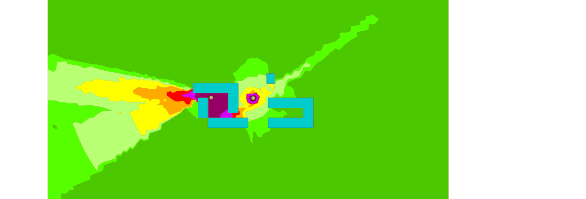

## Define a building Geometry

First, define buildings geometry:
```mysql
-- make buildings table
drop table if exists buildings;
create table buildings ( the_geom GEOMETRY, height double );
-- Insert 4 buildings
INSERT INTO buildings (the_geom) VALUES (ST_GeomFromText('MULTIPOLYGON (((0 20 0,20 20 0,20 60 0,0 60 0,0 20 0)))'));
INSERT INTO buildings (the_geom) VALUES (ST_GeomFromText('MULTIPOLYGON (((20 0 0,100 0 0, 100 20 0,20 20 0, 20 0 0)))'));
INSERT INTO buildings (the_geom) VALUES (ST_GeomFromText('MULTIPOLYGON (((80 30 0,80 90 0,-10 90 0,-10 70 0,60 70 0,60 30 0,80 30 0)))'));
INSERT INTO buildings (the_geom) VALUES (ST_GeomFromText('POLYGON ((137 89 0, 137 109 0, 153 109 0, 153 89 0, 137 89 0))'));
INSERT INTO buildings (the_geom) VALUES (ST_GeomFromText('MULTIPOLYGON (((140 0 0,230 0 0, 230 60 0, 140 60 0,140 40 0,210 40 0,210 20 0, 140 20 0, 140 0 0)))'));
```
## Create sound sources

Then, create two punctual sound sources with uniform spectrum of 80 dB(A) and 100 dB(A) for each third octave band, between 100Hz and 5000Hz:

```mysql
drop table if exists sound_source;
create table sound_source(the_geom geometry, db_m100 double,db_m125 double,db_m160 double,db_m200 double,db_m250 double,db_m315 double,db_m400 double,db_m500 double,db_m630 double,
db_m800 double,db_m1000 double,db_m1250 double,db_m1600 double,db_m2000 double,db_m2500 double,db_m3150 double,db_m4000 double,db_m5000 double);
insert into sound_source values ('POINT (110 60)'::geometry, 80, 80, 80, 80, 80, 80, 80, 80, 80, 80, 80, 80, 80, 80, 80, 80, 80, 80);
insert into sound_source values ('POINT (26 61)'::geometry, 100, 100, 100, 100, 100, 100, 100, 100, 100, 100, 100, 100, 100, 100, 100, 100, 100, 100);
```

## Extends noise map calculation zone

Just for extending the noise map calculation zone, add 2 "artificial" source points (with a sound power of -inf dB, i.e. Log10(0)) to specify a "bounding box" of triangulation zone (choose the source points such as they are localized at the extremity of the bounding box you want to consider):
```mysql
INSERT INTO sound_source (the_geom, db_m100,db_m125,db_m160,db_m200,db_m250,db_m315,db_m400,db_m500,db_m630,
db_m800,db_m1000,db_m1250,db_m1600,db_m2000,db_m2500,db_m3150,db_m4000,db_m5000) VALUES (ST_GeomFromText('POINT( -300 -300 0 )'),Log10(0),Log10(0),Log10(0),Log10(0),Log10(0),Log10(0),Log10(0),Log10(0),Log10(0),Log10(0),Log10(0),Log10(0),Log10(0),Log10(0),Log10(0),Log10(0),Log10(0),Log10(0));
INSERT INTO sound_source (the_geom, db_m100,db_m125,db_m160,db_m200,db_m250,db_m315,db_m400,db_m500,db_m630,
db_m800,db_m1000,db_m1250,db_m1600,db_m2000,db_m2500,db_m3150,db_m4000,db_m5000) VALUES (ST_GeomFromText('POINT( 500 500 0 )'),Log10(0),Log10(0),Log10(0),Log10(0),Log10(0),Log10(0),Log10(0),Log10(0),Log10(0),Log10(0),Log10(0),Log10(0),Log10(0),Log10(0),Log10(0),Log10(0),Log10(0),Log10(0));
```

## Calculation of the sound propagation

Calculate the sound propagation from sources between buildings, with the following parameters :

BR_PtGrid(String buildingsTable,String sourcesTable, String receiversTable, String sourcesTableSoundFieldName, String groundTypeTable, double maximumPropagationDistance, double maximumWallSeekingDistance, int soundReflectionOrder, int soundDiffractionOrder, double wallAlpha)

 - **buildingsTable** table identifier that contain a geometry column of type POLYGON.
 - **sourcesTable** table identifier that contain a geometry column of type POINT or LINESTRING.The table must contain the sound emission level in dB(A).
 - **receiversTable** table identifier that contain the list of evaluation point of sound level. This table must contains only POINT. And optionally an integer primary key.
 - **sourcesTableSoundFieldName** prefix identifier of the emission level column. ex 'DB_M' for columns 'DB_M100' to 'DB_M5000'.  
 - **groundTypeTable** table identifier of the ground category table. This table must contain a geometry field of type POLYGON. And a column 'G' of type double between 0 and 1.
 dimensionless coefficient G:
    - Law, meadow, field of cereals G=1
    - Undergrowth (resinous or decidious) G=1
    - non-compacted earth G=0.7
    - Compacted earth, track G=0.3
    - Road surface G=0
    - Smooth concrete G=0
 - **maximumPropagationDistance** From a receiver, each source that are farther than this parameter are ignored. Recommended value, greater or equal to 750 meters. Greatly impacts performance and memory usage.
 - **maximumWallSeekingDistance** From the direct propagation line source-receiver, wall farther than this parameter are ignored for reflection and diffraction. Greatly impacts performance.
 - **soundReflectionOrder** Maximum depth of wall reflection. Greatly impacts performance. Recommended value is 2.
 - **soundDiffractionOrder** Maximum depth of sound diffraction. Impacts performance. Recommended value is 1.
 - **wallAlpha** Wall absorption value. Between 0 and 1. Recommended value is 0.23 for concrete.

```mysql
drop table if exists tri_lvl;
create table tri_lvl as SELECT * from BR_TriGrid('BUILDINGS','SOUND_SOURCE','DB_M','',750,50,1.5,2.8,75,2,1,0.23);
-- Use the triangle area contouring interpolation (split triangle covering level parameter)
-- iso lvls in w corresponding to dB->'45,50,55,60,65,70,75,200'
-- the output iso will be [-inf to 45] -> 0 ]45 to 50] -> 1 etc..
-- Theses levels corresponding to the ranges specified in the standart NF S 31 130
drop table if exists tricontouring_noise_map;
create table tricontouring_noise_map AS SELECT * from ST_TriangleContouring('tri_lvl','w_v1','w_v2','w_v3',31622, 100000, 316227, 1000000, 3162277, 1e+7, 31622776, 1e+20);
-- Merge adjacent triangle into polygons (multiple polygon by row, for unique isoLevel and cellId key)
drop table if exists multipolygon_iso;
create table multipolygon_iso as select ST_UNION(ST_ACCUM(the_geom)) the_geom ,idiso from tricontouring_noise_map GROUP BY IDISO, CELL_ID;
-- Explode each row to keep only a polygon by row
drop table if exists contouring_noise_map;
create table contouring_noise_map as select the_geom,idiso from ST_Explode('multipolygon_iso');
drop table multipolygon_iso;
```

## Result

