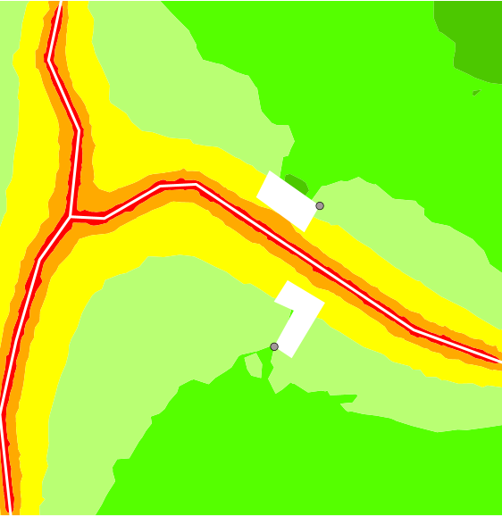
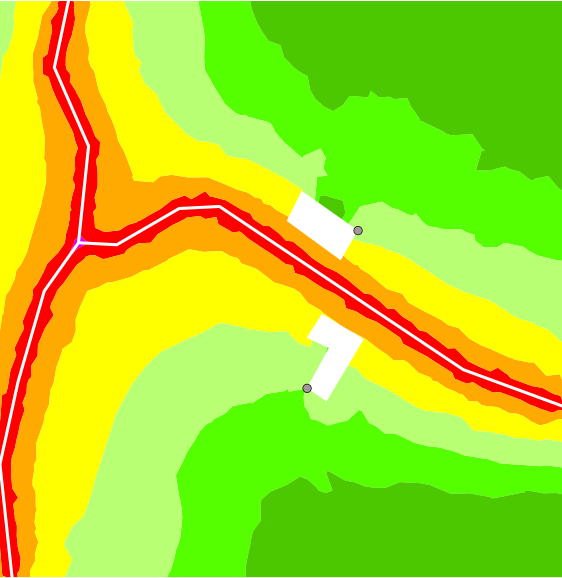
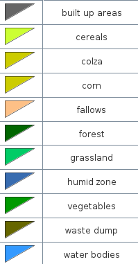
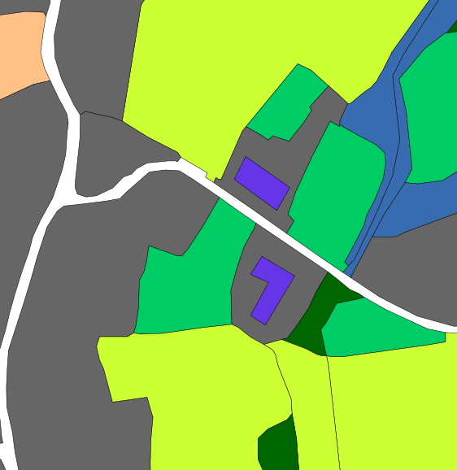

This script require the loading of LANDCOVER2000 shapefile available on [Github source](https://github.com/irstv/noisemap/tree/master/noisemap-h2/src/test/resources/org/orbisgis/noisemap/h2/)

## Test data generation (buildings, roads, traffic, noise, etc)

```sql
drop table if exists buildings;
create table buildings(gid serial, the_geom polygon, height double);
insert into buildings values (null, 'POLYGON ((183945 2428977, 183963 2429007, 183943 2429019, 183936 2429008, 183947 2429003,
 183936 2428983, 183945 2428977))', 10); 
insert into buildings values (null, 'POLYGON ((183926 2429066, 183952 2429047, 183960 2429061, 183933 2429080, 183926 2429066))', 6);  

-- Using type name, convert into G coefficient. 
drop table if exists land_g;
create table land_g as select the_geom, CASEWHEN(TYPE='built up areas', 0, CASEWHEN(TYPE='cereals', 1, 0.7)) as G from LANDCOVER2000;

-- Make roads table (just geometries and road type)
drop table if exists roads_geom;
create table roads_geom ( the_geom GEOMETRY, NUM INTEGER, node_from INTEGER, node_to INTEGER, road_type INTEGER );
INSERT INTO roads_geom (the_geom,NUM,node_from,node_to,road_type) VALUES (ST_GeomFromText('LINESTRING (183817 2429175 0, 183810 2429142 0,183827 2429103 0,183822 2429055 0)'),0,0,1,53);
INSERT INTO roads_geom (the_geom,NUM,node_from,node_to,road_type) VALUES (ST_GeomFromText('LINESTRING (183822 2429055 0,183841 2429054 0,183872 2429072 0,183892 2429073 0, 184013 2428992 0,184062 2428974 0)'),1,1,2,53);
INSERT INTO roads_geom (the_geom,NUM,node_from,node_to,road_type) VALUES (ST_GeomFromText('LINESTRING (183822 2429055 0, 183805 2429031 0, 183792 2428986 0, 183783 2428945 0, 183789 2428889 0)'),2,2,3,53);

-- Make traffic information table
drop table if exists roads_traffic;
create table roads_traffic ( node_from INTEGER, node_to INTEGER, load_speed DOUBLE, junction_speed DOUBLE, max_speed DOUBLE, lightVehicleCount DOUBLE, heavyVehicleCount DOUBLE);

-- Insert traffic data
INSERT INTO roads_traffic (node_from,node_to,load_speed,junction_speed,max_speed,lightVehicleCount,heavyVehicleCount) VALUES (0,1,43,42,50,450,18);
INSERT INTO roads_traffic (node_from,node_to,load_speed,junction_speed,max_speed,lightVehicleCount,heavyVehicleCount) VALUES (1,0,43,42,50,650,10);
INSERT INTO roads_traffic (node_from,node_to,load_speed,junction_speed,max_speed,lightVehicleCount,heavyVehicleCount) VALUES (1,2,43,42,50,450,18);
INSERT INTO roads_traffic (node_from,node_to,load_speed,junction_speed,max_speed,lightVehicleCount,heavyVehicleCount) VALUES (2,1,43,42,50,650,10);
INSERT INTO roads_traffic (node_from,node_to,load_speed,junction_speed,max_speed,lightVehicleCount,heavyVehicleCount) VALUES (2,3,43,42,50,450,18);
INSERT INTO roads_traffic (node_from,node_to,load_speed,junction_speed,max_speed,lightVehicleCount,heavyVehicleCount) VALUES (3,2,46,45,50,650,10);
*land cover regions*
-- Duplicate geometries to give sound level for each traffic direction
drop table if exists roads_dir_one;
drop table if exists roads_dir_two;
CREATE TABLE roads_dir_one AS SELECT the_geom,road_type,load_speed,junction_speed,max_speed,lightVehicleCount,heavyVehicleCount FROM roads_geom as geo,roads_traffic traff WHERE geo.node_from=traff.node_from AND geo.node_to=traff.node_to;
CREATE TABLE roads_dir_two AS SELECT the_geom,road_type,load_speed,junction_speed,max_speed,lightVehicleCount,heavyVehicleCount FROM roads_geom as geo,roads_traffic traff WHERE geo.node_to=traff.node_from AND geo.node_from=traff.node_to;
-- Collapse two direction in one table
drop table if exists roads_geo_and_traffic;
CREATE TABLE roads_geo_and_traffic AS select * from roads_dir_one UNION select * from roads_dir_two;
-- Compute the sound level for each segment of roads
drop table if exists roads_src_global;
CREATE TABLE roads_src_global AS SELECT the_geom,BR_EvalSource(load_speed,lightVehicleCount,heavyVehicleCount,junction_speed,max_speed,road_type,ST_Z(ST_GeometryN(ST_ToMultiPoint(the_geom),1)),ST_Z(ST_GeometryN(ST_ToMultiPoint(the_geom),2)),ST_Length(the_geom),False) as db_m from roads_geo_and_traffic;
-- Apply frequency repartition of road noise level
drop table if exists roads_src;
CREATE TABLE roads_src AS SELECT the_geom,
BR_SpectrumRepartition(100,1,db_m) as d*land cover regions*b_m100,
BR_SpectrumRepartition(125,1,db_m) as db_m125,
BR_SpectrumRepartition(160,1,db_m) as db_m160,
BR_SpectrumRepartition(200,1,db_m) as db_m200,
BR_SpectrumRepartition(250,1,db_m) as db_m250,
BR_SpectrumRepartition(315,1,db_m) as db_m315,
BR_SpectrumRepartition(400,1,db_m) as db_m400,
BR_SpectrumRepartition(500,1,db_m) as db_m500,
BR_SpectrumRepartition(630,1,db_m) as db_m630,
BR_SpectrumRepartition(800,1,db_m) as db_m800,
BR_SpectrumRepartition(1000,1,db_m) as db_m1000,
BR_SpectrumRepartition(1250,1,db_m) as db_m1250,
BR_SpectrumRepartition(1600,1,db_m) as db_m1600,
BR_SpectrumRepartition(2000,1,db_m) as db_m2000,
BR_SpectrumRepartition(2500,1,db_m) as db_m2500,
BR_SpectrumRepartition(3150,1,db_m) as db_m3150,
BR_SpectrumRepartition(4000,1,db_m) as db_m4000,
BR_SpectrumRepartition(5000,1,db_m) as db_m5000 from roads_src_global;
*land cover regions*
-- Sound propagation from sources through buildings reflecting on ground
drop table if exists tri_lvl;
create table tri_lvl as SELECT * from BR_TriGrid3D('BUILDINGS','HEIGHT','ROADS_SRC','DB_M','LAND_G','',750,50,1.5,2.8,75,2,1,0.23);

-- Use the triangle area contouring interpolation (split triangle covering level parameter)
-- iso lvls in w corresponding to dB->'45,50,55,60,65,70,75,200'
-- the output iso will be [-inf to 45] -> 0 ]45 to 50] -> 1 etc..
-- Theses levels corresponding to the ranges specified in the standard NF S 31 130 
drop table if exists tricontouring_noise_map;
create table tricontouring_noise_map AS SELECT * from ST_TriangleContouring('tri_lvl','w_v1','w_v2','w_v3',31622, 100000, 316227, 1000000, 3162277, 1e+7, 31622776, 1e+20);

-- Merge adjacent triangle into polygons (multiple polygon by row, for unique isoLevel and cellId key)
drop table if exists multipolygon_iso;
create table multipolygon_iso as select ST_UNION(ST_ACCUM(the_geom)) the_geom ,idiso from tricontouring_noise_map GROUP BY IDISO, CELL_ID;
-- Explode each row to keep only a polygon by row
drop table if exists contouring_noise_map;
create table contouring_noise_map as select the_geom,idiso from ST_Explode('multipolygon_iso');
drop table multipolygon_iso;*land cover regions*
```

## Result without ground effect
 

## Result with ground effect
 

## Land cover regions
### Caption

### Map
