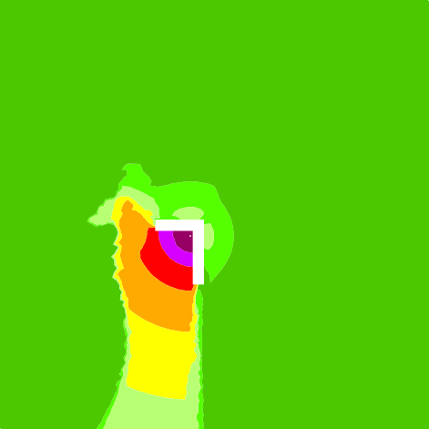
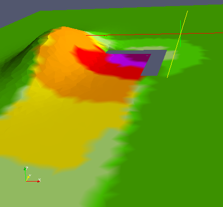

Hill noise barrier using digital elevation model. This sample create a dem using gaussian function.
However in your study you may feed a point cloud.

## Producing generic data

```sql
-- make buildings table
drop table if exists buildings;
create table buildings ( the_geom GEOMETRY, height double );
INSERT INTO buildings VALUES
('POLYGON ((80 -30 0,80 90 0,-10 90 0,-10 70 0,60 70 0,60 -30 0,80 -30 0))',5);
drop table if exists sound_source;
create table sound_source(the_geom ge*Result of noise map*ometry, db_m100 double,db_m125 double,db_m160 double,db_m200 double,db_m250 double,db_m315 double,db_m400 double,db_m500 double,db_m630 double,
db_m800 double,db_m1000 double,db_m1250 double,db_m1600 double,db_m2000 double,db_m2500 double,db_m3150 double,db_m4000 double,db_m5000 double);
insert into sound_source VALUES ('POINT(55 60 1)', 100, 100, 100, 100, 100, 100, 100, 100, 100, 100, 100, 100, 100, 100, 100, 100, 100, 100);
INSERT INTO sound_source VALUES ('POINT( -300 -300 0 )',Log10(0),Log10(0),Log10(0),Log10(0),Log10(0),Log10(0),Log10(0),Log10(0),Log10(0),Log10(0),Log10(0),Log10(0),Log10(0),Log10(0),Log10(0),Log10(0),Log10(0),Log10(0));
INSERT INTO sound_source VALUES ('POINT( 500 500 0 )',Log10(0),Log10(0),Log10(0),Log10(0),Log10(0),Log10(0),Log10(0),Log10(0),Log10(0),Log10(0),Log10(0),Log10(0),Log10(0),Log10(0),Log10(0),Log10(0),Log10(0),Log10(0));
-- Create Digital elevation model using gaussian 2d function
drop table if exists all_dem;
SET @DOMAIN_XMIN = SELECT ST_XMIN(ST_EXTENT(THE_GEOM)) FROM SOUND_SOURCE;
SET @DOMAIN_XMAX = SELECT ST_XMAX(ST_EXTENT(THE_GEOM)) FROM SOUND_SOURCE;
SET @DOMAIN_YMIN = SELECT ST_YMIN(ST_EXTENT(THE_GEOM)) FROM SOUND_SOURCE;
SET @DOMAIN_YMAX = SELECT ST_YMAX(ST_EXTENT(THE_GEOM)) FROM SOUND_SOURCE;
SET @POINT_COUNT = 50;
SET @MOUNTAIN_X = -80;
SET @MOUNTAIN_Y = 50;
SET @MONTAIN_WIDTH = 8;
SET @MOUNTAIN_LENGTH = 50;
create table all_dem(the_geom POINT,Z double as ST_Z(the_geom)) as select ST_MAKEPOINT(X * ((@DOMAIN_XMAX - @DOMAIN_XMIN) / @POINT_COUNT) + @DOMAIN_XMIN, Y * ((@DOMAIN_YMAX - @DOMAIN_YMIN) / @POINT_COUNT) + @DOMAIN_YMIN,
-- Gaussian*Result of noise map*
45 * EXP(-(POWER(X - ((@MOUNTAIN_X - @DOMAIN_XMIN) / (@DOMAIN_XMAX - @DOMAIN_XMIN) * @POINT_COUNT)  ,2) / @MONTAIN_WIDTH  + POWER(Y - ((@MOUNTAIN_Y - @DOMAIN_YMIN) / (@DOMAIN_YMAX - @DOMAIN_YMIN) * @POINT_COUNT) ,2) / @MOUNTAIN_LENGTH ))) the_geom,

null  from (select X from system_range(0,@POINT_COUNT)),(select X Y from system_range(0,@POINT_COUNT)) ;
select (-24 - @DOMAIN_XMIN) / (@DOMAIN_XMAX - @DOMAIN_XMIN) * @POINT_COUNT;
-- Remove dem point too close from buildings
drop table if exists dem;
create spatial index on buildings(the_geom);
create table dem as select d.the_geom, d.Z from all_dem d where (select COUNT(*) near from buildings b where d.the_geom && b.the_geom AND ST_DISTANCE(d.the_geom, b.the_geom) < 1) = 0;

-- Sound propagation from sources through buildings reflecting on ground
drop table if exists tri_lvl;
create table tri_lvl as SELECT * from BR_TriGrid3D('BUILDINGS','HEIGHT','SOUND_SOURCE','DB_M','','DEM',750,50,1.5,2.8,75,2,1,0.23);

-- Use the triangle area contouring interpolation (split triangle covering level parameter)
-- iso lvls in w corresponding to dB->'45,50,55,60,65,70,75,200'
-- the output iso will be [-inf to 45] -> 0 ]45 to 50] -> 1 etc..
-- Theses levels corresponding to the*Result of noise map* ranges specified in the standard NF S 31 130 
drop table if exists tricontouring_noise_map;
create table tricontouring_noise_map AS SELECT * from ST_TriangleContouring('tri_lvl','w_v1','w_v2','w_v3',31622, 100000, 316227, 1000000, 3162277, 1e+7, 31622776, 1e+20);

-- Merge adjacent triangle into polygons (multiple polygon by row, for unique isoLevel and cellId key)
drop table if exists multipolygon_iso;
create table multipolygon_iso as select ST_UNION(ST_ACCUM(the_geom)) the_geom ,idiso from tricontouring_noise_map GROUP BY IDISO, CELL_ID;
-- Explode each row to keep only a polygon by row
drop table if exists contouring_noise_map;
create table contouring_noise_map as select the_geom,idiso from ST_Explode('multipolygon_iso');
drop table multipolygon_iso;
```

## Result of noise map
 

## Generate map in ParaView
*Result of noise map*
You can export the noise map into a PLY file in order to render it in 3D application like [ParaView](http://www.paraview.org).

```groovy
import groovy.sql.Sql;

def sql = Sql.newInstance(grv_ds);
def z_factor = 1
sql.execute("""DROP TABLE IF EXISTS NODES;
CREATE TABLE NODES(GID SERIAL, the_geom POINT, w_m double) AS SELECT null, THE_GEOM, W_M FROM (SELECT null, ST_POINTN(ST_EXTERIORRING(THE_GEOM), 1) the_geom, W_V1 W_M from TRI_LVL UNION ALL SELECT null, ST_POINTN(ST_EXTERIORRING(THE_GEOM), 2) the_geom, W_V2 W_M from TRI_LVL UNION ALL SELECT null, ST_POINTN(ST_EXTERIORRING(THE_GEOM), 3) the_geom, W_V3 W_M from TRI_LVL) GROUP BY THE_GEOM, W_M;
CREATE INDEX ON NODES(the_geom);
DROP TABLE IF EXISTS FACES;
CREATE TABLE FACES(GID SERIAL, V1 BIGINT, V2 BIGINT, V3 BIGINT) AS SELECT null, (SELECT N.GID FROM NODES N WHERE N.THE_GEOM = ST_POINTN(ST_EXTERIORRING(T.THE_GEOM), 1)) , (SELECT N.GID FROM NODES N WHERE N.THE_GEOM = ST_POINTN(ST_EXTERIORRING(T.THE_GEOM), 2)), (SELECT N.GID FROM NODES N WHERE N.THE_GEOM = ST_POINTN(ST_EXTERIORRING(T.THE_GEOM), 3))FROM TRI_LVL T;""")
def powerToColor(power) {
     if(power < 31622)*Result of noise map*
         return "76 200 0"
     else if(power < 100000)
         return "85 255 0"
     else if(power < 316227)
         return "185 255 115"
     else if(power < 1000000)
         return "255 255 0"
     else if(power < 3162277)
         return "255 170 0"
     else if(power < 1e+7)
         return "255 0 0"
     else if(power < 31622776)
         return "213 0 255"
     else if(power < 1e+20)
         return "150 0 100"
     else*Result of noise map*
         return "0 0 0"
}
def vertexCount = sql.rows("SELECT COUNT(*) CPT FROM NODES")[0]["CPT"]
def faceCount = sql.rows("SELECT COUNT(*) CPT FROM FACES")[0]["CPT"]
new File("/home/fortin/workspaces/nm_4.1_test/plytest/model.ply").withWriter { out ->
     out.writeLine("ply")
     out.writeLine("format ascii 1.0")
     out.writeLine("element vertex "+vertexCount)
     out.writeLine("property float x")
     out.writeLine("property float y")
     out.writeLine("property float z")
     out.writeLine("property uchar red")
     out.writeLine("property uchar green")
     out.writeLine("property uchar blue")
     out.writeLine("element face "+faceCount)
     out.writeLine("property list uchar int vertex_index")
     out.writeLine("end_header")
     // Vertex
     sql.eachRow("select * from nodes") { row ->
        pt = row["THE_GEOM"].getCoord*Result of noise map*inate()
        out.writeLine(pt.x+" "+pt.y+" "+(pt.z * z_factor)+" "+powerToColor(row["W_M"]))
     }
     // Faces
     sql.eachRow("select * from faces") { row ->
        out.writeLine("3 "+(row["V1"] - 1)+" "+(row["V2"] - 1)+" "+(row["V3"] - 1))
     }
}
```

## Result : 3D Map view


